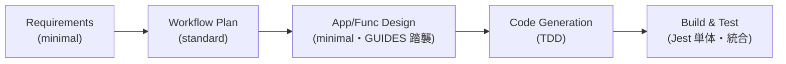

# ワークフロー計画 — ユニット `public-api-rest`

## 採用するステージと深度

Brownfield 継続。設計成果物（`docs/`）と先行ユニット `apps/api` の実装が既存のため、Inception は軽量に進める。Construction はコード生成と TDD に重心を置く。

## 対象（公開 REST API のエンドポイント）

正本は [features/05-public-api.md](../../../docs/service/features/05-public-api.md) §3。本ユニットは以下 6 エンドポイントを End-to-End に実装する（ベースパス `/api/public/v1`）。

| メソッド・パス | 必要スコープ | 受け入れ条件 |
| --- | --- | --- |
| `GET /me/profile` | `read` | AC-API-005 |
| `PUT /me/profile` | `full` | AC-API-009/010 |
| `PATCH /me/profile` | `full` | AC-API-008/009 |
| `DELETE /me/profile` | `full` | AC-API-010 |
| `GET /profiles/{handle}` | `read` | AC-API-006/007 |
| `GET /profiles` | `read` | AC-API-006・BR-API-007 |

横断機能: API キー認証（ハッシュ照合・`BR-API-001`）、スコープ認可（`read`/`full`・`BR-API-001b`）、共通エンベロープ（`BR-COMMON-011`）、例外写像（`BR-API-011`）、レート制限とヘッダ（`BR-API-008/009`）、OpenAPI/Swagger UI（`BR-API-012`）。

## クリーンアーキテクチャ層と本ユニットの実装要素

層の定義は [`clean-architecture` スキル](../../../.claude/skills/clean-architecture/SKILL.md)、本サービスの対応は [coding/01-architecture.md](../../../docs/GUIDES/coding/01-architecture.md) §2 を正本とする。本ユニットの配置:

| 層 | 実装要素（`apps/public-api/src/`） |
| --- | --- |
| Entities | `domain/`（`apps/api` から複製＋ `api-key`：スコープ・キー状態・ハッシュ規約） |
| Use Cases | `application/`（Gateway インターフェース＋公開 API 用ユースケース＝本人 CRUD・他者公開 Read・一覧） |
| Interface Adapters | `interface/rest/`（コントローラ・Presenter・ガード〔認証/スコープ〕・エンベロープ Interceptor・例外フィルタ・DTO・ValidationPipe）、`infrastructure/persistence/`（MikroORM リポジトリ＝Gateway 実装） |
| Frameworks & Drivers | `infrastructure/`（MikroORM 設定・エンティティ・ハッシュ・seed）、`config/`、`app.module.ts`、`main.ts`（Swagger・Throttler 結線） |
| Composition root | `app.module.ts` / `profile.module.ts` の `providers`（Gateway/実装をトークンで束ねる） |

## ドメイン共有方針（判断記録）

実効公開ゲート・入力検証・カーソル・エラー語彙などのドメインは `apps/api` と共通だが、**`apps/public-api` 内に複製する**（独立アプリ・別 Worker）。「別アプリ・別 Worker・別境界」（[api/00-overview.md](../../../docs/GUIDES/api/00-overview.md) §1）と pnpm-workspace（`apps/*` のみ）の方針に整合。経緯・トレードオフは [ADR 20260617-public-api-domain-duplication](../../../docs/adr/20260617-public-api-domain-duplication.md)。

## 範囲

- **対象**: 上記 6 エンドポイントと横断機能。API キーの認証・スコープ・レート制限・OpenAPI。
- **範囲外**:
  - API キーの**発行/失効 UI・ユースケース**（画面操作・再認証が必要。client/admin 側の後続ユニット、`BR-API-010`）。本ユニットでは認証に必要な `api_keys` の読み取り（ハッシュ照合・最終利用日時更新）と、ローカル検証用の seed のみを扱う。
  - アイコン画像アップロードと NSFW 判定（`BR-SAFE-001`・後続ユニット）。本ユニットの PUT/PATCH は `iconImageId` を扱わない。
  - 本番 Hono/Workers アダプタ・Durable Objects バックエンドの `ThrottlerStorage` 実装（[ADR DO](../../../docs/adr/20260604-public-api-rate-limit-durable-objects.md)）。ローカルはメモリストレージで同等のキー単位カウントを再現する。
  - アカウント認証フロー・Trust&Safety・管理者コンソール・コンテンツ配信・メール送信。

## 技術スタック（本ユニット）

[CLAUDE.md](../../../CLAUDE.md) の技術選定に従う。

- NestJS 11（クリーンアーキテクチャ・REST）
- MikroORM 7（SQLite ドライバ・ローカル）。本番 D1 は SQLite 互換のため同一スキーマ
- class-validator / class-transformer・ULID
- `@nestjs/throttler`（アプリ層レート制限・キー単位）
- `@nestjs/swagger`（OpenAPI / Swagger UI）
- API キーのハッシュは Node 標準 `node:crypto` の SHA-256（高エントロピー乱数キーのため適切・追加 npm 不要、`BR-API-001`）
- Jest + ts-jest（単体・統合）・Supertest（HTTP レベル統合）

> ローカル開発のランタイムは `@nestjs/platform-express`。本番の Hono/Workers アダプタと DO カウンタは後続ユニット（[coding/04-nestjs.md](../../../docs/GUIDES/coding/04-nestjs.md) §7・§6）。`main.ts` はランタイム差を Frameworks & Drivers に閉じ込め、Entities/Use Cases に持ち込まない。

## コミット分割（Trunk-Based Development・短命ブランチ `feature/public-api-rest`）

1. `chore`: AI-DLC inception ドキュメント＋ `apps/public-api` プロジェクト雛形
2. `feat`: ドメイン層（複製＋ `api-key`）＋単体テスト
3. `feat`: ユースケース層（Gateway・公開 API ユースケース）＋フェイクでの単体テスト
4. `feat`: MikroORM 永続化層（エンティティ〔`api_keys` 追加〕・リポジトリ・ハッシュ・設定・seed）
5. `feat`: REST 層（コントローラ・Presenter・ガード・Interceptor・フィルタ・DTO・Swagger）＋統合テスト
6. `feat`: アプリ起動（AppModule・main・Throttler・設定検証）
7. `docs`: GUIDES/README/CHANGELOG/CODEMAPS 更新
