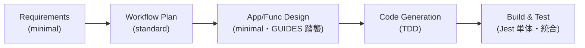

# ワークフロー計画 — ユニット `api-internal-profile`

## 採用するステージと深度

Brownfield かつ設計成果物（`docs/`）が既存のため、Inception は軽量に進める。Construction はコード生成と TDD に重心を置く。

## クリーンアーキテクチャ層と本ユニットの実装要素

層の定義は [`clean-architecture` スキル](../../../.claude/skills/clean-architecture/SKILL.md)、本サービスの対応は [coding/01-architecture.md](../../../docs/GUIDES/coding/01-architecture.md) §2 を正本とする。本ユニットの配置:

| 層 | 実装要素（`apps/api/src/`） |
| --- | --- |
| Entities | `domain/`（`user-status`・`effective-public`・`text`・`grapheme`・`handle`・`display-name`・`cursor`・`errors`） |
| Use Cases | `application/`（Gateway インターフェース＋プロフィール系ユースケース） |
| Interface Adapters | `interface/graphql/`（型・リゾルバ・DataLoader・例外フィルタ・ガード・バリデータ）、`infrastructure/persistence/`（MikroORM リポジトリ＝Gateway 実装） |
| Frameworks & Drivers | `infrastructure/`（MikroORM 設定・エンティティ）、`config/`、`app.module.ts`、`main.ts` |
| Composition root | `app.module.ts` の `providers`（Gateway/実装をトークンで束ねる） |

## 範囲

- **対象**: [requirements.md](../requirements/requirements.md) §2 の FR-1〜FR-8。
- **範囲外**: [requirements.md](../requirements/requirements.md) §4 の後続ユニット群。

## 技術スタック（本ユニット）

[CLAUDE.md](../../../CLAUDE.md) の技術選定に従う。

- NestJS 11（クリーンアーキテクチャ）/ Apollo Server（`@nestjs/apollo`・code-first）/ GraphQL
- MikroORM 6（SQLite ドライバ・ローカル）。本番 D1 は SQLite 互換のため同一スキーマ
- class-validator / class-transformer・DataLoader・ULID
- Jest + ts-jest（単体・統合）・Supertest（HTTP レベル統合）

> ローカル開発のランタイムは `@nestjs/platform-express`。本番の Hono/Workers アダプタは後続ユニット（[coding/04-nestjs.md](../../../docs/GUIDES/coding/04-nestjs.md) §7）。`main.ts` はランタイム差を Frameworks & Drivers に閉じ込め、Entities/Use Cases に持ち込まない。

## コミット分割（Trunk-Based Development・短命ブランチ）

1. `chore`: AI-DLC inception ドキュメント＋ `apps/api` プロジェクト雛形
2. `feat`: ドメイン層（純粋ロジック）＋単体テスト
3. `feat`: ユースケース層（Gateway・プロフィール系）＋フェイクでの単体テスト
4. `feat`: MikroORM 永続化層（エンティティ・リポジトリ・設定）
5. `feat`: GraphQL 層（型・リゾルバ・DataLoader・フィルタ・ガード）＋統合テスト
6. `feat`: アプリ起動（AppModule・main・設定検証・seed）
7. `docs`: GUIDES/README/CHANGELOG/CODEMAPS 更新
