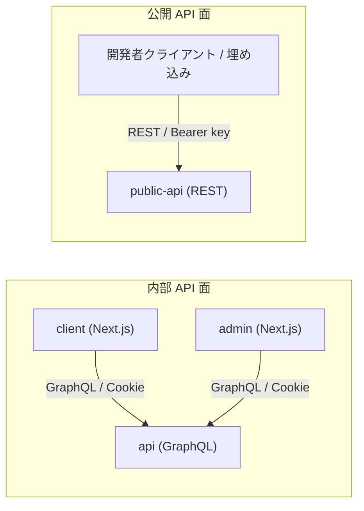

# API 設計概要・設計原則 — GenAI Profile Community

本サービスの API 全体方針と、内部 GraphQL API・公開 REST API を貫く設計原則を定義する。
各面の具体的な設計規約は [01-graphql-internal.md](./01-graphql-internal.md)（内部 GraphQL）・[02-public-rest-api.md](./02-public-rest-api.md)（公開 REST）、公開 API の使い方は [03-public-api-developer-guide.md](./03-public-api-developer-guide.md) を参照。

> **位置づけ**: 本ガイドは [docs/service/features/](../../service/features/)（ビジネスルールの正本 SSoT）と [CLAUDE.md](../../../CLAUDE.md)（技術選定）を、API の設計・実装観点へ落とし込んだものである。
> エンドポイント・キースコープ・しきい値・エラーコード・文字数などの**具体値は features/ が正本**であり、本ガイドは値を持たず参照する。矛盾した場合は features/ を優先して本ガイドを更新する。
> **現状フェーズ**: `apps/api` はプロフィール共有コアドメイン（User/Profile/SnsLink、ユニット `api-internal-profile`）を、`apps/public-api` は公開 REST API（ユニット `public-api-rest`：本人フル CRUD・他者公開分 Read・API キー認証・スコープ・レート制限・OpenAPI）を実装済み。アカウント認証フロー等の他ドメインは未実装で、本ガイドの該当箇所は実装に先行する設計仕様である。

## 1. API の全体方針（2 面の分離）

本サービスは目的の異なる 2 つの API を提供し、**別アプリ・別 Worker・別認証・別境界**として独立させる。

| 観点 | 内部 API（`apps/api`） | 公開 API（`apps/public-api`） |
| --- | --- | --- |
| プロトコル | GraphQL（Apollo Server） | REST |
| 消費者 | `client` / `admin`（Next.js） | 外部開発者・自サイト埋め込み |
| 認証 | 呼び出し元の Cookie セッションを引き継ぐ（`BR-COMMON-001`/`002`） | API キー `Authorization: Bearer`（`BR-API-001`） |
| 公開範囲 | 内部のみ（`client`/`admin` からのみ到達） | 外部公開（`/api/public/v1`） |
| ドキュメント | GraphQL Playground（dev/local 限定） | OpenAPI / Swagger UI（`BR-API-012`） |

> 経路・ドメイン分離・データストアへの接続は再掲しない。トポロジは [infra/01-network-architecture.md](../infra/01-network-architecture.md) §1、アプリ構成は [infra/00-overview.md](../infra/00-overview.md) §2 を正本とする。

## 2. 共通する設計原則

2 面に共通して守る設計の背骨。各原則は「方針の宣言」に徹し、しきい値・上限・列挙などの**具体値は正本へ参照**する。

### 2.1 検証は境界で・単一ルール

- 外部入力はすべてシステム境界でスキーマ検証してから処理する（`client` は Zod、`api`/`public-api` は class-validator / GraphQL スキーマ）。信頼しない（`BR-COMMON-008`）。
- 画面・内部 API・公開 API は**同一のビジネスルール**で検証する。公開 API がプロフィールを書き込む際の検証は画面と同じ（`BR-API-006`、各値は [02-profile.md](../../service/features/02-profile.md) `BR-PROF-*`）。
- 文字列の正規化（NFC・不可視文字除去・書記素単位の計数）はアプリ層で行い、DB は最終防衛線とする（`BR-COMMON-009`、[db/00-overview.md](../db/00-overview.md) §2.4・§5）。

### 2.2 認可の 2 モデル

| モデル | 適用面 | 概要 |
| --- | --- | --- |
| ロールベース | 内部 GraphQL（admin 操作） | 管理者の権限による制御（[07-admin-console.md](../../service/features/07-admin-console.md)） |
| 所有権ベース | 内部 GraphQL（自ユーザー）・公開 REST | 「そのリソースの所有者か」による制御（自ユーザー・全ユーザー） |
| スコープ | 公開 REST | API キーの `read`/`full` による操作制限（定義は `BR-API-001b`） |

- どの API がどのモデルかの対応のみを示す。スコープの定義値・許可操作は [02-public-rest-api.md](./02-public-rest-api.md) §5 と `BR-API-001b` を参照。

### 2.3 実効公開ゲートは API 層でも必ず評価する

- 「実効公開」の判定は内部 GraphQL・公開 REST の双方で必ず評価し、非公開・未確認・凍結・退会・不存在は一律 `404` 相当で秘匿する（他者分の存在・状態を漏らさない）。
- 判定式そのものは再掲しない。正本は `BR-COMMON-007`（[00-common-rules.md](../../service/features/00-common-rules.md) COMMON-3）。

### 2.4 エラーは一貫して写像する

- ドメイン例外を、各トランスポートの表現へ**対称に**写像する（GraphQL は `extensions.code`、REST は HTTP ステータス + 共通エンベロープ）。エラーコードの語彙は両面で一致させる。
- HTTP ステータスとコードの対応表の正本は `BR-API-011`（[05-public-api.md](../../service/features/05-public-api.md) §5）。本ガイドは写像の規約のみを扱い、数値表を再掲しない。
- 利用者向けメッセージは日本語・一般化（情報漏えい防止）とし、詳細は構造化ログへ（`BR-COMMON-012`）。

### 2.5 ページングはカーソル方式で統一する

- 一覧・検索は OFFSET を避けカーソルベースで統一する（[db/00-overview.md](../db/00-overview.md) §6、`BR-DISC-003`/`BR-API-007`）。
- 表現の写像のみ規定する: 内部 GraphQL は Connection（`edges`/`pageInfo`）、公開 REST は `meta.nextCursor`/`hasMore`。既定件数・最大件数は正本を参照する。

### 2.6 N+1 対策は内部 GraphQL 固有

- GraphQL の N+1 は DataLoader でバッチ化する。バッチ対象（Profile→SnsLink、一覧→アイコン解決）の正本は [infra/01-network-architecture.md](../infra/01-network-architecture.md) §5。
- 公開 REST は内部 GraphQL とは独立した境界であり、DataLoader の対象ではない。

### 2.7 観測性と秘匿

- 相関 ID を付与し、LogTape で構造化ログを出力する。エラーは握りつぶさず Sentry へ送る（[infra/03-logging-monitoring.md](../infra/03-logging-monitoring.md)）。
- ログ・エラー出力にパスワード・API キー秘匿値・Cookie 値・トークンを**出力しない**（`BR-COMMON-014`）。

### 2.8 レート制限は層を分けて実装する

- 公開 API のキー単位カウンタは Durable Objects で厳密に、認証系・通報系は KV で近似、未認証の一般閲覧はエッジ WAF のみで制限する。
- しきい値・多層図・カウンタ配置の正本は `BR-COMMON-010`・[infra/01-network-architecture.md](../infra/01-network-architecture.md) §3・[db/01-data-model.md](../db/01-data-model.md) §7。本ガイドは所在を示すのみで再掲しない。

## 3. バージョニング方針

実装着手前に、API の進化方針を設計原則として先行定義する。具体的な運用値（併走期間など）が必要になった時点で ADR 化する。

### 3.1 公開 REST API

- ベースパスにメジャーバージョンを含める**パスバージョニング**を採る（現行 `/api/public/v1`、[05-public-api.md](../../service/features/05-public-api.md) §3）。
- **非破壊変更**（任意フィールドの追加、新エンドポイントの追加、エラー詳細の拡充）は同一バージョン内で行い、バージョンを上げない。
- **破壊的変更**（フィールド削除・型変更・必須化・意味変更）が必要な場合は新メジャーバージョン（`v2`）を併走させ、旧バージョンには廃止予告を行う。廃止予告は `Deprecation` / `Sunset` ヘッダおよびドキュメント（Swagger UI・[03-public-api-developer-guide.md](./03-public-api-developer-guide.md)）で告知する。
- 併走期間・告知期間などの運用値は本サービス規模に応じて別途定め、確定時に ADR 化する。

### 3.2 内部 GraphQL API

- 内部 API は `client`/`admin` と同一リポジトリ・同時デプロイのため、URL のパスバージョンは切らない。
- スキーマは進化させる: フィールド・型の**追加は非破壊**として随時行い、廃止予定の要素には `@deprecated`（理由付き）を付けて段階的に除去する。
- 破壊的変更は消費側（`client`/`admin`）の追従とセットで行い、`@deprecated` 期間を経てから削除する。

## 4. 関連ドキュメント

- 内部 GraphQL API 設計規約: [01-graphql-internal.md](./01-graphql-internal.md)
- 公開 REST API 設計規約: [02-public-rest-api.md](./02-public-rest-api.md)
- 公開 API 開発者向け利用ガイド: [03-public-api-developer-guide.md](./03-public-api-developer-guide.md)
- 横断ビジネスルールの正本: [00-common-rules.md](../../service/features/00-common-rules.md)
- 公開 API 仕様の正本: [05-public-api.md](../../service/features/05-public-api.md)
- ネットワーク経路・レート制限多層・内部通信: [infra/01-network-architecture.md](../infra/01-network-architecture.md)
- データモデル（`api_keys`・インデックス・KV/DO 配置）: [db/01-data-model.md](../db/01-data-model.md)
