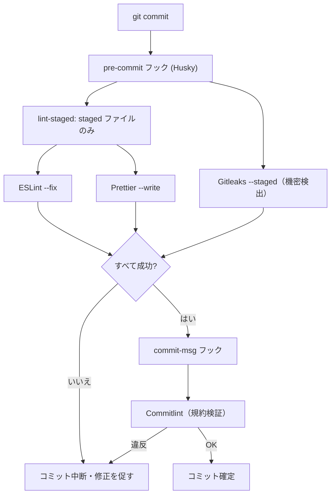

# 静的解析・整形・コミット規約 — GenAI Profile Community

ESLint・Prettier による静的解析/整形、Husky + lint-staged による pre-commit、Commitlint・Gitleaks/TruffleHog による品質ゲートを定義する。
原則は [00-overview.md](./00-overview.md)、アーキテクチャは [01-architecture.md](./01-architecture.md) を参照。

> **位置づけ**: 本ガイドは [CLAUDE.md](../../../CLAUDE.md)（ツール選定）と [ecc-common/git-workflow.md](../../../.claude/rules/ecc-common/git-workflow.md)・[ecc-web/hooks.md](../../../.claude/rules/ecc-web/hooks.md) を、本サービスの運用へ具体化したものである。
> **現状フェーズ**: `apps/` 配下・各設定ファイルは未実装で、本ガイドは実装に先行する設定方針である。確定した設定値（ルール詳細）は実装時に設定ファイル側を正本とし、本ガイドには方針を記す。

## 1. ツール全体像

| 目的 | ツール | 実行契機 |
| --- | --- | --- |
| 静的解析（バグ・規約） | **ESLint**（Flat Config / TypeScript ESLint） | エディタ保存時・pre-commit（staged）・CI |
| コード整形 | **Prettier**（+ `prettier-plugin-tailwindcss`） | エディタ保存時・pre-commit（staged）・CI |
| Tailwind クラス名の妥当性検証 | **eslint-plugin-tailwindcss**（`recommended`、並び順ルール `classnames-order` のみ無効化） | エディタ保存時・pre-commit（staged）・CI |
| ESLint と Prettier の責務分離 | **eslint-config-prettier** | ESLint 設定に組み込み |
| pre-commit 実行基盤 | **Husky** | `git commit` / `git push` フック |
| staged ファイルのみ整形/解析 | **lint-staged** | pre-commit |
| コミットメッセージ規約 | **Commitlint** | `commit-msg` フック |
| 機密情報の混入防止 | **Gitleaks**（`--staged`）/ **TruffleHog**（CI） | pre-commit / CI |

> CSS 専用 Linter（**Stylelint**）は採用しない（§3）。テストツール（Jest/RTL/Playwright 等）は [docs/GUIDES/testing/](../testing/) を参照。

## 2. ESLint（Flat Config）

- **最新バージョン**（[CLAUDE.md](../../../CLAUDE.md)）に合わせ、**Flat Config（`eslint.config.js`）** を採用する。レガシーな `.eslintrc` 形式は用いない。
- モノレポ**ルートに共通設定**を置き、各アプリで上書きする。最低限の構成:
  - `typescript-eslint`（型情報を用いた解析）を全アプリ共通の基盤にする。
  - `client`/`admin`（Next.js）: `eslint-plugin-react` / `eslint-plugin-react-hooks` / `eslint-plugin-jsx-a11y`、および Next.js 推奨ルール。フックの依存配列・Server/Client 境界・アクセシビリティ違反を検出する。
  - `api`/`public-api`（NestJS）: Node 指向のルール。デコレータ・DI と相性の良い設定にする。
  - import 順序・未使用 import の整理ルールを共通で有効化する。
- **整形系ルールは ESLint で持たない**（§4）。ESLint は「正しさ・規約」、Prettier は「見た目」と責務を分ける。
- ルール違反は**警告ではなくエラー**を基本とし、CI で落とす（`--max-warnings=0`）。

## 3. Stylelint を採用しない（決定）

- 本サービスのスタイリングは **Tailwind CSS 主体**で、素の CSS はデザイントークン（`tokens.css`）・`global.css` など限定的（[ecc-web/coding-style.md](../../../.claude/rules/ecc-web/coding-style.md)・[01-architecture.md](./01-architecture.md) §3.3）。
- CSS の整形は **Prettier**（`prettier-plugin-tailwindcss` でユーティリティクラスを規約順に整列）が担い、ロジック面は ESLint（`jsx-a11y` 含む）と TypeScript が担う。Stylelint を追加すると設定・運用コストが増え、Tailwind 主体の構成では重複が大きい。
- **クラス名自体の妥当性**（Tailwind に存在しないクラス名・タイポ、矛盾するクラスの併用）は Stylelint の代替ではなく **`eslint-plugin-tailwindcss`**（`tailwindcss/no-custom-classname`・`tailwindcss/no-contradicting-classname`）が担う。並び順（`tailwindcss/classnames-order`）は `prettier-plugin-tailwindcss` と責務が重複するため無効化している（§4）。
- 以上より、**個人開発向けの低コスト方針**（[CLAUDE.md](../../../CLAUDE.md)）に沿って Stylelint は採用しない。将来、素の CSS の比重が増えた場合は `stylelint-config-tailwindcss` 併用での再検討余地を残す（必要時に ADR 化）。

> **既知の限界**: `tailwindcss/no-custom-classname` は `class`/`className` 属性のリテラル文字列と、`cn`/`cva` 等の関数呼び出し引数のみを解析対象とする。`const FIELD = '...'` のようにクラス文字列を変数へ切り出し、`className={FIELD}` の形で参照する書き方は検知対象外になる（`apps/admin/src/components/content/*.tsx` に実例あり）。タイポ検知の恩恵を受けるには、クラス文字列は `className` に直接記述するか `cn()` でラップすることを推奨する。
> また `tailwindcss/no-contradicting-classname` は `divide-*`（子要素の区切り線）と `border-*`（要素自体の枠線）の組み合わせを誤って「矛盾」と判定する既知の誤検知がある。実際には競合しないため、該当箇所は無視して構わない。

## 4. Prettier と責務分離

- **Prettier** を唯一の整形ツールとする。`.ts`/`.tsx`/`.js`/`.json`/`.css`/`.md` を対象にする。
- `prettier-plugin-tailwindcss` を導入し、Tailwind ユーティリティクラスを規約順に自動整列する。
- **eslint-config-prettier** を ESLint 設定の最後に適用し、Prettier と競合する整形系 ESLint ルールを無効化する。整形は Prettier、解析は ESLint と明確に分ける（`eslint-plugin-prettier` で ESLint 経由の整形は行わず、Prettier を独立実行する）。

## 5. pre-commit（Husky + lint-staged）

`.husky/` にフックを定義し、**staged ファイルのみ**を対象に高速に走らせる（[ecc-web/hooks.md](../../../.claude/rules/ecc-web/hooks.md)）。



- **lint-staged**: staged の対象ファイルに `eslint --fix` と `prettier --write` を適用する。整形・自動修正後に再ステージしてコミットする。
- **Gitleaks**: `--staged` オプションで、コミット前に staged 差分の秘匿情報（API キー・トークン等）を検出してブロックする（[ecc-common/security.md](../../../.claude/rules/ecc-common/security.md)）。
- **型チェック**は pre-commit では必須にしない（差分外の型エラーで開発を阻害しないため）。エディタの保存時フックや CI で担保する。任意で導入する場合は `--incremental` + `timeout` で暴走を防ぐ（[ecc-web/hooks.md](../../../.claude/rules/ecc-web/hooks.md) Type Check）。

## 6. コミットメッセージ規約（Commitlint）

- **Conventional Commits** に従う（[ecc-common/git-workflow.md](../../../.claude/rules/ecc-common/git-workflow.md)）。`commit-msg` フックで **Commitlint** が検証する。

```
<type>: <description>

<optional body>
```

- `type` は次を用いる: `feat` / `fix` / `refactor` / `docs` / `test` / `chore` / `perf` / `ci`。
- **説明（description）・本文は日本語**で記述する（[CLAUDE.md](../../../CLAUDE.md) 作業ルール）。
- `apps/` 配下を変更したコミットは、`docs/` の関連ドキュメント・README の更新も同一の作業単位に含める（[CLAUDE.md](../../../CLAUDE.md)）。

> Git ワークフローは **Trunk-Based Development**（[CLAUDE.md](../../../CLAUDE.md)）。`main` への push で dev 自動デプロイ、`git tag` で prod デプロイ（人間のみ）。詳細は [infra/02-deployment.md](../infra/02-deployment.md)。

## 7. CI 品質ゲート

`main` への push をトリガーに GitHub Actions / Workers Builds でパイプラインを実行する（[CLAUDE.md](../../../CLAUDE.md)・[infra/02-deployment.md](../infra/02-deployment.md)）。本ガイドが定めるコード品質ステージの推奨順序:

1. 依存インストール（`pnpm install`）
2. 整形チェック（`prettier --check`）
3. 静的解析（`eslint`、警告ゼロ）
4. 型チェック（`tsc --noEmit`）
5. テスト（単体・統合。カバレッジ 80% 未満は失敗、[testing/00-overview.md](../testing/00-overview.md)）
6. ビルド（各アプリ）
7. **TruffleHog**（機密情報の検出、[CLAUDE.md](../../../CLAUDE.md)）

- いずれかが失敗した場合、後続ステージとデプロイを実行しない。
- E2E（Playwright）の実行範囲・契機は [testing/02-e2e.md](../testing/02-e2e.md) を参照。

## 8. エディタ統合（任意）

- 保存時に Prettier 整形・ESLint `--fix` を走らせる設定を推奨する（[ecc-web/hooks.md](../../../.claude/rules/ecc-web/hooks.md) Format on Save / Lint Check）。フックはリポジトリ所有の依存（`pnpm` 経由）を用い、リモートの一回限りパッケージ実行に依存しない。

## 9. 関連ドキュメント

- コーディング原則: [00-overview.md](./00-overview.md)
- アーキテクチャ設計: [01-architecture.md](./01-architecture.md)
- テスト方針・カバレッジ: [docs/GUIDES/testing/](../testing/)
- Git ワークフロー・コミット規約の一次情報: [ecc-common/git-workflow.md](../../../.claude/rules/ecc-common/git-workflow.md)
- フック推奨設定: [ecc-web/hooks.md](../../../.claude/rules/ecc-web/hooks.md)
- デプロイ・CI/CD: [infra/02-deployment.md](../infra/02-deployment.md)
- 技術選定の正本: [CLAUDE.md](../../../CLAUDE.md)
