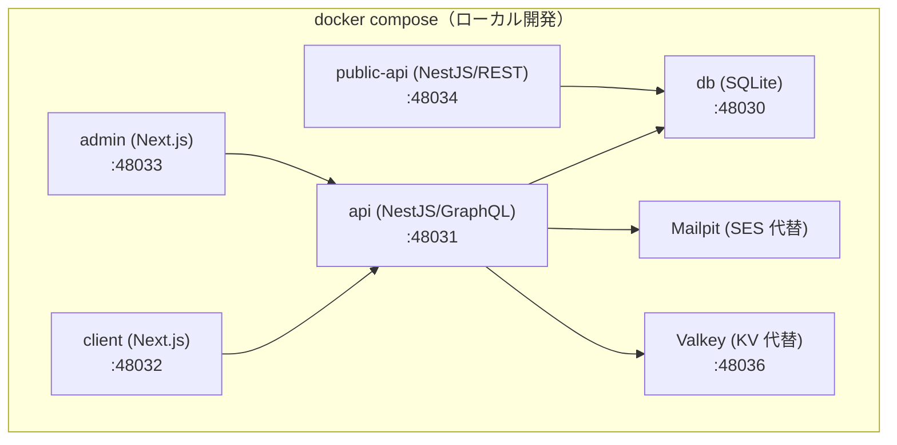

# Docker コーディング・構成ルール — GenAI Profile Community

ローカル開発で用いる Docker / compose の構成・記述規約を定義する。
全体方針は [00-overview.md](./00-overview.md)、アーキテクチャは [01-architecture.md](./01-architecture.md) を参照。

> **位置づけ**: 本ガイドは [CLAUDE.md](../../../CLAUDE.md)（コンテナ＝Docker `node@trixie-slim`・`Dockerfile`・`compose.yaml`・ポート定義）と [infra/00-overview.md](../infra/00-overview.md) §5・[infra/02-deployment.md](../infra/02-deployment.md) §4.1 を、コンテナ記述の観点へ具体化したものである。
> ポート番号・アプリ構成の正本は [CLAUDE.md](../../../CLAUDE.md)・[infra/00-overview.md](../infra/00-overview.md) §2。
> **現状フェーズ**: ルート `Dockerfile`・`compose.yaml`・各アプリの `apps/<app>/Dockerfile`（db/api/client/admin/public-api）はローカル開発用に整備済み。ルートのワークスペース定義（`package.json` / `pnpm-workspace.yaml` / `pnpm-lock.yaml`）と `apps/db` の最小 dev サーバー（healthcheck 用にポート 48030 を開く常駐プロセス。MikroORM・スキーマは未実装）も整備済みで、`docker compose up -d db` は healthy になる。`apps/api`・`apps/client`・`apps/admin`・`apps/public-api` の実装は未着手のため、これらの実起動はアプリ整備後に有効になる。

## 1. Docker の位置づけ（重要）

- **Docker はローカル開発専用**である。本番ランタイムは **Cloudflare Workers（サーバーレス）** であり、**コンテナをデプロイしない**（[infra/00-overview.md](../infra/00-overview.md) §1・§4）。
- したがって Dockerfile は「本番イメージの最適化」ではなく「再現性のあるローカル開発環境」を目的に記述する。本番相当の検証は `wrangler`／Workers ローカルエミュレーションで補う（[infra/02-deployment.md](../infra/02-deployment.md)）。
- コンテナの 2 つの役割（[CLAUDE.md](../../../CLAUDE.md) ディレクトリ構成）:
  - **ルート `Dockerfile`**: npm パッケージ等をグローバルインストールする共通コンテナ（pnpm / Terraform / wrangler のツールチェーン）。`compose.yaml` では常駐サービス `root` として定義し、`docker compose exec root <cmd>` で利用する。
  - **各アプリのコンテナ**: `apps/<app>/Dockerfile` で定義し、ルート `compose.yaml` から `build.dockerfile` で参照してポートを割り当てる（下表）。



> ポートの正本は [CLAUDE.md](../../../CLAUDE.md)。ローカルでは D1→SQLite、SES→Mailpit、Cloudflare Images→ローカル配信、KV→Valkey に置き換える（[infra/00-overview.md](../infra/00-overview.md) §5）。

## 2. ベースイメージ

- ベースは **`node:26.3-trixie-slim`**（Debian trixie ベースの Node、[CLAUDE.md](../../../CLAUDE.md)）。**タグを固定**し、再現性のためメジャー/マイナーを明示する。`latest` を使わない。
- 同一のベース・同一のロックファイルで全アプリをそろえ、環境差を最小化する。
- パッケージマネージャは **pnpm**。各コンテナで **`npm install -g pnpm@<version>`** によりグローバルインストールし、バージョンは `Dockerfile` の `ARG PNPM_VERSION` で固定する（build-arg で上書き可）。
- ルートのツールチェーンコンテナには pnpm に加え **Terraform**・**wrangler** をグローバルインストールする（バージョンは `ARG TERRAFORM_VERSION` / `ARG WRANGLER_VERSION` で固定）。Terraform は npm 外の単一バイナリのため、公式リリースの固定バージョンを取得して `/usr/local/bin` に配置する（`ARG TARGETARCH` で amd64/arm64 を解決）。
- **git** はコンテナ内での Git 操作（husky・コミット・各種ツール連携）に用いるため、ルートのツールチェーンコンテナに導入する。

## 3. Dockerfile の記述規約

- **ローカル開発コンテナはバインドマウント前提の単段イメージ**とする: イメージには root（Node + グローバル `pnpm`）のみを用意し、ソースは `compose.yaml` のバインドマウントで供給する。依存は起動時にコンテナ内で `pnpm install` する（`command` 参照）。`node_modules` はホストと混ぜず名前付きボリュームで隔離する。
- **`.dockerignore`** を必ず用意し、`.git` / `node_modules` / `.env*` / ビルド成果物 / テスト成果物を除外する（イメージ肥大化と秘匿情報混入の防止）。
- 将来、成果物を**イメージに焼き込む**場合は、`package.json` / `pnpm-lock.yaml` / `pnpm-workspace.yaml` を先に `COPY` して依存を入れてからソースを `COPY` し（レイヤキャッシュを活かす）、**マルチステージビルド**でビルド専用依存を最終段に持ち込まない。
- 可能な範囲で**非 root ユーザー**で実行する（`node` ユーザー）。
- **シークレットをイメージに焼き込まない**。ビルド引数・環境変数経由で秘匿値を渡さない（§6）。

## 4. compose の記述規約

- **1 アプリ = 1 サービス**として定義し、ポートは [CLAUDE.md](../../../CLAUDE.md) の割り当て（48030〜48034）に厳密に一致させる。
- 依存関係は `depends_on` と**ヘルスチェック**で表現し、起動順序の取り違えを防ぐ（例: `api` は `db` の healthy を待つ）。
- `node_modules` はホストと混ぜず**アプリごとの名前付きボリューム**に隔離する。pnpm パッケージインストール後のビルド許可は各アプリ直下の `pnpm-workspace.yaml`（§3）で与える。
- ツールチェーンの `root` サービスのみリポジトリ全体（`.:/workspace`）をマウントする（pnpm ワークスペース全体・Terraform・wrangler のため）。
- **共通フロントエンド（`apps/frontend-lib`）を `client` / `admin` コンテナ内の `/workspace/lib` にマウント**する。各アプリの `pnpm-workspace.yaml`（`packages: ['.', 'lib']`、[admin](../../../apps/admin/pnpm-workspace.yaml) / [client](../../../apps/client/pnpm-workspace.yaml)）がこの `lib` をワークスペースの一員として取り込み、`@app/frontend-lib`（`workspace:*`）を解決する。狙いは、ホスト側のコード・`tsconfig`・`next.config` を変えずにコンテナ内だけで共通ライブラリを参照できるようにすること。ホストには `lib` を置かないので、ホスト側ではこの `lib` 指定は対象なしとして無視されるだけで問題ない。`node_modules` は専用ボリューム（`frontend_lib_node_modules`）でホスト側と隔離する。
- **Mailpit** を SES 代替サービスとして、**Valkey** を Cloudflare KV 代替サービスとして compose に含める。SQLite・Valkey はいずれも名前付きボリュームで永続化する。
- **SQLite はファイルベースでネットワークの「接続先サーバー」を持たない**。そのため `db` の SQLite 実体を格納するホスト側ディレクトリ `apps/db/.db-data`（バインドマウント、`.gitignore` 対象）を、`db` / `api` / `public-api` の各コンテナへ**同一パス `/workspace/.db-data` で共有マウント**し、`DATABASE_URL=file:/workspace/.db-data/local.sqlite`（`.env`）で同じ実体を参照する。名前付きボリュームではなくホスト側ディレクトリに直接配置することで、DB データをコンテナのライフサイクルから独立させ、ホストから直接参照・バックアップできるようにする。ディレクトリの所有権は最初に起動するコンテナ（`db`。`api`/`public-api` は `db` の healthy を待つ）の `/workspace/.db-data` から初期化されるため、`db` イメージで同ディレクトリを `node` 所有で用意し、`node` ユーザーの `api`/`public-api` が SQLite を生成・書き込みできるようにする（EACCES 回避）。
- **コンテナ間の HTTP 接続はサービス名で名前解決する**。compose のデフォルトネットワークでは各コンテナ内の `localhost` はそのコンテナ自身を指すため、`client` / `admin`（Next.js のサーバー側 BFF）から内部 GraphQL API へは `localhost:48031` ではなく **api サービス名で `http://api:48031/graphql`** に接続する。この URL は両サービスの `environment.API_GRAPHQL_URL` で与える（未設定時はホスト直起動向けに `http://localhost:48031/graphql` へフォールバックする）。`<<: *app-defaults` の `environment` は YAML マージキーでは丸ごと上書きされるため、各サービス側で `NODE_ENV` も再掲する。
- **`client` / `admin` の Next.js テレメトリは収集不要**なため、両サービスの `environment.NEXT_TELEMETRY_DISABLED: "1"` で無効化する。デプロイ先（Cloudflare Workers）でも同様に、各アプリの `wrangler.jsonc` の `env.dev.vars` / `env.production.vars` に同じ値を設定する。
- 環境変数は `.env`（リポジトリ管理外）から読み込む。`.env.example` のみコミットし、実値はコミットしない（§6）。
- ポート・依存などの共通部分は重複を避け、YAML アンカー等で集約する（DRY、[00-overview.md](./00-overview.md) §2）。`volumes` はサービスごとにマウント構成が異なるため共通化せず、各サービスで個別に定義する。

## 5. 起動・操作コマンド

ルート（`compose.yaml` のある階層）で実行する。`apps/db` は最小 dev サーバーが整備済みで `docker compose up -d db` は healthy になる。`apps/api`・`apps/client`・`apps/admin`・`apps/public-api` の実装が整う前はこれらの実起動はできないが、`build`・`config`・`root` 経由の操作は利用できる。簡易クイックスタートは [infra/02-deployment.md](../infra/02-deployment.md) §4.1・[onboardings/README.md](../../onboardings/README.md) §3 にもある。

### 5.1 起動・停止

```bash
# 初回のみ: .env を用意（実値はコミットしない。§6）
cp .env.example .env

# イメージをビルド（Dockerfile 変更時。ツールのバージョンを上書きする例も可）
docker compose build
# 例: Terraform/pnpm のバージョンを build-arg で固定して再ビルド
# docker compose build --build-arg TERRAFORM_VERSION=1.15.6 --build-arg PNPM_VERSION=11.8 root

# 全サービスを起動（バックグラウンド）
# db:48030 / api:48031 / client:48032 / admin:48033 / public-api:48034 / Mailpit Web UI:48035 / Valkey:48036
docker compose up -d

# 特定サービスのみ起動（依存も解決される。例: api と db のみ）
docker compose up -d api

# 停止（コンテナ削除。名前付きボリューム=DB/メール/Valkey は保持）
docker compose down

# 停止＋ボリュームも削除（ローカル SQLite・Mailpit・Valkey のデータを破棄）
docker compose down -v
```

### 5.2 状態確認・ログ

```bash
# サービスの稼働状況とヘルスチェック状態
docker compose ps
# ログ追従（全体／特定サービス）
docker compose logs -f
docker compose logs -f api
# compose 定義の検証（構文・参照・アンカー継承の確認。実起動しない）
docker compose config
```

### 5.3 root コンテナでのコマンド実行（pnpm / Terraform / wrangler / git）

```bash
# 依存インストール（pnpm ワークスペース）
docker compose run --rm root pnpm install
# ローカル SQLite へマイグレーション適用
docker compose run --rm root pnpm --filter @app/db migration:up
# Terraform / wrangler / git（常駐させている場合は exec も可）
docker compose exec root terraform -version
docker compose exec root wrangler --version
docker compose exec root git --version
```

> `run --rm` は都度コンテナを使い捨てるため CI・単発操作向き。`exec` は起動済みの常駐 `root` に入って実行する（`docker compose up -d root` で常駐させてから使う）。

## 6. セキュリティ・秘匿

- `.env` / 認証情報 / 鍵をイメージ・リポジトリに含めない（`BR-COMMON-014`、[ecc-common/security.md](../../../.claude/rules/ecc-common/security.md)）。pre-commit の Gitleaks（`--staged`）・CI の TruffleHog で多重防御する（[02-lint-format-commit.md](./02-lint-format-commit.md) §7）。
- ベースイメージ・依存をバージョン固定し、既知脆弱性の再現性を保つ。
- ローカルのシークレットは `.env` に留め、dev/prod は **Wrangler Secrets / GitHub Actions Secrets** を正本とする（[infra/02-deployment.md](../infra/02-deployment.md) §6）。Docker 経由で本番シークレットを扱わない。

## 7. 関連ドキュメント

- コーディング原則: [00-overview.md](./00-overview.md)
- アーキテクチャ（アプリ境界・モノレポ）: [01-architecture.md](./01-architecture.md)
- 整形・コミット・CI 品質ゲート: [02-lint-format-commit.md](./02-lint-format-commit.md)
- インフラ全体像・ローカル環境・ポート: [infra/00-overview.md](../infra/00-overview.md)
- デプロイ・環境別手順（local/dev/prod）: [infra/02-deployment.md](../infra/02-deployment.md)
- 技術選定・コンテナ方針の正本: [CLAUDE.md](../../../CLAUDE.md)
