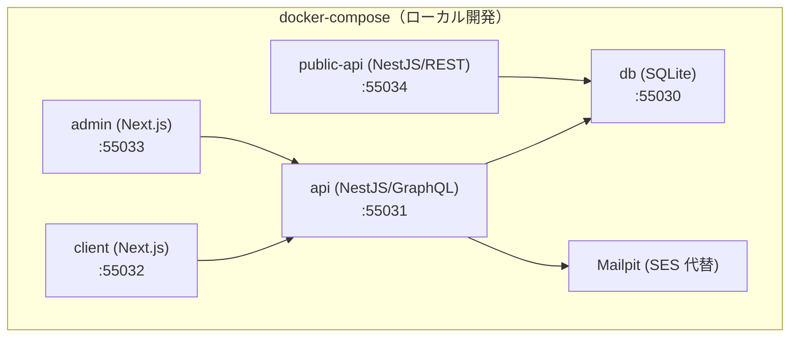

# Docker コーディング・構成ルール — GenAI Profile Community

ローカル開発で用いる Docker / docker-compose の構成・記述規約を定義する。
全体方針は [00-overview.md](./00-overview.md)、アーキテクチャは [01-architecture.md](./01-architecture.md) を参照。

> **位置づけ**: 本ガイドは [CLAUDE.md](../../../CLAUDE.md)（コンテナ＝Docker `node@trixie`・`Dockerfile`・`docker-compose.yaml`・ポート定義）と [infra/00-overview.md](../infra/00-overview.md) §5・[infra/02-deployment.md](../infra/02-deployment.md) §4.1 を、コンテナ記述の観点へ具体化したものである。
> ポート番号・アプリ構成の正本は [CLAUDE.md](../../../CLAUDE.md)・[infra/00-overview.md](../infra/00-overview.md) §2。
> **現状フェーズ**: `Dockerfile`・`docker-compose.yaml`・`apps/` 配下は未実装で、本ガイドは実装に先行する設定方針である。

## 1. Docker の位置づけ（重要）

- **Docker はローカル開発専用**である。本番ランタイムは **Cloudflare Workers（サーバーレス）** であり、**コンテナをデプロイしない**（[infra/00-overview.md](../infra/00-overview.md) §1・§4）。
- したがって Dockerfile は「本番イメージの最適化」ではなく「再現性のあるローカル開発環境」を目的に記述する。本番相当の検証は `wrangler`／Workers ローカルエミュレーションで補う（[infra/02-deployment.md](../infra/02-deployment.md)）。
- コンテナの 2 つの役割（[CLAUDE.md](../../../CLAUDE.md) ディレクトリ構成）:
  - **ルート `Dockerfile`**: npm パッケージ等をグローバルインストールする共通コンテナ（pnpm/wrangler 等のツールチェーン）。
  - **各アプリのコンテナ**: `docker-compose.yaml` で定義し、ポートを割り当てる（下表）。

> ポートの正本は [CLAUDE.md](../../../CLAUDE.md)。ローカルでは D1→SQLite、SES→Mailpit、Cloudflare Images→ローカル配信に置き換える（[infra/00-overview.md](../infra/00-overview.md) §5）。

## 2. ベースイメージ

- ベースは **`node@trixie`**（Debian trixie ベースの Node、[CLAUDE.md](../../../CLAUDE.md)）。**タグを固定**し、再現性のためメジャー/マイナーを明示する（`node:<version>-trixie` 等）。`latest` を使わない。
- 同一のベース・同一のロックファイルで全アプリをそろえ、環境差を最小化する。
- パッケージマネージャは **pnpm**。`corepack enable` で pnpm を有効化し、バージョンを固定する（[CLAUDE.md](../../../CLAUDE.md)）。

## 3. Dockerfile の記述規約

- **レイヤキャッシュを活かす順序**にする: 先に `package.json` / `pnpm-lock.yaml` / `pnpm-workspace.yaml` をコピーして依存をインストールし、その後にソースをコピーする。ソース変更のたびに依存を再インストールしない。
- 依存インストールは**ロックファイル固定**（`pnpm install --frozen-lockfile`）で決定的にする。
- **`.dockerignore`** を必ず用意し、`.git` / `node_modules` / `.env*` / ビルド成果物 / テスト成果物を除外する（イメージ肥大化と秘匿情報混入の防止）。
- **マルチステージビルド**を用い、ビルド専用の依存を最終段に持ち込まない（ローカル用途でも層を小さく保つ）。
- 可能な範囲で**非 root ユーザー**で実行する（`node` ユーザー）。
- **シークレットをイメージに焼き込まない**。ビルド引数・環境変数経由で秘匿値を渡さない（§5）。

## 4. docker-compose の記述規約

- **1 アプリ = 1 サービス**として定義し、ポートは [CLAUDE.md](../../../CLAUDE.md) の割り当て（55030〜55034）に厳密に一致させる。
- 依存関係は `depends_on` と**ヘルスチェック**で表現し、起動順序の取り違えを防ぐ（例: `api` は `db` の healthy を待つ）。
- ソースは**バインドマウント**でホットリロードを効かせる。`node_modules` はホストと混ぜず、名前付きボリューム等でコンテナ側に隔離する（OS 差・ネイティブ依存の不整合を避ける）。
- **Mailpit** を SES 代替サービスとして compose に含める。SQLite はファイル/ボリュームで永続化する。
- 環境変数は `.env`（リポジトリ管理外）から読み込む。`.env.example` のみコミットし、実値はコミットしない（§5）。
- ポート・依存・ボリュームの定義は重複を避け、共通部分は YAML アンカー等で集約する（DRY、[00-overview.md](./00-overview.md) §2）。

## 5. セキュリティ・秘匿

- `.env` / 認証情報 / 鍵をイメージ・リポジトリに含めない（`BR-COMMON-014`、[ecc-common/security.md](../../../.claude/rules/ecc-common/security.md)）。pre-commit の Gitleaks（`--staged`）・CI の TruffleHog で多重防御する（[02-lint-format-commit.md](./02-lint-format-commit.md) §7）。
- ベースイメージ・依存をバージョン固定し、既知脆弱性の再現性を保つ。
- ローカルのシークレットは `.env` に留め、dev/prod は **Wrangler Secrets / GitHub Actions Secrets** を正本とする（[infra/02-deployment.md](../infra/02-deployment.md) §6）。Docker 経由で本番シークレットを扱わない。

## 6. 関連ドキュメント

- コーディング原則: [00-overview.md](./00-overview.md)
- アーキテクチャ（アプリ境界・モノレポ）: [01-architecture.md](./01-architecture.md)
- 整形・コミット・CI 品質ゲート: [02-lint-format-commit.md](./02-lint-format-commit.md)
- インフラ全体像・ローカル環境・ポート: [infra/00-overview.md](../infra/00-overview.md)
- デプロイ・環境別手順（local/dev/prod）: [infra/02-deployment.md](../infra/02-deployment.md)
- 技術選定・コンテナ方針の正本: [CLAUDE.md](../../../CLAUDE.md)
