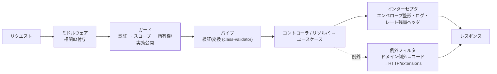

# NestJS コーディングルール — GenAI Profile Community

バックエンド（`apps/api`＝内部 GraphQL、`apps/public-api`＝公開 REST）の NestJS 実装規約を定義する。
原則は [00-overview.md](./00-overview.md)、層構造は [01-architecture.md](./01-architecture.md) §2、API 設計規約は [docs/GUIDES/api/](../api/) を参照。

> **位置づけ**: 本ガイドは [CLAUDE.md](../../../CLAUDE.md)（NestJS クリーンアーキテクチャ・Hono アダプタ・Apollo Server・class-validator/transformer・@nestjs/throttler・DataLoader）と [01-architecture.md](./01-architecture.md) §2 を、NestJS の実装観点へ具体化したものである。クリーンアーキテクチャの概念・層・依存性ルール・実装パターンは [`clean-architecture` スキル](../../../.claude/skills/clean-architecture/SKILL.md) を正本とし、本ガイドでは再掲しない。
> エラーコード・スコープ・しきい値・文字数などの**業務具体値は features/ が正本**であり、本ガイドは値を持たず参照する。API の設計規約は [api/01-graphql-internal.md](../api/01-graphql-internal.md)・[api/02-public-rest-api.md](../api/02-public-rest-api.md) が担う。
> **現状フェーズ**: `apps/api` はプロフィール共有コアドメイン（ユニット `api-internal-profile`）を本規約に沿って実装済み（[CODEMAPS/api.md](../../CODEMAPS/api.md)）。`apps/public-api` および `apps/api` の他ドメインは未実装で、本ガイドの該当箇所は実装に先行する規約である。

## 1. モジュール構成とクリーンアーキテクチャの層

- **機能（ドメイン）単位でモジュールを分割**する。1 モジュール 1 ドメイン領域（User/Profile/SnsLink/ApiKey/Report/Admin 等、[features/README.md](../../service/features/README.md) のエンティティに対応）。
- モジュール内は**クリーンアーキテクチャの層**に対応づける。層の定義・依存性ルールは [`clean-architecture` スキル](../../../.claude/skills/clean-architecture/SKILL.md)、本サービスの層と要素の対応は [01-architecture.md](./01-architecture.md) §2.1 を正本とする。本ガイドは **NestJS の構成要素がどの層に属するか**のみを補足する（依存方向は内向き）。

| NestJS の構成要素 | 属する層 | 規約 |
| --- | --- | --- |
| リゾルバ（`api`）/ コントローラ（`public-api`） | Interface Adapters（Controller） | 薄く保ち、業務ロジックを置かない（§3） |
| 結果の整形 | Interface Adapters（Presenter） | Output Boundary を実装し ViewModel/エンベロープへ変換（§4.3） |
| ガード・パイプ・インターセプタ・フィルタ | Interface Adapters（横断） | 認可・検証・整形・例外写像を集約（§4） |
| `@Injectable()` のアプリケーションサービス | Use Cases（Interactor） | Gateway・Input/Output Boundary を宣言、トランザクション境界 |
| エンティティ・値オブジェクト | Entities | NestJS/MikroORM/Cloudflare を import しない |
| リポジトリ・外部アダプタ実装（R2/Images/SES/Rekognition/KV/DO） | Interface Adapters（Gateway 実装） | Use Case 層の Gateway を実装し DI で束ねる |
| NestJS・Hono・Apollo Server・MikroORM・各 SDK | Frameworks & Drivers | 設定・結線が中心。内側へ漏らさない |

## 2. 依存性注入（DI）

- 依存は**コンストラクタ注入**で受け取る。Use Cases / Entities は**Gateway・Boundary（インターフェース）に依存**し、具体実装に依存しない（依存性逆転、[01-architecture.md](./01-architecture.md) §2.2）。
- インターフェースは TypeScript の型のため、**プロバイダトークン**（`InjectionToken`／`Symbol`／文字列）で Gateway/Boundary と実装を結びつける。`useClass`/`useFactory` で環境別（local の SQLite ／ Workers の D1 など）に差し替える。NestJS の DI コンテナがクリーンアーキテクチャの **Composition root（Main）** に相当する。
- **循環依存を作らない**。発生した場合はモジュール境界・責務分割を見直す（`forwardRef` の常用は避ける）。
- これにより**テスト時は Gateway をモック/フェイクへ差し替え**できる（Rekognition 決定論的スタブ等、[testing/01-unit-integration.md](../testing/01-unit-integration.md) §3）。

## 3. コントローラ / リゾルバ（Interface Adapters）

- **薄く保つ**。入出力の変換とユースケース呼び出しに徹し、業務ロジック・認可判定・DB アクセスを書かない（[api/01-graphql-internal.md](../api/01-graphql-internal.md) §2.3・[api/02-public-rest-api.md](../api/02-public-rest-api.md) §1）。
- REST（`public-api`）: リソース指向 URL・HTTP メソッドの約束は [api/02-public-rest-api.md](../api/02-public-rest-api.md) §2 に従う。
- GraphQL（`api`）: Query は副作用なし・Mutation は `Input`/`Payload` で包む。実効公開ゲート・認可はリゾルバ手前のガード/サービスで評価する（[api/01-graphql-internal.md](../api/01-graphql-internal.md) §2.3・§6）。
- レスポンスは**共通エンベロープ**（REST）や Connection（GraphQL）に統一し、各ハンドラで手組みしない（§5 のインターセプタ）。

## 4. リクエストパイプライン（横断関心の集約）

NestJS の実行順序に沿って横断関心を**一箇所に集約**し、各ハンドラへ散在させない。

### 4.1 ガード（認可）

- 適用順序は **認証 → スコープ → 所有権/実効公開**（[api/02-public-rest-api.md](../api/02-public-rest-api.md) §5）。
  - 認証: 利用者/管理者は Cookie セッション（`api`、ストア分離 `BR-COMMON-002`）、公開 API は API キーのハッシュ照合（`public-api`、`BR-API-001`）。
  - スコープ: API キーの `read`/`full`（定義は `BR-API-001b`）。
  - 所有権・実効公開: 自リソースのみ書き込み可。他者は実効公開のみ返し、それ以外は `404` 相当で秘匿（`BR-COMMON-007`、判定式は再掲しない）。
- 認可・ゲートは**ガード／Use Case 層に集約**する（[api/01-graphql-internal.md](../api/01-graphql-internal.md) §6）。

### 4.2 パイプ（検証・変換）

- グローバル `ValidationPipe` を有効化し、`whitelist` + `forbidNonWhitelisted` で未知プロパティを拒否、`transform` で DTO へ変換する。
- DTO は **class-validator / class-transformer** で検証する。検証ルールは画面と**同一**（`BR-API-006`）で、値の正本は [02-profile.md](../../service/features/02-profile.md) 等の `BR-*`。
- 文字列は NFC 正規化・不可視文字除去・**書記素単位**の計数を行う（`BR-COMMON-008`/`009`）。書記素計数など class-validator 標準で表せない検証はカスタムバリデータに切り出し、フロント（Zod）と同一ルールを共有する。

### 4.3 インターセプタ

- **共通エンベロープ**（`success`/`data`/`error`/`meta`）への整形を一律に行う（`BR-COMMON-011`、[api/02-public-rest-api.md](../api/02-public-rest-api.md) §3）。
- 相関 ID 付与・**LogTape** での構造化ログ・レート制限残量ヘッダ（`RateLimit-*`）の付与を担う（[api/02-public-rest-api.md](../api/02-public-rest-api.md) §8・[infra/03-logging-monitoring.md](../infra/03-logging-monitoring.md)）。
- ログ・エラーに秘匿値（パスワード・キー・Cookie・トークン）を出力しない（`BR-COMMON-014`）。

### 4.4 例外フィルタ

- ドメイン例外 → エラーコード → HTTP ステータス / GraphQL `extensions.code` への**対称写像**をフィルタに集約する（[api/00-overview.md](../api/00-overview.md) §2.4・[api/02-public-rest-api.md](../api/02-public-rest-api.md) §4）。コードの語彙は両面で一致させる。
- HTTP/コードの数値の正本は `BR-API-011`。本ガイドは写像構造のみを扱い、数値表を再掲しない。
- 想定外の内部エラーはコードを一般化し、詳細は構造化ログにのみ残す（`BR-COMMON-012`/`014`）。

## 5. 設定・シークレット

- 設定は `@nestjs/config` 等で集約し、**起動時に必須環境変数・シークレットの存在を検証**する（欠落時は起動失敗、[ecc-common/security.md](../../../.claude/rules/ecc-common/security.md)）。
- シークレットをコード・リポジトリにハードコードしない。dev/prod は Wrangler Secrets / GitHub Actions Secrets（[infra/02-deployment.md](../infra/02-deployment.md) §6）。

## 6. レート制限（@nestjs/throttler）

- アプリ層は **`@nestjs/throttler`**、本番エッジは Cloudflare WAF の二層構成（[api/02-public-rest-api.md](../api/02-public-rest-api.md) §8）。しきい値・多層図・カウンタ配置の正本は `BR-COMMON-010`・[infra/01-network-architecture.md](../infra/01-network-architecture.md) §3・[db/01-data-model.md](../db/01-data-model.md) §7。
- 公開 API のキー単位カウンタは **Durable Objects** で厳密にカウントする（`ThrottlerStorage` を DO バックエンドで実装、[ADR](../../adr/20260604-public-api-rate-limit-durable-objects.md)）。認証系・通報系は KV の近似カウント。本ガイドは値を再掲しない。

## 7. Cloudflare Workers ランタイム（Hono アダプタ）

- NestJS は **Hono** アダプタで Workers ランタイム上に動かす（`nodejs_compat`、[CLAUDE.md](../../../CLAUDE.md)・[infra/00-overview.md](../infra/00-overview.md) §2）。
- Workers は**ステートレス・短命**である。リクエストをまたぐグローバル可変状態に依存しない。**DataLoader はリクエストスコープ**で生成する（[api/01-graphql-internal.md](../api/01-graphql-internal.md) §5）。
- ランタイム差異（Node 固有 API の可用性等）の吸収は Interface Adapters / Frameworks & Drivers の責務とし、Entities / Use Cases に持ち込まない（[01-architecture.md](./01-architecture.md) §2.2）。

## 8. GraphQL（`api`）と OpenAPI（`public-api`）

- 内部 GraphQL は Apollo Server を NestJS に統合する。スキーマ駆動/コード駆動の確定・型生成（GraphQL Code Generator）の規約は [api/01-graphql-internal.md](../api/01-graphql-internal.md) §7。Playground は dev/local 限定。
- 公開 REST は NestJS の Swagger デコレータで OpenAPI を生成し Swagger UI を公開する（`BR-API-012`、[api/02-public-rest-api.md](../api/02-public-rest-api.md) §9）。業務具体値は OpenAPI に転記せず SSoT を参照させる。

## 9. テスト

- Use Case / Entities は**Gateway をモック/フェイク**して単体テストする（外部 I/O 非依存）。API は **Supertest** で HTTP レベルに統合テストする（[testing/01-unit-integration.md](../testing/01-unit-integration.md) §2）。
- ガード（認可順序）・パイプ（検証）・フィルタ（エラー写像）・実効公開ゲートを重点的に検証する（[testing/00-overview.md](../testing/00-overview.md) §3）。TDD（RED→GREEN→REFACTOR）を徹底する。

## 10. 関連ドキュメント

- コーディング原則: [00-overview.md](./00-overview.md)
- アーキテクチャ（クリーンアーキテクチャの層対応・依存方向）: [01-architecture.md](./01-architecture.md) §2
- クリーンアーキテクチャの概念・実装パターンの正本: [`clean-architecture` スキル](../../../.claude/skills/clean-architecture/SKILL.md)
- 内部 GraphQL API 設計規約: [api/01-graphql-internal.md](../api/01-graphql-internal.md)
- 公開 REST API 設計規約: [api/02-public-rest-api.md](../api/02-public-rest-api.md)
- MikroORM 実装規約（リポジトリ・トランザクション）: [06-mikroorm.md](./06-mikroorm.md)
- テスト規約（Supertest・モック戦略）: [docs/GUIDES/testing/](../testing/)
- 横断ビジネスルール: [00-common-rules.md](../../service/features/00-common-rules.md)
