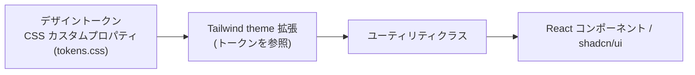

# Tailwind CSS コーディングルール — GenAI Profile Community

フロントエンド（`apps/client`・`apps/admin`）の Tailwind CSS／スタイリング実装規約を定義する。
原則は [00-overview.md](./00-overview.md)、フロント構造は [01-architecture.md](./01-architecture.md) §3 を参照。

> **位置づけ**: 本ガイドは [CLAUDE.md](../../../CLAUDE.md)（Tailwind CSS・shadcn/ui）と [ecc-web/coding-style.md](../../../.claude/rules/ecc-web/coding-style.md)・[ecc-web/design-quality.md](../../../.claude/rules/ecc-web/design-quality.md)・[ecc-web/performance.md](../../../.claude/rules/ecc-web/performance.md) を、本サービスのスタイリング観点へ具体化したものである。
> 画面仕様・ワイヤーフレームの正本は [docs/service/screens/](../../service/)（今後整備）、コンポーネントカタログは [docs/apps/frontend-lib/components/](../../../apps/frontend-lib/components/)（今後整備、Storybook）。
> Next.js / React 固有のコーディングは Skills で定義済みのため本ガイドでは扱わない。
> **現状フェーズ**: `apps/client`・`apps/admin` は未実装で、本ガイドは実装に先行する規約である。

## 1. デザイントークン（CSS カスタムプロパティ）

- 色・タイポグラフィ・余白・モーションなどの**デザイントークンは CSS カスタムプロパティで定義**し、パレット・タイポ・スペーシングをコード中に繰り返しハードコードしない（[ecc-web/coding-style.md](../../../.claude/rules/ecc-web/coding-style.md)）。
- Tailwind の `theme` 拡張は**トークン（CSS 変数）を参照**して定義し、トークンを単一の出所にする。値の二重管理を避ける（DRY、[00-overview.md](./00-overview.md) §2）。
- マジックな数値（色・サイズ）を任意値クラスに直書きせず、意味のある名前付きトークンに束ねる（[00-overview.md](./00-overview.md) §4.2 マジックナンバー）。

## 2. ユーティリティ・ファーストと抽象化

- **ユーティリティ・ファースト**で記述する。繰り返すパターンは `@apply` を多用するのではなく、**React コンポーネントとして抽出**して再利用する（コンポーネントが抽象の単位、[01-architecture.md](./01-architecture.md) §3.1）。
- `@apply` はトークン的な小さな共通クラス（フォーカスリング等）に限って控えめに使う。ユーティリティの羅列を CSS 側へ移し替えただけの「`@apply` の塊」を作らない。
- 条件付きクラスの合成は **`cn()`（`clsx` + `tailwind-merge`）** を用い、重複・衝突するユーティリティを安全にマージする（shadcn/ui 慣例）。文字列連結でクラスを組み立てない。

## 3. クラス整列・整形

- ユーティリティクラスの並び順は **`prettier-plugin-tailwindcss`** が自動整列する。**手作業で並べ替えない**（[02-lint-format-commit.md](./02-lint-format-commit.md) §4）。
- **CSS 専用 Linter（Stylelint）は採用しない**。整形は Prettier、規約は本ガイドと ESLint（`jsx-a11y` 等）で担保する（決定の根拠は [02-lint-format-commit.md](./02-lint-format-commit.md) §3）。

## 4. レスポンシブ

- **モバイルファースト**で記述し、`sm`/`md`/`lg`/`xl`/`2xl` のブレークポイントで段階的に拡張する。
- 主要ブレークポイント **320 / 375 / 768 / 1024 / 1440 / 1920** で横溢れ（overflow）が無いことを確認する（[testing/02-e2e.md](../testing/02-e2e.md) §4.1・[ecc-web/testing.md](../../../.claude/rules/ecc-web/testing.md)）。
- タッチ操作の当たり判定（ヒットエリア）を十分に確保する（[ecc-web/performance.md](../../../.claude/rules/ecc-web/performance.md)・アクセシビリティ）。

## 5. テーマ（ライト/ダーク）

- **既定でダークモードにしない**。プロダクトが実際に求める視覚方向を選ぶ（[ecc-web/design-quality.md](../../../.claude/rules/ecc-web/design-quality.md)）。
- 両テーマを提供する場合は、**ライト・ダークの双方が意図的**に設計されていること。テーマ切替はトークン（CSS 変数）の差し替えで実現し、コンポーネント側のクラスを分岐させすぎない。

## 6. アニメーション

- **コンポジタフレンドリーなプロパティのみ**アニメーションする: `transform` / `opacity` / `clip-path` / `filter`（控えめに）。
- レイアウト連動プロパティ（`width`/`height`/`top`/`left`/`margin`/`padding`/`border`/`font-size`）のアニメーションを避ける（[ecc-web/coding-style.md](../../../.claude/rules/ecc-web/coding-style.md)）。
- `will-change` は狭く使い、終わったら外す。`prefers-reduced-motion` を尊重し、モーション低減設定時は過度な動きを抑制する（[ecc-web/performance.md](../../../.claude/rules/ecc-web/performance.md)・[testing/02-e2e.md](../testing/02-e2e.md) §4.2）。

## 7. shadcn/ui

- プリミティブは **shadcn/ui** をベースにしつつ、**テンプレート然とした見た目を避け**、プロダクト固有の意図的な装いへ調整する（[ecc-web/design-quality.md](../../../.claude/rules/ecc-web/design-quality.md)）。
- キーボード操作・ARIA・フォーカス管理は**ヘッドレス層に保持**し、装飾の差し替えで壊さない（[01-architecture.md](./01-architecture.md) §3.1・[ecc-web/patterns.md](../../../.claude/rules/ecc-web/patterns.md)）。

## 8. セマンティック HTML・アクセシビリティ

- **セマンティック HTML を第一**とし、`header`/`nav`/`main`/`section`/`footer` 等を用いる。意味のある要素があるところで `div` の入れ子に逃げない（[ecc-web/coding-style.md](../../../.claude/rules/ecc-web/coding-style.md)）。
- フォーカス可視状態（`focus-visible`）・ホバー・アクティブ状態を**設計された状態**として作り込む（[ecc-web/design-quality.md](../../../.claude/rules/ecc-web/design-quality.md) コンポーネントチェックリスト）。
- 色コントラスト・キーボード操作は ESLint（`jsx-a11y`）と axe（jest-axe / @axe-core/playwright）で検証する（[testing/02-e2e.md](../testing/02-e2e.md) §4.2）。

## 9. アンチテンプレート方針

- 汎用テンプレート然とした UI を出さない。意味のある画面は階層・リズム・奥行き・タイポグラフィ等の質を満たす（要件は [ecc-web/design-quality.md](../../../.claude/rules/ecc-web/design-quality.md)「Required Qualities」）。
- 均一な角丸・余白・影をすべてのコンポーネントに当てるだけの平板なレイアウトを避ける。階層（スケールコントラスト）で強弱をつける。

## 10. パフォーマンス

- CSS バジェット（ページ種別ごとの上限）を意識する（[ecc-web/performance.md](../../../.claude/rules/ecc-web/performance.md) Bundle Budget）。
- Tailwind の `content` 設定を正しく行い、未使用ユーティリティを生成・出荷しない。任意値クラスの乱用で CSS を肥大化させない。
- 正当な場合のみ above-the-fold のクリティカル CSS をインライン化し、非クリティカルな CSS/JS は遅延させる（[ecc-web/performance.md](../../../.claude/rules/ecc-web/performance.md) Loading Strategy）。
- パフォーマンスは設計指針として CWV 目標を参照する。Lighthouse CI は CI ゲートに組み込まない（[testing/00-overview.md](../testing/00-overview.md) §2）。

## 11. 関連ドキュメント

- コーディング原則: [00-overview.md](./00-overview.md)
- フロント構造・状態管理・shadcn/ui: [01-architecture.md](./01-architecture.md) §3
- 整形・Stylelint 不採用の根拠: [02-lint-format-commit.md](./02-lint-format-commit.md) §3・§4
- フロントスタイル一次情報: [ecc-web/coding-style.md](../../../.claude/rules/ecc-web/coding-style.md)
- デザイン品質基準: [ecc-web/design-quality.md](../../../.claude/rules/ecc-web/design-quality.md)
- パフォーマンス（CSS バジェット・モーション）: [ecc-web/performance.md](../../../.claude/rules/ecc-web/performance.md)
- ビジュアル回帰・アクセシビリティ検証: [testing/02-e2e.md](../testing/02-e2e.md)
