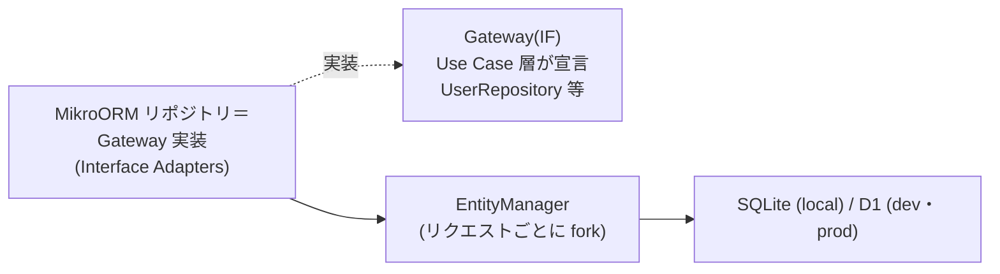

# MikroORM コーディングルール — GenAI Profile Community

データアクセス（`apps/db` のエンティティ／マイグレーション、`apps/api`・`apps/public-api` のリポジトリ）の MikroORM 実装規約を定義する。
原則は [00-overview.md](./00-overview.md)、層構造は [01-architecture.md](./01-architecture.md) §2、DB 設計の正本は [docs/GUIDES/db/](../db/) を参照。

> **位置づけ**: 本ガイドは [CLAUDE.md](../../../CLAUDE.md)（MikroORM・SQLite/D1）と [db/00-overview.md](../db/00-overview.md)（設計原則・命名・ID/時刻）を、ORM の実装観点へ具体化したものである。
> **テーブル定義・型・制約・インデックス・KV/DO 配置の正本は [db/01-data-model.md](../db/01-data-model.md)**、マイグレーション手順の正本は [db/02-migrations.md](../db/02-migrations.md)。本ガイドは値・スキーマを複製せず、実装規約に限定する。
> **現状フェーズ**: `apps/api`（内部 GraphQL）が MikroORM を本規約に沿って導入済み（`users`/`profiles`/`sns_links` のエンティティ・リポジトリ、SQLite ドライバ、[CODEMAPS/api.md](../../CODEMAPS/api.md)）。`apps/db` は引き続き healthcheck 用 dev サーバーのみで、スキーマ/マイグレーションの集約は後続課題。本ガイドの該当箇所は実装に先行する規約である。

## 1. 位置づけ（クリーンアーキテクチャの層）

クリーンアーキテクチャの概念・依存性ルールは [`clean-architecture` スキル](../../../.claude/skills/clean-architecture/SKILL.md)、本サービスの層対応は [01-architecture.md](./01-architecture.md) §2 を正本とする。本ガイドは MikroORM 固有の実装規約に限定する。

- MikroORM の**リポジトリ＝Gateway 実装は Interface Adapters**、MikroORM 本体・SQLite/D1 ドライバは **Frameworks & Drivers** に属する（[01-architecture.md](./01-architecture.md) §2.1）。
- リポジトリは **Use Case 層が宣言する Gateway（インターフェース）を実装**する（Repository パターン、[ecc-common/patterns.md](../../../.claude/rules/ecc-common/patterns.md)）。Use Cases / Entities は MikroORM の型に依存せず、Gateway 越しに永続化を扱う。
- 永続化エンティティ（MikroORM エンティティ）に業務ロジックを持たせない。実効公開判定などのエンタープライズルールは **Entities** に置く（[00-overview.md](./00-overview.md) §3・`BR-COMMON-007`）。

## 2. エンティティ定義

- 物理スキーマ（カラム・型・制約・列挙）は [db/01-data-model.md](../db/01-data-model.md) §5 を正本とし、エンティティ定義をそれに**一致**させる。値（文字数・列挙・既定値）を独自に決めない。
- **命名戦略は underscore**: TS 側 camelCase ↔ DB 物理名 snake_case を MikroORM の命名戦略で対応づける（[db/00-overview.md](../db/00-overview.md) §3）。物理名を手書きで散在させない。
- **主キーは ULID（TEXT・26 文字）**。自動連番を使わない。ULID はアプリ層で生成して代入する（生成時刻順ソート・カーソルページング適性、[db/00-overview.md](../db/00-overview.md) §4）。
- 時刻は **UTC 保存**（`datetime`）。列挙は features/ の表記に一致させた文字列（TEXT＋CHECK 相当）。真偽値は INTEGER(0/1)。論理型の対応は [db/01-data-model.md](../db/01-data-model.md) 型表記に従う。
- **外部キーを定義**し参照整合性を DB で担保する。SQLite は接続時に `PRAGMA foreign_keys = ON` を保証、D1 は FK を強制（[db/02-migrations.md](../db/02-migrations.md) §5.3）。

## 3. EntityManager / Unit of Work

- **EntityManager はリクエストスコープで `fork()`**（または `RequestContext`）する。リクエストをまたいで Identity Map を共有しない（古いデータ・権限混線の防止）。Workers のステートレス前提と整合する（[04-nestjs.md](./04-nestjs.md) §7）。
- 変更は Unit of Work が追跡する。**`flush()` は Use Case（Interactor）境界**で行い、リポジトリ内で無秩序に flush しない。
- **イミュータビリティとの両立**: Entities・値オブジェクトは不変に扱う（[00-overview.md](./00-overview.md) §3）。永続化エンティティの状態変更は**リポジトリ（Gateway 実装）の内側に閉じ込め**、管理対象エンティティの参照を層をまたいで配り回さない。

## 4. トランザクション

- 複数テーブルにまたがる不可分な更新は **`em.transactional()`** でアトミックに行う。例: 凍結＝`suspensions` 追加 ＋ `api_keys` 失効 ＋ `audit_logs` 追記（[db/01-data-model.md](../db/01-data-model.md) §8、`BR-SAFE-006`）。
- トランザクション境界は **Use Case 層**に置く（Interface Adapters/Entities に散らさない、[01-architecture.md](./01-architecture.md) §2.1）。
- 退会（`WITHDRAWN`）の匿名化・ハンドル予約・キー失効・パスキー削除も単一トランザクションで整合させる（[db/01-data-model.md](../db/01-data-model.md) §8、`BR-ACCT-009`）。

## 5. クエリと N+1

- **N+1 を作らない**。関連は `populate` または QueryBuilder の JOIN でまとめて取得する。GraphQL 層の N+1 は **DataLoader** でバッチ化し（リクエストスコープ、[api/01-graphql-internal.md](../api/01-graphql-internal.md) §5）、MikroORM の populate と役割を重複させない。
- **ページングはカーソル方式**（OFFSET を避ける）。カーソルは ULID（または複合キー）を不透明文字列にエンコードする。既定/最大件数は再掲せず `BR-DISC-003`/`BR-API-007` を参照（[db/00-overview.md](../db/00-overview.md) §6）。
- ホットパス（公開ページ・一覧/検索・公開 API）は [db/01-data-model.md](../db/01-data-model.md) §6 のインデックスに沿ったクエリ形にする。実効公開で除外される行は取得段階で確実に落とす（取得後フィルタの漏れを作らない）。
- **生 SQL は原則使わない**。必要時もパラメータバインドを用い、文字列連結でクエリを組まない（SQL インジェクション防止、[00-overview.md](./00-overview.md) §7）。

## 6. 検証境界・追記専用・論理削除

- 厳密な入力検証（書記素単位の文字数・NFC 正規化）は**アプリ層**（Zod / class-validator）で行い、DB の `CHECK`・長さは**最終防衛線**とする（[db/00-overview.md](../db/00-overview.md) §2.4・`BR-COMMON-008`/`009`）。ORM に書記素計数を期待しない。
- **`audit_logs` は追記専用**。ORM 経由で UPDATE/DELETE しない。改ざん拒否は DB トリガーで担保する（[db/02-migrations.md](../db/02-migrations.md) §5.1、`BR-ADMIN-010`）。
- 退会は**物理削除せず状態遷移（`WITHDRAWN`）＋匿名化**で表現する（`BR-ACCT-009`、[db/00-overview.md](../db/00-overview.md) §2.5）。`policies` は版を上書きせず追加する（`BR-CONTENT-008`）。

## 7. マイグレーション

- **マイグレーションの正本は MikroORM Migrator**。エンティティ変更から差分を `migration:create` で生成し、生成 SQL をレビューする（[db/02-migrations.md](../db/02-migrations.md) §2）。適用済みマイグレーションを手編集しない。
- 破壊的変更は **Expand → Migrate → Contract** に分割する。同一リリースでの rename（drop+add）や NOT NULL 即時付与をしない（[db/02-migrations.md](../db/02-migrations.md) §4）。
- ローカル SQLite は MikroORM が直接適用、dev/prod（D1）は **wrangler** で適用する（[db/02-migrations.md](../db/02-migrations.md) §3）。**prod 適用は人間のみ**（AI は実行しない、[CLAUDE.md](../../../CLAUDE.md)）。

## 8. SQLite / D1 ドライバ差

- ローカルは SQLite ドライバ、Workers は D1 ドライバを用い、**同一の SQL/スキーマ**を流して環境差を最小化する（[db/02-migrations.md](../db/02-migrations.md) §1）。ドライバ差は Frameworks & Drivers / Interface Adapters で吸収し、Entities / Use Cases に持ち込まない。
- SQLite/D1 は `ALTER TABLE` が限定的（カラム削除・型変更でテーブル再作成が要る場合がある）。MikroORM 生成の再作成 SQL をレビューし、FK・インデックスの再構築漏れに注意する（[db/02-migrations.md](../db/02-migrations.md) §4）。

## 9. テスト

- DB 統合テストは**テスト用 SQLite**（インメモリ/一時ファイル）に対して実行する。`PRAGMA foreign_keys = ON` を有効化し、FK・ユニーク制約・追記専用トリガーを検証する（[testing/01-unit-integration.md](../testing/01-unit-integration.md) §2.3）。
- テストごとに **EntityManager を fork ／トランザクションでロールバック**して分離する（並列実行・状態持ち越し防止）。
- リポジトリの Gateway は Use Case / Entities のテストでモック/フェイクへ差し替える（[testing/01-unit-integration.md](../testing/01-unit-integration.md) §3）。マイグレーションの up/down が通ることを確認する（[db/02-migrations.md](../db/02-migrations.md) §8）。

## 10. 関連ドキュメント

- コーディング原則（イミュータビリティ・検証境界）: [00-overview.md](./00-overview.md)
- アーキテクチャ（リポジトリ＝Gateway 実装）: [01-architecture.md](./01-architecture.md) §2
- クリーンアーキテクチャの概念・実装パターンの正本: [`clean-architecture` スキル](../../../.claude/skills/clean-architecture/SKILL.md)
- DB 設計原則・命名・ID/時刻: [db/00-overview.md](../db/00-overview.md)
- データモデル・テーブル定義・インデックス: [db/01-data-model.md](../db/01-data-model.md)
- マイグレーション手順・トリガー・ロールバック: [db/02-migrations.md](../db/02-migrations.md)
- NestJS 実装規約（DI・トランザクション境界）: [04-nestjs.md](./04-nestjs.md)
- テスト規約（DB テスト・モック戦略）: [docs/GUIDES/testing/](../testing/)
