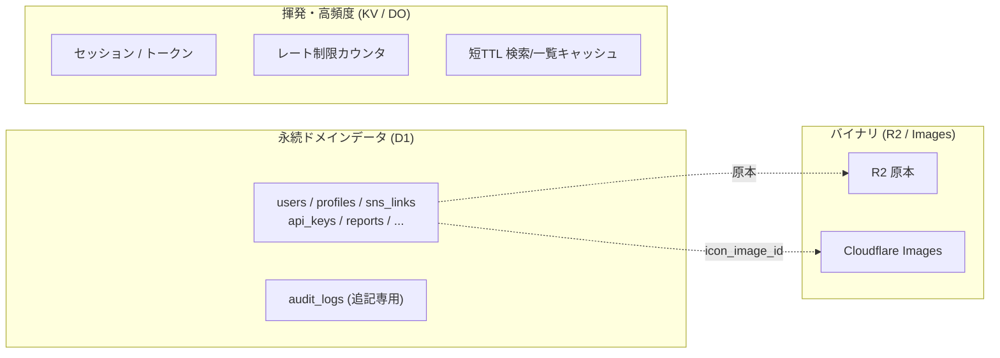

# データベース設計概要・設計原則 — GenAI Profile Community

データベースの全体方針・設計原則・命名規約・ID/時刻の扱いを定義する。
具体的なテーブル定義は [01-data-model.md](./01-data-model.md)、マイグレーション手順は [02-migrations.md](./02-migrations.md) を参照。

> **位置づけ**: 本ガイドは [docs/service/features/](../../service/features/)（ビジネスルールの正本 SSoT）を物理データモデルへ落とし込んだものである。
> 文字数上限・件数上限・状態・期限などの**具体値は features/ が正本**であり、矛盾した場合は features/ を優先して本ガイドを更新する。
> **現状フェーズ**: `apps/db` は未実装で、本ガイドが当面のスキーマ正本となる。

## 1. DB の全体方針

| 項目 | 内容 |
| --- | --- |
| エンジン | SQLite（ローカル・ポート 55030）/ Cloudflare D1（dev・prod）。D1 は SQLite 互換 |
| ORM | MikroORM（エンティティ定義・マイグレーション・クエリ） |
| 永続データの正本 | D1（User/Profile/監査ログ等の永続ドメインデータ） |
| 揮発・高頻度データ | Cloudflare KV（セッション・トークン・短 TTL キャッシュ・公開API 以外のレート制限）／ Durable Objects（公開API のキー単位レート制限のみ） |
| 画像 | バイナリは R2（原本）/ Cloudflare Images（配信）。D1 には**参照 ID のみ**を保持 |

> **D1 と KV の役割分担**: 「正本・関係・トランザクション・監査」が要るものは D1、「短命・高頻度・TTL で消えてよい」ものは KV に置く。配置の一覧は [01-data-model.md](./01-data-model.md) §7 を参照。

## 2. 設計原則

### 2.1 正規化と整合性

- 第 3 正規形を基本とし、読み取り性能のための非正規化は短 TTL キャッシュ（KV）側で吸収する（DB は正本として正規化を保つ）。
- **外部キー制約を有効化**する（SQLite は `PRAGMA foreign_keys = ON`、D1 は FK を強制）。参照整合性は DB で担保する。
- 1 ユーザー = 1 プロフィール（1:1）。Profile はアカウント作成時に空生成する（`BR-COMMON-006`、[02-profile.md](../../service/features/02-profile.md)）。

### 2.2 イミュータブル/追記専用

- `audit_logs` は**追記専用・改ざん不可**。UPDATE/DELETE を DB トリガーで拒否する（`BR-ADMIN-010`、[03-logging-monitoring.md](../infra/03-logging-monitoring.md)）。
- 規約（`policies`）は**版を上書きせず追加**する。公開中の版は常に 1 つ（`BR-CONTENT-008`）。

### 2.3 状態は列挙で表現

- User の状態（`UNVERIFIED`/`ACTIVE`/`FROZEN`/`WITHDRAWN`）など、状態は文字列の列挙カラムで保持し、`S-USER-*`（features/）と一致させる。
- 「実効公開」は保存値ではなく**導出**する: `effectivePublic = (visibility = 'public') AND (owner.status = 'ACTIVE')`（`BR-COMMON-007`）。検索・一覧の高速化は短 TTL キャッシュ＋適切なインデックスで対応する。

### 2.4 検証は境界で、DB は最終防衛線

- 文字数は**書記素クラスタ単位**（絵文字・結合文字を 1 文字）で数えるため、厳密な上限はアプリ層（Zod / class-validator）で検証する（`BR-COMMON-008`）。
- DB の `CHECK` 制約・長さは**補助的な防御**（明らかな異常値の拒否）として、やや余裕を持たせて設定する。

### 2.5 削除・匿名化

- 退会は物理削除ではなく**状態遷移（`WITHDRAWN`）＋本人特定可能データの削除/匿名化**で表現する（`BR-ACCT-009`）。
- 監査・不正対策に必要な最小限は匿名化のうえ保持する（`BR-COMMON-014`）。

## 3. 命名規約

| 対象 | 規約 | 例 |
| --- | --- | --- |
| テーブル名 | スネークケース・複数形 | `users`, `sns_links`, `audit_logs` |
| カラム名 | スネークケース | `email_verified_at`, `name_display_order` |
| 主キー | `id` | `id` |
| 外部キー | `<参照先単数>_id` | `user_id`, `profile_id` |
| 真偽値 | `is_` / `has_` 接頭辞 | `is_published`, `has_consented` |
| 日時 | `_at` 接尾辞（UTC 保存） | `created_at`, `revoked_at` |
| 列挙値 | features/ の表記に一致 | `status = 'ACTIVE'`, `platform = 'github'` |
| インデックス | `idx_<table>_<columns>` | `idx_profiles_handle` |
| ユニーク制約 | `uq_<table>_<columns>` | `uq_users_email_normalized` |

> アプリ側（MikroORM エンティティ）は TypeScript の慣例で camelCase、DB 物理名は snake_case とし、MikroORM の命名戦略（underscore）で対応づける。

## 4. ID 方針

- 主キーは **ULID（TEXT・26 文字）** を用いる。
  - **根拠**: 連番 ID の露出による列挙・件数推測を避ける（`BR-SHARE-006` の秘匿方針と整合）。ULID は生成時刻順にソート可能でカーソルページング（`BR-API-007`/`BR-DISC-003`）と相性が良い。
- 公開識別子はあくまで**ハンドル名**（`/@{handle}`）であり、内部 ID は公開・列挙させない（`User.id` は不変・非公開、[01-user-account.md](../../service/features/01-user-account.md)）。
- カーソルページングのカーソルは ULID（または複合キー）を不透明文字列にエンコードして返す。

## 5. 時刻・文字・正規化

- **時刻は UTC で保存**し、表示時に JST（Asia/Tokyo）へ変換する（`BR-COMMON-015`）。日時型は ISO-8601 文字列または整数エポックで一貫させる（MikroORM の `datetime`）。
- 文字列は保存前に **NFC 正規化**し、不可視・両方向制御文字を除去/拒否する（`BR-COMMON-009`）。これはアプリ層で実施し、DB には正規化済みの値を保存する。
- **大文字小文字非依存の一意性**（email・handle）:
  - `handle` は形式上すでに小文字（`a-z0-9-`）のため、そのままユニーク制約で一意性を担保する（`BR-SHARE-001`）。
  - `email` は表示用の原文と別に、小文字化・トリム済みの `email_normalized` を保持し、これに**ユニーク制約**を張る（`BR-ACCT-001`）。

## 6. パフォーマンス指針

- 一覧・検索・公開 API のホットパスには**カバリングインデックス**を用意する（[01-data-model.md](./01-data-model.md) のインデックス節）。
- GraphQL の N+1 は **DataLoader** でバッチ化する（[01-network-architecture.md](../infra/01-network-architecture.md) §5）。
- ページングは**カーソルベース**（OFFSET を避ける）。`limit` 既定 20・最大 100（`BR-DISC-003`/`BR-API-007`）。
- 高頻度な実効公開判定の結果は KV に短 TTL でキャッシュし、状態変更時に無効化する（`BR-DISC-006`）。

## 7. 関連ドキュメント

- テーブル定義・ERD・インデックス・KV/DO 配置: [01-data-model.md](./01-data-model.md)
- マイグレーション手順: [02-migrations.md](./02-migrations.md)
- インフラ（D1/KV/R2/Images の位置づけ）: [docs/GUIDES/infra/](../infra/)
- ビジネスルールの正本: [docs/service/features/](../../service/features/)
- 用語の定義: [docs/service/glossary.md](../../service/glossary.md)
