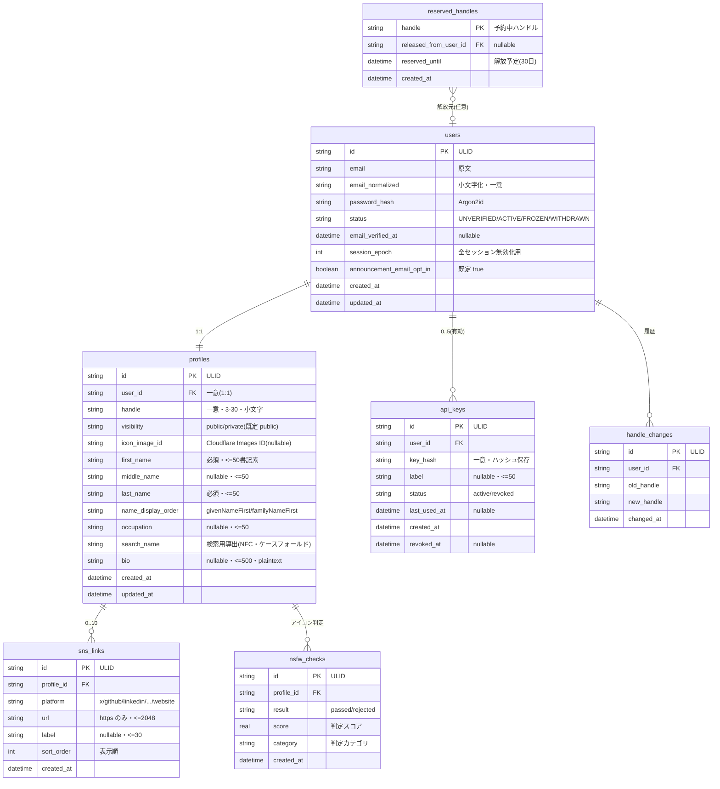
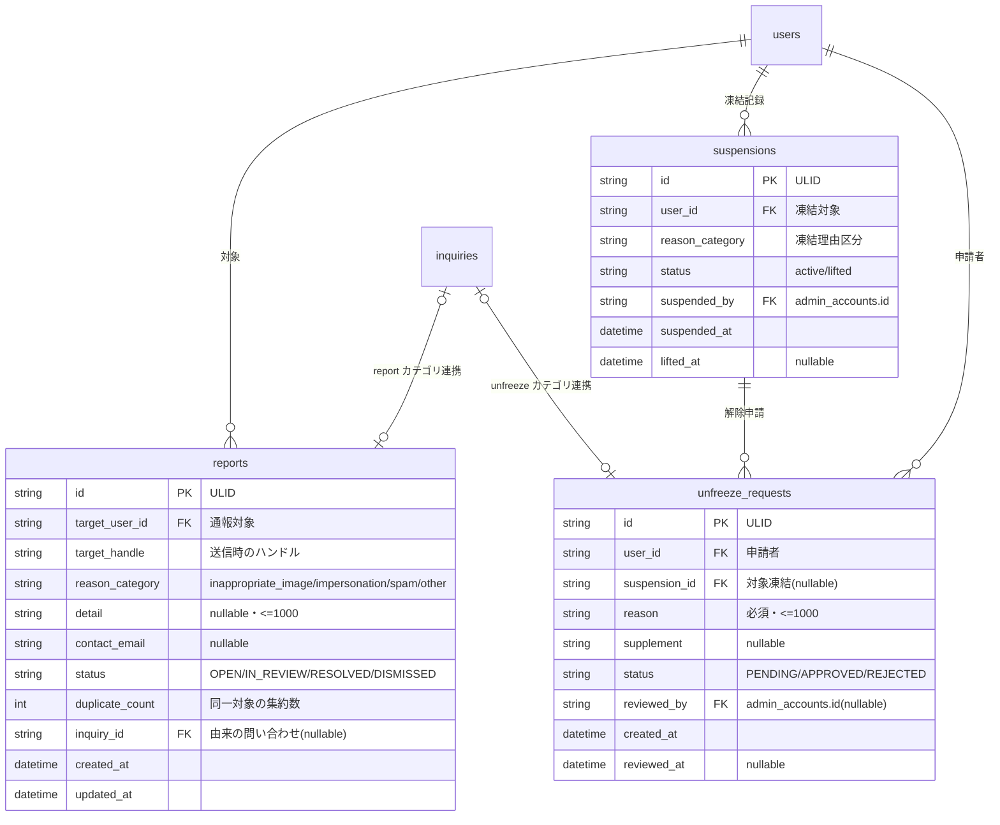
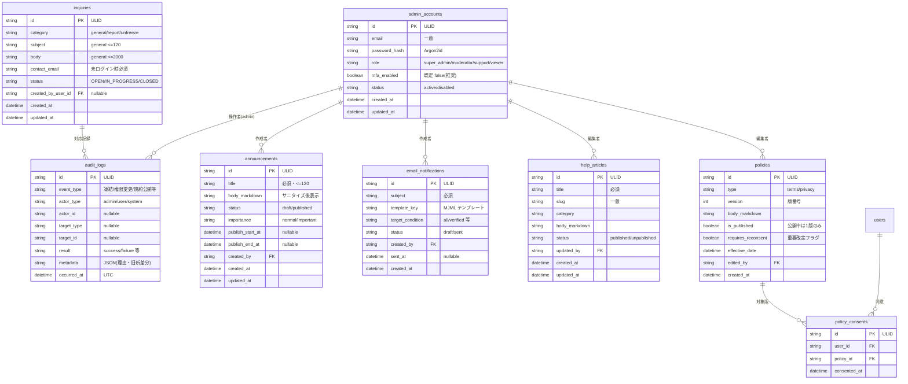
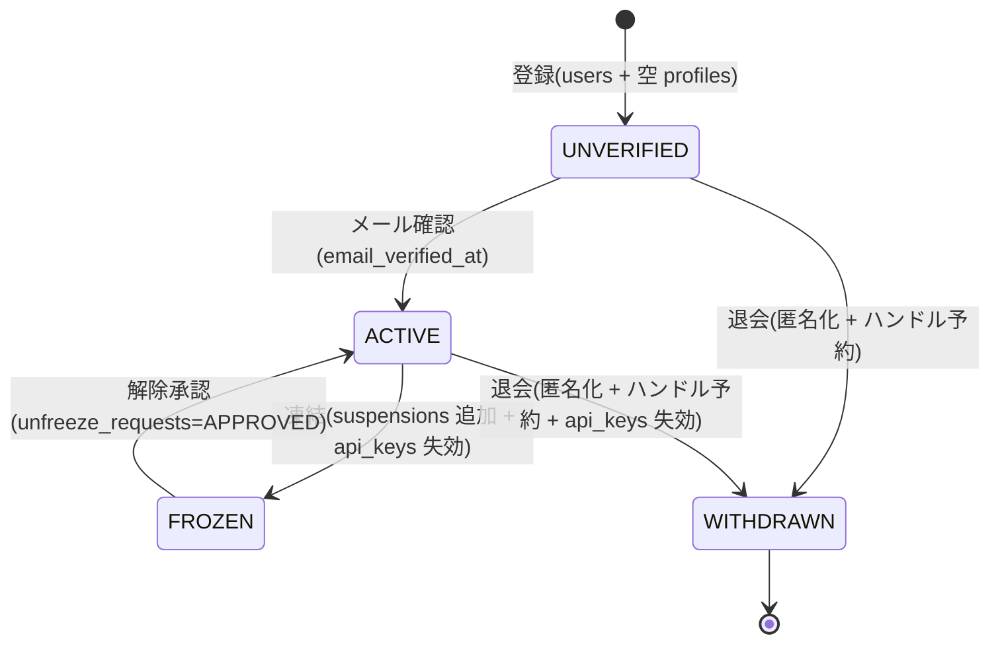

# データモデル（ERD・テーブル定義） — GenAI Profile Community

D1（SQLite 互換）の物理データモデルを ERD とテーブル定義で示す。あわせて KV / Durable Objects / R2 に置く揮発・バイナリデータの配置を定義する。

> **正本（SSoT）**: 列挙値・上限・期限・状態などの具体値は [docs/service/features/](../../service/features/) を正本とする。本書の値は features/ に一致させる。設計原則・命名規約・ID/時刻方針は [00-overview.md](./00-overview.md) を参照。
> **型表記**: D1/SQLite の実体型は `TEXT`/`INTEGER`/`REAL`/`BLOB` の 4 種。本書では意図を表すため `datetime`（UTC, TEXT）・`enum`（TEXT＋CHECK）・`boolean`（INTEGER 0/1）などの論理型で記す。

## 1. エンティティ全体像

| エンティティ（テーブル） | 説明 | 主担当 features/ |
| --- | --- | --- |
| `users` | 会員アカウント。1:1 で `profiles` を持つ | [01](../../service/features/01-user-account.md) |
| `profiles` | プロフィール本体（アイコン・氏名・職業・自己紹介・公開設定） | [02](../../service/features/02-profile.md) / [03](../../service/features/03-profile-sharing.md) |
| `sns_links` | Profile に紐づく SNS/Web リンク（0〜10 件） | [02](../../service/features/02-profile.md) |
| `api_keys` | 公開 API の認証キー（ユーザーあたり有効 5 個まで） | [05](../../service/features/05-public-api.md) |
| `reserved_handles` | 変更・退会で手放したハンドルの予約保持（30 日） | [03](../../service/features/03-profile-sharing.md) |
| `handle_changes` | ハンドル変更履歴（30 日 3 回の頻度制限判定用） | [03](../../service/features/03-profile-sharing.md) |
| `nsfw_checks` | アイコンの NSFW 自動判定結果 | [06](../../service/features/06-trust-and-safety.md) |
| `reports` | プロフィール通報 | [06](../../service/features/06-trust-and-safety.md) |
| `suspensions` | 管理者によるユーザー凍結記録 | [06](../../service/features/06-trust-and-safety.md) |
| `unfreeze_requests` | 凍結ユーザーの解除リクエスト | [06](../../service/features/06-trust-and-safety.md) |
| `admin_accounts` | 管理者アカウント（利用者とは別ストア・RBAC） | [07](../../service/features/07-admin-console.md) |
| `audit_logs` | 監査ログ（追記専用・改ざん不可） | [00](../../service/features/00-common-rules.md) / [07](../../service/features/07-admin-console.md) |
| `announcements` | サイト内お知らせ | [08](../../service/features/08-content-and-comms.md) |
| `email_notifications` | 管理者が配信するメール通知 | [08](../../service/features/08-content-and-comms.md) |
| `help_articles` | ヘルプ記事（マークダウン） | [08](../../service/features/08-content-and-comms.md) |
| `inquiries` | 問い合わせ（general/report/unfreeze） | [06](../../service/features/06-trust-and-safety.md) / [08](../../service/features/08-content-and-comms.md) |
| `policies` | 利用規約・プライバシーポリシー（版管理） | [08](../../service/features/08-content-and-comms.md) |
| `policy_consents` | 利用者の規約同意記録（再同意含む） | [08](../../service/features/08-content-and-comms.md) |

## 2. ERD（コアドメイン）

## 3. ERD（Trust & Safety）

## 4. ERD（管理者・コンテンツ）

## 5. テーブル定義

各表は「カラム / 型 / 制約 / 説明（根拠となる features/ の ID）」で示す。`NN` = NOT NULL。

### 5.1 `users`（[01-user-account.md](../../service/features/01-user-account.md)）

| カラム | 型 | 制約 | 説明 |
| --- | --- | --- | --- |
| `id` | TEXT(ULID) | PK | 内部主キー・不変・非公開 |
| `email` | TEXT | NN | 表示用の原文（最大 254） |
| `email_normalized` | TEXT | NN, UNIQUE | 小文字化・トリム済み。一意判定はこちら（`BR-ACCT-001`） |
| `password_hash` | TEXT | NN | Argon2id（`BR-COMMON-003`） |
| `status` | TEXT(enum) | NN, CHECK | `UNVERIFIED`/`ACTIVE`/`FROZEN`/`WITHDRAWN`（`COMMON-2`） |
| `email_verified_at` | datetime | nullable | 確認完了時刻（`BR-ACCT-003`） |
| `session_epoch` | INTEGER | NN, 既定 0 | 全セッション無効化用の世代。変更/リセットで +1（`BR-ACCT-005`/`006`） |
| `announcement_email_opt_in` | boolean | NN, 既定 1 | お知らせ系メール受信可否（`BR-ACCT-008`/`BR-CONTENT-004`） |
| `created_at` | datetime | NN | |
| `updated_at` | datetime | NN | |

> 退会時は `status='WITHDRAWN'` とし、`email`/`email_normalized` 等の本人特定可能データを匿名化値に置換する（`BR-ACCT-009`）。

### 5.2 `profiles`（[02](../../service/features/02-profile.md) / [03](../../service/features/03-profile-sharing.md)）

| カラム | 型 | 制約 | 説明 |
| --- | --- | --- | --- |
| `id` | TEXT(ULID) | PK | |
| `user_id` | TEXT | NN, UNIQUE, FK→users | 1:1（`BR-COMMON-006`） |
| `handle` | TEXT | NN, UNIQUE | `^[a-z0-9](?:-?[a-z0-9])*$` 3〜30（`BR-SHARE-001`） |
| `visibility` | TEXT(enum) | NN, CHECK, 既定 `public` | `public`/`private`（`BR-SHARE-005`） |
| `icon_image_id` | TEXT | nullable | Cloudflare Images の画像 ID。未設定は既定アイコン（`BR-PROF-001`） |
| `first_name` | TEXT | NN | 必須・最大 50 書記素（アプリ層検証） |
| `middle_name` | TEXT | nullable | 最大 50 書記素 |
| `last_name` | TEXT | NN | 必須・最大 50 書記素 |
| `name_display_order` | TEXT(enum) | NN, 既定 `givenNameFirst` | `givenNameFirst`/`familyNameFirst`（`BR-PROF-004`） |
| `occupation` | TEXT | nullable | 最大 50 書記素・単一行（`BR-PROF-005`） |
| `search_name` | TEXT | nullable | 検索用の導出値。`first/middle/last` ＋表示順を連結し NFC 正規化・ケースフォールド（`BR-DISC-004`/`BR-COMMON-009`、アプリ層で保守。→ [ADR 20260603](../../adr/20260603-profile-search-fts5.md)） |
| `bio` | TEXT | nullable | 最大 500 書記素・プレーンテキスト（`BR-PROF-006`） |
| `created_at` | datetime | NN | |
| `updated_at` | datetime | NN | |

> `first_name`/`last_name` の必須は**アプリ層で強制**（空生成直後の Profile は未入力でも存在しうるため、DB ではアプリのバリデーションを正とする）。

### 5.3 `sns_links`（`BR-PROF-007`）

| カラム | 型 | 制約 | 説明 |
| --- | --- | --- | --- |
| `id` | TEXT(ULID) | PK | |
| `profile_id` | TEXT | NN, FK→profiles | 1 プロフィール最大 10 件（アプリ層で件数制御） |
| `platform` | TEXT(enum) | NN, CHECK | `x`/`github`/`linkedin`/`instagram`/`youtube`/`facebook`/`tiktok`/`website` |
| `url` | TEXT | NN | `https://` のみ・最大 2048（`BR-PROF-007`） |
| `label` | TEXT | nullable | 最大 30（`website` 用ラベル） |
| `sort_order` | INTEGER | NN | 表示順（並べ替え可能） |
| `created_at` | datetime | NN | |

### 5.4 `api_keys`（[05-public-api.md](../../service/features/05-public-api.md)）

| カラム | 型 | 制約 | 説明 |
| --- | --- | --- | --- |
| `id` | TEXT(ULID) | PK | |
| `user_id` | TEXT | NN, FK→users | 発行は `ACTIVE` のみ（`BR-API-002`） |
| `key_hash` | TEXT | NN, UNIQUE | キー値のハッシュ。秘匿値は保存しない（`BR-API-001`） |
| `label` | TEXT | nullable | 最大 50 |
| `status` | TEXT(enum) | NN, CHECK | `active`/`revoked`。有効上限 5（アプリ層判定） |
| `last_used_at` | datetime | nullable | 最終利用日時（`BR-API-003`） |
| `created_at` | datetime | NN | |
| `revoked_at` | datetime | nullable | 失効時刻 |

> `FROZEN`/`WITHDRAWN` への遷移時、当該ユーザーの全キーを `revoked` にする（`BR-API-003`）。

### 5.5 `reserved_handles` / `handle_changes`（`BR-SHARE-004`）

`reserved_handles`

| カラム | 型 | 制約 | 説明 |
| --- | --- | --- | --- |
| `handle` | TEXT | PK | 予約中のハンドル |
| `released_from_user_id` | TEXT | nullable, FK→users | 解放元（退会時は匿名化に伴い null 可） |
| `reserved_until` | datetime | NN | 解放予定（変更/退会から 30 日） |
| `created_at` | datetime | NN | |

`handle_changes`（直近 30 日で 3 回までの頻度判定に使用）

| カラム | 型 | 制約 | 説明 |
| --- | --- | --- | --- |
| `id` | TEXT(ULID) | PK | |
| `user_id` | TEXT | NN, FK→users | |
| `old_handle` | TEXT | NN | |
| `new_handle` | TEXT | NN | |
| `changed_at` | datetime | NN | 30 日窓のカウント基準 |

### 5.6 `nsfw_checks`（`BR-SAFE-001`）

| カラム | 型 | 制約 | 説明 |
| --- | --- | --- | --- |
| `id` | TEXT(ULID) | PK | |
| `profile_id` | TEXT | NN, FK→profiles | |
| `result` | TEXT(enum) | NN, CHECK | `passed`/`rejected` |
| `score` | REAL | nullable | 判定スコア（AWS Rekognition の最大 `Confidence`） |
| `category` | TEXT | nullable | 判定カテゴリ（Rekognition トップレベルラベルのマッピング値。個人特定情報は最小化） |
| `created_at` | datetime | NN | |

> 判定エンジンは **AWS Rekognition Content Moderation** に確定（[ADR 20260603-nsfw-moderation-rekognition](../../adr/20260603-nsfw-moderation-rekognition.md)）。`category`/`score` はラベル→カテゴリ・最大 `Confidence`→スコアのマッピング結果を保持し、判定不能（fail-closed）時も `rejected` として記録する。

### 5.7 `reports`（`BR-SAFE-003`〜`005`）

| カラム | 型 | 制約 | 説明 |
| --- | --- | --- | --- |
| `id` | TEXT(ULID) | PK | |
| `target_user_id` | TEXT | nullable, FK→users | 解決した通報対象 |
| `target_handle` | TEXT | NN | 送信時のハンドル（実在検証） |
| `reason_category` | TEXT(enum) | NN, CHECK | `inappropriate_image`/`impersonation`/`spam`/`other` |
| `detail` | TEXT | nullable | 最大 1000・プレーンテキスト |
| `contact_email` | TEXT | nullable | 返信が必要な場合 |
| `status` | TEXT(enum) | NN, CHECK | `OPEN`/`IN_REVIEW`/`RESOLVED`/`DISMISSED` |
| `duplicate_count` | INTEGER | NN, 既定 1 | 同一対象の集約数（`AC-SAFE-006`） |
| `inquiry_id` | TEXT | nullable, FK→inquiries | 問い合わせ（report）由来 |
| `created_at` | datetime | NN | |
| `updated_at` | datetime | NN | |

### 5.8 `suspensions` / `unfreeze_requests`（`BR-SAFE-006`〜`008`）

`suspensions`

| カラム | 型 | 制約 | 説明 |
| --- | --- | --- | --- |
| `id` | TEXT(ULID) | PK | |
| `user_id` | TEXT | NN, FK→users | 凍結対象 |
| `reason_category` | TEXT | NN | 凍結理由区分 |
| `status` | TEXT(enum) | NN, CHECK | `active`/`lifted` |
| `suspended_by` | TEXT | NN, FK→admin_accounts | 実行管理者 |
| `suspended_at` | datetime | NN | |
| `lifted_at` | datetime | nullable | 解除時刻 |

`unfreeze_requests`

| カラム | 型 | 制約 | 説明 |
| --- | --- | --- | --- |
| `id` | TEXT(ULID) | PK | |
| `user_id` | TEXT | NN, FK→users | 申請者 |
| `suspension_id` | TEXT | nullable, FK→suspensions | 対象の凍結 |
| `reason` | TEXT | NN | 申請理由・最大 1000 |
| `supplement` | TEXT | nullable | 補足 |
| `status` | TEXT(enum) | NN, CHECK | `PENDING`/`APPROVED`/`REJECTED` |
| `reviewed_by` | TEXT | nullable, FK→admin_accounts | 審査管理者 |
| `created_at` | datetime | NN | 連投制限（1 件/24h）の判定基準 |
| `reviewed_at` | datetime | nullable | |

> 承認時は対象 User を `ACTIVE` に戻し、`visibility` は凍結前の値を引き継ぐ（`BR-SAFE-008`）。

### 5.9 `admin_accounts`（[07-admin-console.md](../../service/features/07-admin-console.md)）

| カラム | 型 | 制約 | 説明 |
| --- | --- | --- | --- |
| `id` | TEXT(ULID) | PK | 利用者とは別ストア（`BR-ADMIN-001`） |
| `email` | TEXT | NN, UNIQUE | |
| `password_hash` | TEXT | NN | Argon2id |
| `role` | TEXT(enum) | NN, CHECK | `super_admin`/`moderator`/`support`/`viewer`（`BR-ADMIN-002`） |
| `mfa_enabled` | boolean | NN, 既定 0 | MFA は推奨（`BR-COMMON-002`） |
| `status` | TEXT(enum) | NN, CHECK | `active`/`disabled` |
| `created_at` | datetime | NN | |
| `updated_at` | datetime | NN | |

> 最後の `super_admin` の削除/降格はアプリ層でブロックする（`AC-ADMIN-003` ロックアウト防止）。

### 5.10 `audit_logs`（`BR-COMMON-013`/`BR-ADMIN-010`）

| カラム | 型 | 制約 | 説明 |
| --- | --- | --- | --- |
| `id` | TEXT(ULID) | PK | |
| `event_type` | TEXT | NN | 凍結・解除・権限変更・規約公開・しきい値変更 等 |
| `actor_type` | TEXT(enum) | NN, CHECK | `admin`/`user`/`system` |
| `actor_id` | TEXT | nullable | 操作者 ID |
| `target_type` | TEXT | nullable | 対象種別 |
| `target_id` | TEXT | nullable | 対象 ID |
| `result` | TEXT | NN | `success`/`failure` 等 |
| `metadata` | TEXT(JSON) | nullable | 理由・旧新値の差分。**秘匿値は含めない**（`BR-COMMON-014`） |
| `occurred_at` | datetime | NN | UTC 保存 |

> **追記専用**: UPDATE/DELETE を DB トリガーで拒否する（実装例は [02-migrations.md](./02-migrations.md)）。

### 5.11 `announcements` / `email_notifications`（`BR-CONTENT-001`〜`004`）

`announcements`

| カラム | 型 | 制約 | 説明 |
| --- | --- | --- | --- |
| `id` | TEXT(ULID) | PK | |
| `title` | TEXT | NN | 最大 120 |
| `body_markdown` | TEXT | NN | サニタイズ後に表示（`BR-CONTENT-001`） |
| `status` | TEXT(enum) | NN, CHECK | `draft`/`published` |
| `importance` | TEXT(enum) | NN, 既定 `normal` | `normal`/`important` |
| `publish_start_at` | datetime | nullable | 公開開始 |
| `publish_end_at` | datetime | nullable | 公開終了 |
| `created_by` | TEXT | NN, FK→admin_accounts | |
| `created_at` / `updated_at` | datetime | NN | |

`email_notifications`

| カラム | 型 | 制約 | 説明 |
| --- | --- | --- | --- |
| `id` | TEXT(ULID) | PK | |
| `subject` | TEXT | NN | |
| `template_key` | TEXT | NN | MJML テンプレート識別子 |
| `target_condition` | TEXT | NN | `all`/`verified` 等の配信条件 |
| `status` | TEXT(enum) | NN, CHECK | `draft`/`sent` |
| `created_by` | TEXT | NN, FK→admin_accounts | |
| `sent_at` | datetime | nullable | |
| `created_at` | datetime | NN | |

> お知らせ系メールはオプトアウト対象（`announcement_email_opt_in`）。トランザクションメールは受信設定に関わらず送信する（`BR-CONTENT-004`）。

### 5.12 `help_articles` / `inquiries`（`BR-CONTENT-005`〜`007`）

`help_articles`

| カラム | 型 | 制約 | 説明 |
| --- | --- | --- | --- |
| `id` | TEXT(ULID) | PK | |
| `title` | TEXT | NN | |
| `slug` | TEXT | NN, UNIQUE | 一意 |
| `category` | TEXT | nullable | |
| `body_markdown` | TEXT | NN | サニタイズ後表示 |
| `status` | TEXT(enum) | NN, CHECK | `published`/`unpublished` |
| `updated_by` | TEXT | NN, FK→admin_accounts | |
| `created_at` / `updated_at` | datetime | NN | |

`inquiries`

| カラム | 型 | 制約 | 説明 |
| --- | --- | --- | --- |
| `id` | TEXT(ULID) | PK | |
| `category` | TEXT(enum) | NN, CHECK | `general`/`report`/`unfreeze`（`BR-CONTENT-006`） |
| `subject` | TEXT | nullable | `general` は最大 120 |
| `body` | TEXT | NN | `general` は最大 2000 |
| `contact_email` | TEXT | nullable | 未ログイン時は必須（アプリ層） |
| `status` | TEXT(enum) | NN, CHECK | `OPEN`/`IN_PROGRESS`/`CLOSED` |
| `created_by_user_id` | TEXT | nullable, FK→users | ログイン時 |
| `created_at` / `updated_at` | datetime | NN | |

> `report`/`unfreeze` カテゴリは、それぞれ `reports`/`unfreeze_requests` のキューへ連携する（`BR-CONTENT-007`）。

### 5.13 `policies` / `policy_consents`（`BR-CONTENT-008`〜`010`）

`policies`

| カラム | 型 | 制約 | 説明 |
| --- | --- | --- | --- |
| `id` | TEXT(ULID) | PK | |
| `type` | TEXT(enum) | NN, CHECK | `terms`/`privacy` |
| `version` | INTEGER | NN | 版番号 |
| `body_markdown` | TEXT | NN | |
| `is_published` | boolean | NN, 既定 0 | **type ごとに公開中は 1 版のみ**（アプリ層で保証） |
| `requires_reconsent` | boolean | NN, 既定 0 | 重要改定フラグ（`BR-CONTENT-009`） |
| `effective_date` | datetime | NN | 発効日 |
| `edited_by` | TEXT | NN, FK→admin_accounts | |
| `created_at` | datetime | NN | |

- ユニーク制約: `uq_policies_type_version`（`type` + `version`）。旧版は削除せず履歴として保持する。

`policy_consents`

| カラム | 型 | 制約 | 説明 |
| --- | --- | --- | --- |
| `id` | TEXT(ULID) | PK | |
| `user_id` | TEXT | NN, FK→users | |
| `policy_id` | TEXT | NN, FK→policies | 同意した版 |
| `consented_at` | datetime | NN | |

## 6. インデックス設計

ホットパス（公開ページ・一覧/検索・公開 API・モデレーションキュー・監査ログ閲覧）を支える主要インデックス。

| インデックス | 対象 | 目的 |
| --- | --- | --- |
| `uq_users_email_normalized` | `users(email_normalized)` UNIQUE | メール一意・ログイン引き当て |
| `uq_profiles_user_id` | `profiles(user_id)` UNIQUE | 1:1 保証 |
| `uq_profiles_handle` | `profiles(handle)` UNIQUE | ハンドル一意・`/@{handle}` 解決 |
| `idx_profiles_visibility_updated` | `profiles(visibility, updated_at)` | 一覧（実効公開・新着順）＋カーソルページング |
| `idx_profiles_occupation` | `profiles(occupation)` | 職業での検索（`BR-DISC-004`） |
| `idx_profiles_search_name` | `profiles(search_name)` | 氏名検索の前方一致（`BR-DISC-004`、ADR 0001） |
| `idx_sns_links_profile_sort` | `sns_links(profile_id, sort_order)` | リンクの順序付き取得 |
| `uq_api_keys_key_hash` | `api_keys(key_hash)` UNIQUE | キー認証の引き当て |
| `idx_api_keys_user_status` | `api_keys(user_id, status)` | 有効キー数の判定（上限 5） |
| `idx_handle_changes_user_changed` | `handle_changes(user_id, changed_at)` | 30 日窓の変更回数カウント |
| `idx_reserved_handles_until` | `reserved_handles(reserved_until)` | 予約解放バッチ |
| `idx_reports_target_status` | `reports(target_user_id, status)` | 通報キュー・集約 |
| `idx_unfreeze_user_created` | `unfreeze_requests(user_id, created_at)` | 連投制限（1 件/24h） |
| `idx_audit_logs_occurred` | `audit_logs(occurred_at)` | 監査ログの時系列閲覧 |
| `idx_audit_logs_actor` | `audit_logs(actor_type, actor_id)` | 操作者での絞り込み |
| `idx_audit_logs_target` | `audit_logs(target_type, target_id)` | 対象での追跡 |
| `uq_help_articles_slug` | `help_articles(slug)` UNIQUE | ヘルプ記事 URL |
| `uq_policies_type_version` | `policies(type, version)` UNIQUE | 規約版の一意性 |

> **氏名・職業検索（`BR-DISC-004`）**: **FTS5 は採用しない**（決定経緯は [ADR 20260603](../../adr/20260603-profile-search-fts5.md)）。表示名は `first/middle/last` + 表示順から導出するため、検索用に NFC 正規化・ケースフォールド済みの結合名カラム `search_name` を持たせ、`idx_profiles_search_name` を張る。部分一致は `LIKE`、既定ソートの関連度は簡易ヒューリスティック（完全一致 ＞ 前方一致 ＞ 部分一致、氏名一致 ＞ 職業一致）で実装する。職業は NFC 正規化済み（`BR-COMMON-009`）の値にクエリ時ケースフォールドして比較する。中間一致は B-tree インデックス非適用（全表スキャン依存）だが現規模では許容し、結果は短 TTL キャッシュ（`BR-DISC-006`）で補う。

## 7. KV / Durable Objects / R2 の配置

D1 に置かない揮発・バイナリデータの配置。詳細経路は [infra/01-network-architecture.md](../infra/01-network-architecture.md) §4 を参照。

| データ | 保存先 | キー設計（例） | TTL | 関連 |
| --- | --- | --- | --- | --- |
| 利用者セッション | KV（利用者用名前空間） | `sess:client:<sessionId>` | 30 日（スライディング） | `BR-COMMON-001` |
| 管理者セッション | KV（管理者用名前空間・分離） | `sess:admin:<sessionId>` | 8h / アイドル 30 分 | `BR-COMMON-002` |
| メール確認トークン | KV | `tok:verify:<hash>` | 24h・ワンタイム | `BR-ACCT-003` |
| パスワードリセットトークン | KV | `tok:reset:<hash>` | 1h・ワンタイム | `BR-ACCT-006` |
| メール変更トークン | KV | `tok:email:<hash>`（新メール内包） | 設定値・ワンタイム | `BR-ACCT-007` |
| レート制限カウンタ | KV / DO | `rl:<scope>:<id>:<window>` | 時間窓 | `BR-COMMON-010`/`BR-API-008` |
| 検索/一覧 短 TTL キャッシュ | KV | `cache:profiles:<query-hash>` | 数十秒〜数分 | `BR-DISC-006` |
| アイコン原本 | R2 | `icons/<userId>/<imageId>` | — | `BR-PROF-001` |
| アイコン配信/変換 | Cloudflare Images | 画像 ID（`profiles.icon_image_id`） | — | `BR-PROF-001` |

- **全セッション無効化**は `users.session_epoch` を +1 し、KV のセッション検証時に epoch 不一致を失効扱いにする（`BR-ACCT-005`/`006`）。
- セッション・トークンは**ハッシュで保存**し、平文 Cookie/トークンは保存しない（`BR-COMMON-014`）。

## 8. 状態遷移（DB 反映の要点）

User 状態の正本は [00-common-rules.md](../../service/features/00-common-rules.md) `COMMON-2`。DB 上の反映時の付帯処理を示す。

- 凍結時: `suspensions` 追加、`api_keys` を `revoked`、公開系は実効公開判定で自動的に除外。
- 退会時: `users.status='WITHDRAWN'`、本人特定可能データの匿名化、`reserved_handles` へ 30 日予約、`api_keys` 失効。すべて `audit_logs` に記録。

## 9. 関連ドキュメント

- 設計原則・命名・ID/時刻方針: [00-overview.md](./00-overview.md)
- マイグレーション手順（トリガー実装含む）: [02-migrations.md](./02-migrations.md)
- KV/DO/R2 のネットワーク経路: [infra/01-network-architecture.md](../infra/01-network-architecture.md)
- ビジネスルールの正本（各 `BR-*`/`AC-*`）: [docs/service/features/](../../service/features/)
- 用語の定義: [docs/service/glossary.md](../../service/glossary.md)
