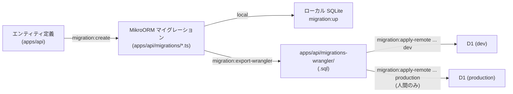
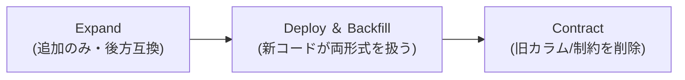

# マイグレーション手順 — GenAI Profile Community

MikroORM Migrator を主軸とし、生成された SQL を wrangler 経由で Cloudflare D1 に適用する手順・運用ルール・ロールバックを定義する。

> データモデルは [01-data-model.md](./01-data-model.md)、設計原則は [00-overview.md](./00-overview.md)、デプロイ全体は [infra/02-deployment.md](../infra/02-deployment.md)。

## 1. 方針

- **マイグレーションの正本は MikroORM Migrator**。`apps/api` が完全なエンティティ集合(16 種)を保持するため、`apps/api` を起点にマイグレーションを生成する([ADR 20260617](../../adr/20260617-public-api-domain-duplication.md)。`apps/public-api` は同一テーブルへの部分的な読み書き用エンティティを別途持つが、自らはスキーマを生成しない)。
- 生成された SQL を **D1 に適用**する二段構えとする。ローカル SQLite と D1 で同じ SQL を流し、環境差を最小化する。
- ローカル（SQLite）は MikroORM が直接適用、dev/prod（D1）は CI/リリースパイプラインから適用する。
  - **`wrangler d1 migrations apply --remote` は使わない**: `CREATE TRIGGER`（`BEGIN...END` を含む複数文のトリガー本体、§5.1 参照）を含む SQL に対して `"incomplete input: SQLITE_ERROR [code: 7500]"` で失敗する既知の不具合があるため（D1 のクエリ API が SQL 文字列を素朴に `;` で分割し、トリガー本体内の `;` で文が途中で切れる）。代わりに `wrangler d1 execute --file=<path>` でファイル全体を一括アップロードする自前スクリプト（`apps/api/scripts/apply-remote-migrations.ts`、`pnpm migration:apply-remote <database> <env>`）を使う。`wrangler d1 migrations apply`/`list` と同じ追跡テーブル（`d1_migrations`）に自前で記録するため、通常の wrangler コマンドからも「適用済み」として認識される互換性を保つ。
- `apps/db` は MikroORM 設定を持たず(ローカル用の DB コンテナのプレースホルダ)、`migration:*` スクリプトは `apps/api` への委譲(`pnpm --filter @app/api migration:*`)とする。



## 2. 標準フロー（開発者）

```bash
# 1) エンティティを編集後、差分マイグレーションを生成(apps/db からの委譲、実体は apps/api)
pnpm --filter @app/db migration:create

# 2) 生成された apps/api/migrations/*.ts の SQL をレビュー（破壊的変更の有無・後方互換を確認）

# 3) ローカル SQLite に適用して動作確認
pnpm --filter @app/db migration:up

# 4) ローカルで巻き戻し確認（down が機能するか）
pnpm --filter @app/db migration:down

# 5) wrangler 用 SQL を apps/api/migrations-wrangler/ へ書き出す(CI が D1 へ適用)
pnpm --filter @app/api migration:export-wrangler <migrations配下のファイル名>.ts
```

- マイグレーションは**タイムスタンプ順の連番**で管理し、適用済み状態は MikroORM のマイグレーションテーブル / wrangler の管理テーブルで追跡する。
- 1 マイグレーション = 1 つの意味のある変更。巨大な混在変更は避ける（レビュー容易性・ロールバック容易性）。

## 3. 環境への適用

| 環境 | 適用方法 | 実行者 |
| --- | --- | --- |
| local | `pnpm --filter @app/db migration:up`（SQLite） | 開発者 |
| dev | CI（`deploy-dev.yml`）で `pnpm migration:apply-remote genai-example-1-dev dev` | GitHub Actions（main push） |
| production | リリースパイプライン（`deploy-prod.yml`）で `pnpm migration:apply-remote genai-example-1-production production` | **人間のみ**（`git tag` 起点） |

> ⚠️ **AI エージェントは prod へのマイグレーション適用・デプロイを行わない**（[CLAUDE.md](../../../CLAUDE.md)）。

適用はデプロイの一部として、**コードデプロイの前**に実行する（[infra/02-deployment.md](../infra/02-deployment.md) §3 のリリース順序）。

## 4. ゼロダウンタイム（expand / contract）

D1 上で安全に変更するため、**Expand → Migrate → Contract** パターンを徹底する。



1. **Expand**: 新カラム/新テーブル/インデックスを**追加のみ**で導入（NULL 許容 or 既定値付き）。旧コードを壊さない。
2. **Migrate**: 新コードをデプロイし、必要ならデータをバックフィルする。新旧両形式を読めるようにする。
3. **Contract**: 旧形式が不要になった後続リリースで、旧カラム/制約を削除する。

- **やってはいけない**: 同一リリースでのカラム rename（= drop + add）や NOT NULL の即時付与。まず追加 → バックフィル → 切替の順にする。
- SQLite/D1 は `ALTER TABLE` の機能が限定的（カラム削除・型変更は再作成が必要な場合がある）。MikroORM が生成する「テーブル再作成」戦略の SQL をレビューし、外部キー・インデックスの再構築漏れに注意する。

## 5. 特殊な制約の実装

### 5.1 監査ログの追記専用（改ざん不可）

`audit_logs` の UPDATE/DELETE を DB トリガーで拒否する（`BR-ADMIN-010`、[infra/03-logging-monitoring.md](../infra/03-logging-monitoring.md)）。マイグレーションで作成する。この `BEGIN...END` を含む複数文のトリガー本体こそが、§1 で述べた `wrangler d1 migrations apply --remote` の不具合を実際に踏んだ具体例である。

```sql
-- 例: audit_logs の更新・削除をブロック
CREATE TRIGGER trg_audit_logs_no_update
BEFORE UPDATE ON audit_logs
BEGIN
  SELECT RAISE(ABORT, 'audit_logs is append-only');
END;

CREATE TRIGGER trg_audit_logs_no_delete
BEFORE DELETE ON audit_logs
BEGIN
  SELECT RAISE(ABORT, 'audit_logs is append-only');
END;
```

### 5.2 一意性・大文字小文字

- `users.email_normalized`・`profiles.handle`・`help_articles.slug`・`policies(type, version)` にユニーク制約を張る（[01-data-model.md](./01-data-model.md) §6）。
- email の大文字小文字非依存は、アプリ層で小文字化した `email_normalized` への一意制約で担保する（`BR-ACCT-001`）。

### 5.3 外部キー

- マイグレーションで FK を定義し、SQLite では接続時に `PRAGMA foreign_keys = ON` を保証する。D1 は FK を強制する。

## 6. シードデータ

- **初期スーパー管理者**は画面から自己昇格できない（`BR-ADMIN-001`）。プロビジョニング用のシード/スクリプトで作成し、認証情報は Wrangler Secrets で安全に投入する（リポジトリに含めない）。
- ローカル開発用のサンプルデータ（ペルソナ相当のプロフィール等）は local 限定のシードで投入し、dev/prod には流さない。

## 7. ロールバック

| 状況 | 手段 |
| --- | --- |
| 直近マイグレーションの取り消し（local/dev） | `migration:down`、または逆方向 SQL を wrangler で適用 |
| prod の不具合 | 逆方向マイグレーション、または **D1 Time Travel** で特定時点へ復元 |
| データ破壊リスクの高い contract | 即時には行わず、expand 状態で安定を確認してから実施 |

- prod のロールバックも**人間が実施**する。
- 破壊的変更の前にバックアップ/Time Travel の復元ポイントを確認する。

## 8. マイグレーション・チェックリスト

- [ ] エンティティ変更から `migration:create` で差分生成
- [ ] 生成 SQL をレビュー（後方互換・expand 先行・FK/インデックス整合）
- [ ] ローカル SQLite で up / down を確認
- [ ] 破壊的変更は expand/contract に分割
- [ ] 監査ログ等の追記専用トリガーが維持されている
- [ ] features/ の具体値（上限・列挙・状態）と整合（[01-data-model.md](./01-data-model.md)）
- [ ] dev で適用確認後、prod は人間が適用（AI は実行しない）

## 9. 関連ドキュメント

- データモデル・インデックス・制約: [01-data-model.md](./01-data-model.md)
- 設計原則・命名・ID/時刻: [00-overview.md](./00-overview.md)
- デプロイ・CI/CD・リリース順序: [infra/02-deployment.md](../infra/02-deployment.md)
- 監査ログの方針: [infra/03-logging-monitoring.md](../infra/03-logging-monitoring.md)
- デプロイ方針の正本: [CLAUDE.md](../../../CLAUDE.md)
