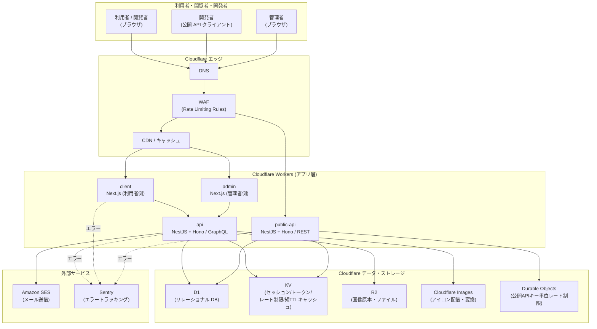
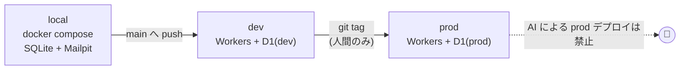

# インフラ概要 — GenAI Profile Community

本サービスのインフラ全体像・実行環境・利用するクラウドリソースを定義する。
ネットワーク構成の詳細は [01-network-architecture.md](./01-network-architecture.md)、デプロイ手順は [02-deployment.md](./02-deployment.md)、ログ・監視は [03-logging-monitoring.md](./03-logging-monitoring.md) を参照。

> **位置づけ**: 本書は [CLAUDE.md](../../../CLAUDE.md) の技術選定・デプロイ方針を、インフラ観点で具体化したものである。
> ビジネスルール（公開ゲート・レート制限のしきい値・セッション仕様など）の正本（SSoT）は [docs/service/features/](../../service/features/) であり、矛盾した場合は features/ を優先する。
> **現状フェーズ**: `apps/` 配下は未実装で、本書は実装に先行する設計仕様である。実装時は本書を起点とし、差異が生じたら本書を更新すること。

## 1. 全体像

モノレポ構成の 3 層 Web アプリケーションを、**Cloudflare を主軸**としたサーバーレス基盤にデプロイする。

## 2. アプリケーション構成（モノレポ）

`apps/` 配下の各アプリケーションと役割。ローカル開発のポート番号は [CLAUDE.md](../../../CLAUDE.md) に準拠する。

| アプリ | 役割 | 技術 | ローカルポート | デプロイ先 |
| --- | --- | --- | --- | --- |
| `apps/infra` | インフラ構成定義（IaC） | Terraform | — | Cloudflare（API 経由） |
| `apps/db` | DB スキーマ定義・マイグレーション | SQLite / MikroORM | 48030 | Cloudflare D1 |
| `apps/api` | 利用者・管理者向け内部 API | NestJS（クリーン）+ Hono + Apollo Server（GraphQL） | 48031 | Cloudflare Workers |
| `apps/client` | 利用者・閲覧者向け Web | Next.js（App Router） | 48032 | Cloudflare Workers |
| `apps/admin` | 管理者コンソール Web | Next.js（App Router） | 48033 | Cloudflare Workers |
| `apps/public-api` | 公開 API（開発者向け） | NestJS（クリーン）+ Hono | 48034 | Cloudflare Workers |

- **internal API（api）と公開 API（public-api）は別アプリ・別 Worker** に分離する。前者は GraphQL（Apollo）で `client`/`admin` に提供し、後者は REST（OpenAPI/Swagger UI）で外部開発者に提供する（[05-public-api.md](../../service/features/05-public-api.md)）。
- **client と admin は別アプリ・別ドメイン・別セッション**に分離する（`BR-COMMON-002`、[00-common-rules.md](../../service/features/00-common-rules.md)）。
- Next.js（client/admin）は Cloudflare Workers ランタイム上で動作させる。配信アダプタは Cloudflare 公式推奨の **`@opennextjs/cloudflare`（OpenNext）** を用いる（Node ランタイム前提・`nodejs_compat` 有効化、ISR/Data Cache は Workers KV と統合。[ADR](../../adr/20260604-nextjs-workers-opennext.md)）。

## 3. 利用するクラウドリソース

### 3.1 Cloudflare（主軸）

| リソース | 用途 | 関連ビジネスルール |
| --- | --- | --- |
| Workers | 全アプリ（client/admin/api/public-api）の実行環境 | — |
| Workers Builds | main への push をトリガーとする CI/CD ビルド・デプロイ | [CLAUDE.md](../../../CLAUDE.md) |
| D1 | リレーショナル DB（SQLite 互換）。永続的なドメインデータの正本 | [db ガイド](../db/) |
| R2 | アイコン画像の**原本**・その他ファイルの永続ストレージ | `BR-PROF-001` |
| Cloudflare Images | アイコンの正規化（512px 正方形）・配信・変換 | `BR-PROF-001` |
| KV | セッション・ワンタイムトークン・レート制限カウンタ・短 TTL の検索/一覧キャッシュ | `BR-COMMON-001`/`010`、`BR-DISC-006` |
| Durable Objects | 公開APIのキー単位レート制限カウンタ（厳密カウント・採用確定） | `BR-API-008`（[ADR](../../adr/20260604-public-api-rate-limit-durable-objects.md)） |
| WAF Rate Limiting Rules | 本番エッジでのレート制限実装（しきい値は Terraform 管理） | `BR-COMMON-010`、`BR-ADMIN-008` |

> **状態保存先の方針**: セッション・ワンタイムトークン（メール確認・パスワードリセット・メール変更）・検索/一覧の短 TTL キャッシュ・認証系/通報系のアプリ層レート制限（@nestjs/throttler）のカウンタは **Cloudflare KV** に保存する。**公開API のキー単位レート制限カウンタは Durable Objects で厳密にカウントする**（採用確定。[ADR](../../adr/20260604-public-api-rate-limit-durable-objects.md)）。**一般閲覧・検索（未認証）はエッジ WAF のみで制限する**（KV カウンタを持たない）。永続的なドメインデータ（User/Profile/監査ログ等）は **D1** に置く。詳細な配置は [db/01-data-model.md](../db/01-data-model.md) を参照。

### 3.2 外部サービス

| サービス | 用途 | ローカル代替 |
| --- | --- | --- |
| Amazon SES（`@aws-sdk/client-ses`） | トランザクション/お知らせメールの送信 | Mailpit |
| Amazon Rekognition（`aws4fetch` で署名呼び出し） | アイコンの NSFW 自動判定（カテゴリ別スコア×しきい値、`BR-SAFE-001`。[ADR](../../adr/20260603-nsfw-moderation-rekognition.md)） | 決定論的スタブ |
| MJML（`faire/mjml-react`） | メールテンプレートの作成（ビルド時に HTML 化） | 同左 |
| Sentry | フロントエンド・バックエンドのエラートラッキング | 無効化（dev/local では任意） |

## 4. 環境（local / dev / prod）

3 つの実行環境を用意する。デプロイ方針は [CLAUDE.md](../../../CLAUDE.md) のとおり。

| 環境 | 用途 | DB | ストレージ | デプロイ契機 | AI 操作 |
| --- | --- | --- | --- | --- | --- |
| local | 開発者ローカル | SQLite（48030） | ローカル FS / Mailpit / Valkey（48036） | `docker compose` 手動起動 | 可 |
| dev | 結合・検証 | Cloudflare D1（dev） | R2/Images/KV（dev） | **main への push で自動** | 可 |
| prod | 本番 | Cloudflare D1（prod） | R2/Images/KV（prod） | **`git tag` で発火** | **禁止** |

> **重要**: AI エージェントによる prod 環境へのデプロイは禁止する（[CLAUDE.md](../../../CLAUDE.md) デプロイ方針）。prod への `git tag` 付けは必ず人間の作業者が行う。

## 5. ローカル開発環境

- コンテナは Docker（`node:26.3-trixie-slim` ベース）。ルート `compose.yaml` でツールチェーン（pnpm/Terraform/wrangler/git）・各アプリのコンテナ（db/api/client/admin/public-api）・ポート・Mailpit・Valkey を定義する。各アプリの `Dockerfile` は `apps/<app>/Dockerfile` に置き、`build.dockerfile` で参照する。
- パッケージマネージャは pnpm（`pnpm-workspace.yaml` でワークスペース管理）。
- ローカルでは D1 の代わりに SQLite、SES の代わりに Mailpit、Cloudflare Images の代わりにローカル配信、**KV の代わりに Valkey**（`valkey/valkey` イメージ、docker compose サービス名 `valkey`、ホスト公開ポート 48036）を用い、本番と同等のドメインロジックを再現する。api はセッション・各種ワンタイムトークン（メール確認・パスワードリセット・メール変更・WebAuthn チャレンジ）を Valkey に保存し、キー設計は本番 KV と同じ形式（`sess:client:<sessionId>` 等、[db/01-data-model.md](../db/01-data-model.md) §7）に揃える。
- 環境構築の手順は [docs/onboardings/README.md](../../onboardings/README.md) を参照。

## 6. セキュリティ・ガバナンスの土台（インフラ観点）

- **シークレット管理**: API キー・SES 認証情報・DB 接続情報などのシークレットは、Wrangler Secrets / GitHub Actions Secrets で管理し、リポジトリに含めない（`BR-COMMON-014`、[ecc-common/security.md](../../../.claude/rules/ecc-common/security.md)）。
- **機密情報の push 防止**: pre-commit で Gitleaks（`--staged`）、CI で TruffleHog を実行する。
- **レート制限の二層構成**: 本番エッジの WAF と、アプリ層の @nestjs/throttler で多層防御する（[01-network-architecture.md](./01-network-architecture.md)）。
- **セキュリティヘッダ / CSP**: 本番では HSTS・CSP・`X-Content-Type-Options` 等を付与する（`BR-COMMON-004`、[docs/GUIDES/security/02-application-security.md](../security/02-application-security.md)）。

## 7. 関連ドキュメント

- ネットワーク構成・リクエストフロー: [01-network-architecture.md](./01-network-architecture.md)
- デプロイ手順・CI/CD: [02-deployment.md](./02-deployment.md)
- ログ管理・監視: [03-logging-monitoring.md](./03-logging-monitoring.md)
- データベース設計: [docs/GUIDES/db/](../db/)
- 横断ビジネスルール（認証・レート制限・公開ゲート）: [00-common-rules.md](../../service/features/00-common-rules.md)
- 技術選定・デプロイ方針の正本: [CLAUDE.md](../../../CLAUDE.md)
- NSFW 判定の実装方式（AWS Rekognition 採用の決定）: [ADR 20260603-nsfw-moderation-rekognition](../../adr/20260603-nsfw-moderation-rekognition.md)
- Next.js の Workers 配信アダプタ（`@opennextjs/cloudflare` 採用の決定）: [ADR 20260604-nextjs-workers-opennext](../../adr/20260604-nextjs-workers-opennext.md)
- 公開API のキー単位レート制限カウンタ（Durable Objects 採用の決定）: [ADR 20260604-public-api-rate-limit-durable-objects](../../adr/20260604-public-api-rate-limit-durable-objects.md)
