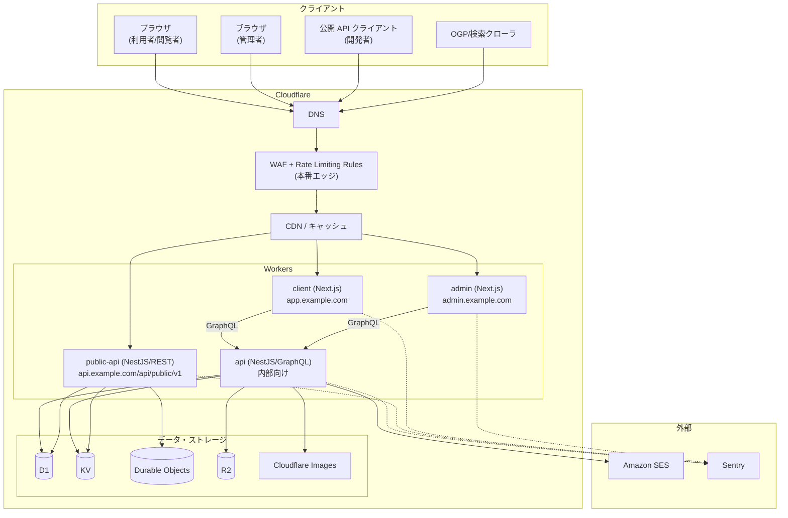
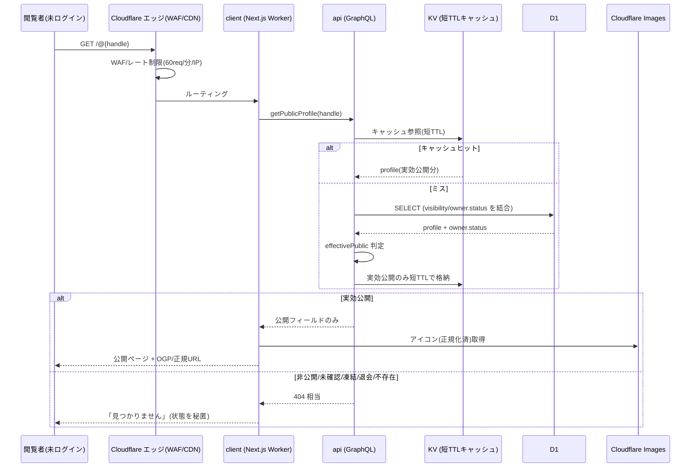
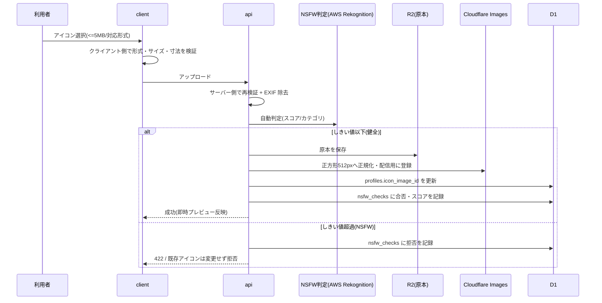
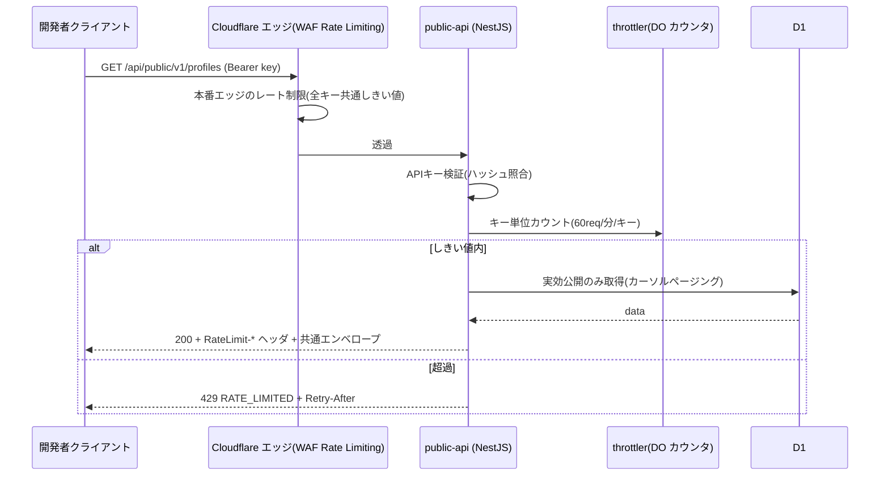
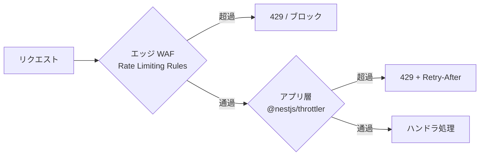

# ネットワーク構成・リクエストフロー — GenAI Profile Community

Cloudflare エッジから各 Worker、データストアまでのネットワーク構成・通信経路・セッション分離・レート制限の多層構造を定義する。

> 全体像・リソース一覧は [00-overview.md](./00-overview.md)。横断前提（認証・公開ゲート・レート制限）の正本は [00-common-rules.md](../../service/features/00-common-rules.md)。

## 1. トポロジ（論理構成）

### ドメイン分離

| サーフェス | 想定ドメイン（例） | 認証 | セッション Cookie |
| --- | --- | --- | --- |
| 利用者・閲覧者（client） | `app.example.com` / 公開ページ `app.example.com/@{handle}` | HTTPS-Only Cookie セッション | `__Host-` プレフィックス・利用者用 |
| 管理者（admin） | `admin.example.com` | HTTPS-Only Cookie セッション（**別ドメイン・別ストア**） | `__Host-` プレフィックス・管理者用 |
| 公開 API（public-api） | `api.example.com/api/public/v1` | API キー（`Authorization: Bearer`） | Cookie を用いない |
| 内部 API（api） | client/admin からのみ到達 | 呼び出し元のセッションを引き継ぐ | — |

> **セッション分離の原則**（`BR-COMMON-002`）: 利用者セッションと管理者セッションは Cookie・ドメイン・ストア（KV 名前空間）をすべて分離する。公開 API は Cookie を用いず API キーのみで認証する（CSRF 面を縮小）。

## 2. リクエストフロー別シーケンス

### 2.1 公開プロフィールページの閲覧（ログイン不要・実効公開ゲート）

`effectivePublic(profile) = (visibility == PUBLIC) AND (owner.status == ACTIVE)`（`BR-COMMON-007`）をサーバー側で必ず評価する。非公開・未確認・凍結・退会・不存在は一律 `404` 相当（`BR-SHARE-006`）。

- **OGP / robots**: 実効公開のページのみ OGP に個人情報を含め、`index` 可能とする。非公開等は汎用メタのみ・`noindex`・サイトマップ除外（`BR-SHARE-007`/`010`）。
- **鮮度・整合**: 公開→非公開・凍結・退会・ハンドル変更は短 TTL のキャッシュで速やかに反映する（`BR-DISC-006`）。状態変更時は該当キャッシュキーを無効化する。
- **旧ハンドルの 301 転送**: ハンドル変更後 30 日以内は、`/@{old}` を予約元ユーザーの現ハンドル `/@{new}` へ `301` 転送する（転送先が実効公開のときのみ・短い `Cache-Control` を付す）。30 日経過後の解放・退会・実効公開でない場合は転送せず `404`（`BR-SHARE-004`）。

### 2.2 アイコン画像のアップロード（NSFW 判定 → R2 → Images）

- NSFW 判定は **AWS Rekognition Content Moderation**（`DetectModerationLabels`）を `aws4fetch` の署名呼び出しで実行する。判定は Gateway（`NsfwModerationGateway`）として抽象化し、ローカルは決定論的スタブに差し替える（実装方式の根拠は [ADR](../../adr/20260603-nsfw-moderation-rekognition.md)）。
- **失敗時方針は fail-closed**: Rekognition がエラー/タイムアウトした場合は保存せず `422` で拒否し、`nsfw_checks` に記録する（bounded timeout ＋ 限定リトライ）。判定エンジン障害は監視・アラートの対象（[03-logging-monitoring.md](./03-logging-monitoring.md) §7）。
- 判定をすり抜けた画像は通報・管理者モデレーションで事後対応する（`BR-SAFE-002`）。
- 画像配信は Cloudflare Images（`` は明示的な `width`/`height`、一覧は遅延読み込み、[performance.md](../../../.claude/rules/ecc-web/performance.md)）。

### 2.3 公開 API（API キー認証 + レート制限二層）

- 応答は共通エンベロープ（`success`/`data`/`error`/`meta`、`BR-COMMON-011`）。
- レスポンスヘッダ `RateLimit-Limit` / `RateLimit-Remaining` / `RateLimit-Reset` を付与する（`BR-API-008`）。

## 3. レート制限の多層構造

レート制限は**エッジ（WAF）とアプリ層（@nestjs/throttler）の二層**で多層防御する。しきい値の正本は `BR-COMMON-010` / 各機能ドキュメント。

| 対象 | 既定しきい値 | エッジ（WAF） | アプリ層（throttler） | カウンタ保存先 |
| --- | --- | --- | --- | --- |
| 公開 API（キー単位） | 60 req / 分 | ◯（全キー共通値・Terraform 管理） | ◯（キー単位） | DO（キー単位・厳密） |
| 認証系（ログイン/登録/リセット） | 10 回 / 5 分 / IP＋識別子 | △ | ◯ | KV |
| 通報・問い合わせ送信 | 5 件 / 10 分 / IP | △ | ◯ | KV |
| 一般閲覧・検索（未認証） | 60 req / 分 / IP | ◯ | — | —（WAF のみ） |

- **エッジ値（WAF）は Terraform で管理**し、**アプリ層の共通しきい値は管理画面から変更**できる（`BR-ADMIN-008`）。両者は整合させて運用する。
- アプリ層カウンタは原則 KV（近似・低コスト）を用いる。**公開 API のキー単位カウンタのみ Durable Objects で厳密にカウントする**（採用確定。[ADR](../../adr/20260604-public-api-rate-limit-durable-objects.md)）。認証系・通報系のカウンタは KV のままとする。**一般閲覧・検索（未認証）はエッジ WAF のみで制限し、アプリ層カウンタ（KV）は用いない**。

## 4. セッション・トークンの保存（KV）

| 種別 | 保存先 | TTL / 期限 | 備考 |
| --- | --- | --- | --- |
| 利用者セッション | KV（利用者用名前空間） | 30 日（スライディング） | `__Host-` Cookie、`Secure`/`HttpOnly`/`SameSite=Lax`（`BR-COMMON-001`） |
| 管理者セッション | KV（管理者用名前空間・分離） | 8 時間 / アイドル 30 分 | 利用者と完全分離（`BR-COMMON-002`） |
| メール確認トークン | KV | 24 時間・ワンタイム | ハッシュ保存、使用後削除（`BR-ACCT-003`） |
| パスワードリセットトークン | KV | 1 時間・ワンタイム | 完了で全セッション無効化（`BR-ACCT-006`） |
| メール変更トークン | KV | 設定値・ワンタイム | 確認完了で切替確定（`BR-ACCT-007`） |
| レート制限カウンタ | 公開API はキー単位で DO、その他は KV | しきい値の時間窓 | §3 参照 |

- **全セッション無効化**（パスワード変更/リセット時、`BR-ACCT-005`/`006`）は、D1 の `users.session_epoch`（トークン世代）をインクリメントし、KV 上の旧セッションを検証時に失効させる方式とする（詳細は [db/01-data-model.md](../db/01-data-model.md)）。
- KV・トークンにはパスワード・API キー秘匿値・Cookie 値を**平文で保存しない**（`BR-COMMON-014`）。

## 5. 内部通信（GraphQL）と N+1 対策

- `client`/`admin` は内部 API（`api`）を **GraphQL（Apollo Server）** で呼び出す。
- GraphQL の N+1 問題は **DataLoader** でバッチ化する（特に Profile→SnsLink、一覧→各 Profile のアイコン解決）。
- 公開 API（`public-api`）は REST で提供し、内部 GraphQL とは独立した境界とする。

## 6. 関連ドキュメント

- インフラ全体像: [00-overview.md](./00-overview.md)
- デプロイ・CI/CD: [02-deployment.md](./02-deployment.md)
- ログ・監視: [03-logging-monitoring.md](./03-logging-monitoring.md)
- データモデル（KV/DO 配置の詳細）: [db/01-data-model.md](../db/01-data-model.md)
- 認証・セッション・公開ゲート・レート制限の正本: [00-common-rules.md](../../service/features/00-common-rules.md)
- 公開 API 仕様: [05-public-api.md](../../service/features/05-public-api.md)
