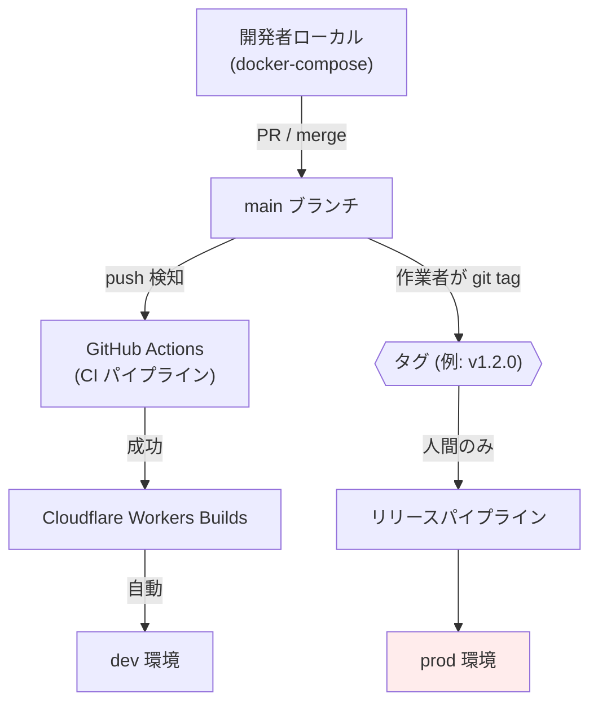
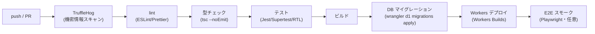
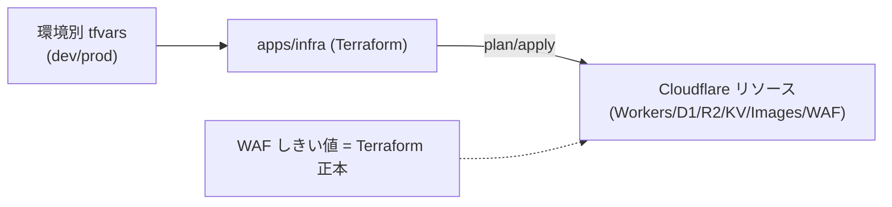

# デプロイ手順・CI/CD — GenAI Profile Community

main への push（dev）と `git tag`（prod）を契機とするデプロイパイプライン、Terraform によるインフラ管理、ロールバック手順を定義する。

> 全体像は [00-overview.md](./00-overview.md)。デプロイ方針の正本は [CLAUDE.md](../../../CLAUDE.md)。
> Git ワークフローは **Trunk-Based Development** を採用する（[ecc-common/git-workflow.md](../../../.claude/rules/ecc-common/git-workflow.md)）。

## 1. デプロイ方針（要点）

- **dev 環境**: `main` ブランチへの push をトリガーに**自動デプロイ**する。
- **prod 環境**: 作業者が `main` に `git tag` を付けるのを**トリガーにデプロイ**する。
- **AI エージェントによる prod デプロイは禁止**。prod へのタグ付けは必ず人間が行う（[CLAUDE.md](../../../CLAUDE.md)）。
- ブランチ運用は Trunk-Based。短命なトピックブランチから `main` へ小さく頻繁にマージする。



## 2. CI/CD パイプライン

`main` への push で GitHub Actions が以下を実行し、成功後に Cloudflare Workers Builds がビルド・デプロイする。



| ステージ | ツール | 目的 |
| --- | --- | --- |
| 機密情報スキャン | TruffleHog（CI）/ Gitleaks `--staged`（pre-commit） | シークレットの push 防止（`BR-COMMON-014`） |
| Lint | ESLint + Prettier | コード品質・整形 |
| 型チェック | TypeScript（`tsc --noEmit`） | 型安全性 |
| テスト | Jest（単体）/ Supertest（API 統合）/ React Testing Library | 80% 以上カバレッジ（[ecc-common/testing.md](../../../.claude/rules/ecc-common/testing.md)） |
| マイグレーション | wrangler d1 migrations apply | スキーマ反映（[db/02-migrations.md](../db/02-migrations.md)） |
| デプロイ | Cloudflare Workers Builds | 各 Worker の配信 |
| E2E（任意） | Playwright | 重要フローのスモーク |

- pre-commit は Husky + lint-staged で Gitleaks・lint を実行し、Commitlint でコミットメッセージ規約（Conventional Commits）を強制する。

## 3. デプロイ単位とリリース順序

各 Worker（client/admin/api/public-api）は独立してデプロイ可能だが、**スキーマ変更を伴う場合は expand→deploy→contract の順**を守る（[db/02-migrations.md](../db/02-migrations.md)）。

推奨順序:

1. **マイグレーション（additive / expand）** を先に適用する。
2. 後方互換のある新コードを **api / public-api** にデプロイする。
3. **client / admin**（フロント）をデプロイする。
4. 不要になった旧カラム等の **contract** マイグレーションを後続リリースで適用する。

## 4. 環境別デプロイ手順

### 4.1 local

```bash
# 依存インストール（ルートで）
pnpm install
# コンテナ起動（DB:55030 / api:55031 / client:55032 / admin:55033 / public-api:55034）
docker compose up -d
# ローカル SQLite にマイグレーション適用
pnpm --filter @app/db migration:up
```

### 4.2 dev（自動）

- `main` への push で GitHub Actions → Workers Builds が自動実行。手動操作は不要。
- マイグレーションは CI 内で dev の D1 に対し `wrangler d1 migrations apply <DB> --env dev` を実行する。
- デプロイ後、Sentry の環境タグ `dev` でエラーを監視する（[03-logging-monitoring.md](./03-logging-monitoring.md)）。

### 4.3 prod（人間のみ）

> ⚠️ **AI エージェントはこの操作を実行しない。** 以下は人間の作業者向け手順。

```bash
# main が緑（CI 成功）であることを確認のうえ、人間がタグを付与
git tag v1.2.0
git push origin v1.2.0
```

- タグ push をトリガーにリリースパイプラインが起動し、prod の D1 へマイグレーション適用 → 各 Worker をデプロイする。
- 影響の大きい変更（破壊的スキーマ変更・WAF しきい値変更）は、リリース前に確認ステップ（承認）を設ける。

## 5. インフラのコード管理（Terraform）

- Cloudflare リソース（Workers ルート・D1・R2・KV 名前空間・Cloudflare Images・WAF Rate Limiting Rules のしきい値）は `apps/infra` の **Terraform** で管理する。
- **本番のレート制限しきい値は Terraform を正本**とする。アプリ層の共通しきい値（管理画面から変更可能、`BR-ADMIN-008`）と整合させる運用とする。
- Terraform の適用は環境ごとに分離し（workspace / tfvars）、状態ファイルはリモートバックエンドで管理する。



## 6. シークレット管理

- ランタイムシークレット（SES 認証情報・Sentry DSN・内部署名鍵など）は **Wrangler Secrets**（`wrangler secret put`）で各 Worker に設定する。
- CI 用シークレットは **GitHub Actions Secrets** で管理する。
- いずれもリポジトリ・ログ・エラー出力に**含めない**（`BR-COMMON-014`、TruffleHog/Gitleaks で多重防御）。
- 露出が疑われるシークレットは即時ローテーションする（[ecc-common/security.md](../../../.claude/rules/ecc-common/security.md)）。

## 7. ロールバック

| 対象 | 手段 |
| --- | --- |
| Worker（コード） | 直前の正常デプロイへ再デプロイ（Workers のバージョン/ロールバック機能） |
| D1（スキーマ） | 逆方向マイグレーション（down）を適用、または D1 Time Travel で復元（[db/02-migrations.md](../db/02-migrations.md)） |
| WAF しきい値 | Terraform で前回値へ revert し apply |
| KV / セッション | 影響を局所化（破壊的変更は避ける）。必要なら名前空間を切替 |

- ロールバックは **expand/contract** の原則に従い、データ損失を伴う `contract` を急がないことで安全性を確保する。
- prod のロールバックも**人間が実施**する。

## 8. デプロイ前チェックリスト

- [ ] CI（lint / 型 / テスト / 機密スキャン）がすべて緑
- [ ] マイグレーションが後方互換（expand 先行）であることを確認
- [ ] 破壊的変更がある場合、ロールバック手順を用意
- [ ] Terraform の差分（特に WAF しきい値）をレビュー
- [ ] Sentry のリリースタグ・環境タグを設定
- [ ] prod は人間が `git tag` を付与（AI は実行しない）

## 9. 関連ドキュメント

- インフラ全体像・環境: [00-overview.md](./00-overview.md)
- ネットワーク構成・レート制限二層: [01-network-architecture.md](./01-network-architecture.md)
- ログ・監視（デプロイ後の確認）: [03-logging-monitoring.md](./03-logging-monitoring.md)
- マイグレーション詳細: [db/02-migrations.md](../db/02-migrations.md)
- 障害対応・ロールバック判断・ランブック: [docs/GUIDES/operations/](../operations/)
- デプロイ方針・技術選定の正本: [CLAUDE.md](../../../CLAUDE.md)
