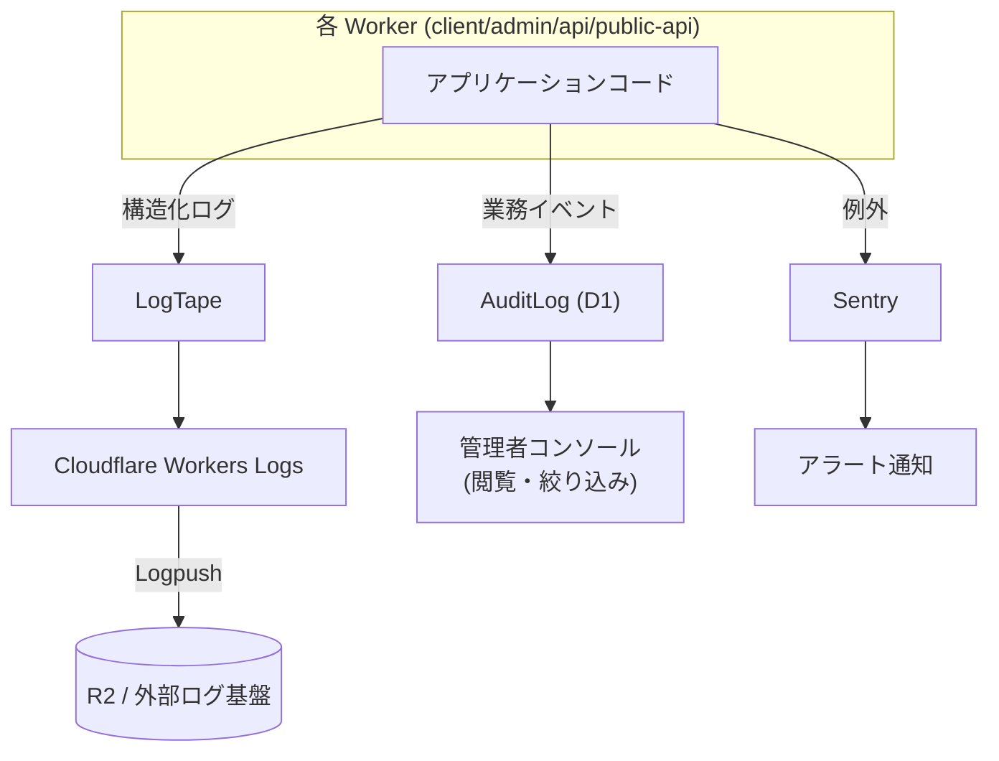

# ログ管理・監視方針 — GenAI Profile Community

構造化ログ（LogTape）、エラートラッキング（Sentry）、監査ログ（AuditLog）、保持方針、アラートを定義する。

> 全体像は [00-overview.md](./00-overview.md)。ログの機密データ取り扱い・監査対象の正本は [00-common-rules.md](../../service/features/00-common-rules.md)（`BR-COMMON-013`/`014`）・[07-admin-console.md](../../service/features/07-admin-console.md)（`ADMIN-5`）。

## 1. ログの 3 分類

本サービスのログは目的の異なる 3 種類を**明確に分離**する。混同すると秘匿・保持・改ざん耐性の要件を満たせない。

| 分類 | 目的 | 実装 | 保存先 | 改ざん耐性 |
| --- | --- | --- | --- | --- |
| アプリケーションログ | 障害調査・デバッグ・性能分析 | LogTape（構造化） | Workers Logs → Logpush（R2 等） | 不要（運用ログ） |
| 監査ログ（AuditLog） | 説明責任・不正追跡・コンプライアンス | ドメインデータ | **D1（追記専用）** | **必須（更新/削除不可）** |
| エラートラッキング | 例外の集約・通知・傾向把握 | Sentry | Sentry（外部） | 不要 |

## 2. アプリケーションログ（LogTape）

### 2.1 方針

- すべてのサーバーログは **LogTape による構造化ログ（JSON）** で出力する。`console.log` 等の素朴な出力は使わない（[ecc-common/code-review.md](../../../.claude/rules/ecc-common/code-review.md)）。
- 1 リクエストを追跡できるよう **相関 ID（request id / trace id）** を全ログに付与する。
- ログレベルは環境で切り替える（local: `debug`、dev: `info`、prod: `info` 既定・必要時 `debug`）。

### 2.2 標準フィールド

| フィールド | 例 | 備考 |
| --- | --- | --- |
| `timestamp` | ISO-8601（UTC 保存） | 表示はローカルタイム（`BR-COMMON-015`） |
| `level` | `info` / `warn` / `error` | — |
| `service` | `api` / `public-api` / `client` / `admin` | アプリ識別 |
| `requestId` | ULID | リクエスト相関 |
| `userId` / `adminId` | 識別子（または匿名化済） | **PII は最小化** |
| `event` | `profile.updated` 等 | イベント名 |
| `message` | 人間可読の要約 | — |

### 2.3 ログに出力してはならないもの（`BR-COMMON-014`）

- パスワード・パスワードハッシュ
- API キーの秘匿値・キーハッシュ
- セッション Cookie 値・各種トークン
- メール本文・確認/リセットリンクの実値

> エラーは握りつぶさず、**詳細なコンテキストはサーバー側ログに**、利用者には一般化した日本語メッセージを返す（`BR-COMMON-012`）。

## 3. 監査ログ（AuditLog）

- 業務上の重要イベントは **D1 の `audit_logs` に追記専用（改ざん不可）** で記録する。アプリケーションログとは別物として扱う（`BR-COMMON-013`、`BR-ADMIN-010`）。
- 記録項目: イベント種別・操作者種別（admin/user/system）・操作者 ID・対象種別/ID・日時（UTC）・結果・関連メタ（理由・旧新値の差分）。秘匿値は記録しない。
- 更新/削除を物理的に防ぐため、D1 で `audit_logs` への UPDATE/DELETE をブロックするトリガーを設ける（[db/01-data-model.md](../db/01-data-model.md)）。
- 管理者は監査ログを**閲覧・絞り込み**できる（`AC-ADMIN-011`/`012`）。

### 監査対象イベント（抜粋）

| カテゴリ | 例 |
| --- | --- |
| 管理者操作 | 凍結・解除・アイコン削除・権限変更・規約公開・しきい値変更 |
| セキュリティ重要ユーザー操作 | ログイン連続失敗・パスワード変更/リセット・メール変更・退会・API キー発行/失効 |
| 公開状態 | 公開/非公開切替・ハンドル変更 |

## 4. エラートラッキング（Sentry）

- フロントエンド（client/admin）・バックエンド（api/public-api）の例外を Sentry に集約する。
- **環境タグ**（`dev`/`prod`）・**リリースタグ**（デプロイバージョン）を付与し、リグレッションを追跡する。
- **PII スクラビング**を有効化し、リクエストボディ・ヘッダから機密情報を除去してから送信する（`BR-COMMON-014`）。
- ソースマップをアップロードし、minify 後のスタックを復元する（秘匿値を含めない）。
- local では Sentry を無効化してよい（任意）。

## 5. エッジ・WAF ログ

- WAF（Rate Limiting Rules）のブロック・チャレンジは Cloudflare のセキュリティイベントで確認する。
- 公開 API・認証系・通報系のレート制限超過の傾向はエッジログとアプリログ（`event: rate_limited`）の双方で、一般閲覧（未認証）のレート制限超過は**エッジ WAF のログ**で把握する（[01-network-architecture.md](./01-network-architecture.md) §3）。

## 6. 保持方針

| ログ種別 | 保持方針 |
| --- | --- |
| アプリケーションログ | 運用ポリシーに従い一定期間保持（Logpush 先の R2/外部基盤のライフサイクルで管理） |
| 監査ログ | 運用ポリシーに従い長期保持。退会ユーザー分も**匿名化のうえ必要範囲で保持**（`BR-ACCT-009`/`BR-COMMON-014`） |
| エラー（Sentry） | Sentry のプラン/保持設定に従う |

> 退会時はアプリログ・監査ログ中の本人特定可能データを匿名化する。匿名化後も不正対策・説明責任のため必要最小限を保持する。

## 7. アラート・監視

- **エラーアラート**: Sentry のしきい値（新規 issue・急増）で通知する。
- **可用性 / 性能**: Core Web Vitals 目標（LCP < 2.5s 等、[performance.md](../../../.claude/rules/ecc-web/performance.md)）を継続監視する。
- **濫用検知**: レート制限超過・通報急増・NSFW 拒否の急増を監視し、運営が早期に対応できるようにする。
- **NSFW 判定エンジンの可用性**: AWS Rekognition のエラー/タイムアウト率を監視・アラートする。判定は **fail-closed**（[01-network-architecture.md](./01-network-architecture.md) §2.2、[ADR](../../adr/20260603-nsfw-moderation-rekognition.md)）のため、エンジン障害はアイコンアップロード不可に直結する。急増時は早期に検知・対応する。

## 8. 関連ドキュメント

- インフラ全体像: [00-overview.md](./00-overview.md)
- ネットワーク構成（相関 ID・レート制限）: [01-network-architecture.md](./01-network-architecture.md)
- デプロイ（リリースタグ）: [02-deployment.md](./02-deployment.md)
- 監査ログのデータ定義: [db/01-data-model.md](../db/01-data-model.md)
- 監査対象・機密データ方針の正本: [00-common-rules.md](../../service/features/00-common-rules.md) / [07-admin-console.md](../../service/features/07-admin-console.md)
