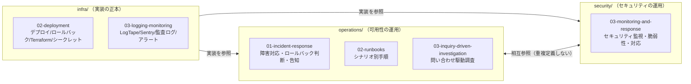

# 運用概要 — GenAI Profile Community

本サービスの運用（可用性/信頼性の維持・障害対応・問い合わせ対応）の全体像と、運用上の責務分担・前提・定期作業・検知手段を定義する。
障害対応は [01-incident-response.md](./01-incident-response.md)、シナリオ別ランブックは [02-runbooks.md](./02-runbooks.md)、問い合わせ駆動調査は [03-inquiry-driven-investigation.md](./03-inquiry-driven-investigation.md) を参照。

> **位置づけ**: 本ガイドは [CLAUDE.md](../../../CLAUDE.md) のデプロイ方針と [docs/GUIDES/infra/](../infra/)（デプロイ・ログ・監視の実装）を、**運用手順の観点**で束ねるものである。**デプロイ/ロールバックの実装正本は [infra/02-deployment.md](../infra/02-deployment.md)、ログ/監視の実装正本は [infra/03-logging-monitoring.md](../infra/03-logging-monitoring.md)** であり、本ガイドは値・パイプライン定義を再掲せず、運用の判断と手順に限定する。
> **現状フェーズ**: `apps/` 配下は未実装で、本ガイドは実装に先行する運用設計である。差異が生じたら本ガイドを更新すること。

## 1. 運用の対象とスコープ

| 対象 | 内容 | 主な参照 |
| --- | --- | --- |
| 可用性/信頼性 | 障害の検知・対応・復旧・事後レビュー、ロールバック判断 | [01-incident-response.md](./01-incident-response.md) |
| リリース運用 | dev 自動／prod 人間タグの運用、リリース順序、デプロイ前チェック | [infra/02-deployment.md](../infra/02-deployment.md) |
| 障害シナリオ対応 | コンポーネント別ランブック（Worker/D1/Rekognition/メール/画像 等） | [02-runbooks.md](./02-runbooks.md) |
| 問い合わせ対応 | 問い合わせ・通報を起点とした調査と回答 | [03-inquiry-driven-investigation.md](./03-inquiry-driven-investigation.md) |
| モデレーション運用 | 通報処理・凍結・解除リクエスト審査 | [06-trust-and-safety.md](../../service/features/06-trust-and-safety.md)・[07-admin-console.md](../../service/features/07-admin-console.md) |

> **セキュリティ運用は別系統**: セキュリティインシデント（情報漏えい・キー漏えい・濫用・脆弱性）・セキュリティ監視・依存脆弱性管理は [security/03-monitoring-and-response.md](../security/03-monitoring-and-response.md) を正本とする。本ディレクトリは可用性/信頼性・問い合わせ運用に集中する。

## 2. 責務分担（operations / security / infra）

- **infra/** が「どう作る・どう載せる・どう記録する」の実装正本。
- **operations/** が「可用性インシデントをどう対応するか・問い合わせをどう調査するか」の手順。
- **security/** が「脅威にどう備え・セキュリティインシデントにどう対応するか」。
- 三者は相互参照し、しきい値・パイプライン定義・監査対象などの**値は infra/ と features/ を単一の正本**として再掲しない。

## 3. 運用環境と前提

| 環境 | デプロイ契機 | AI エージェント操作 | 備考 |
| --- | --- | --- | --- |
| local | `docker-compose` 手動 | 可 | SQLite / Mailpit / 決定論的スタブ |
| dev | main への push で**自動** | 可 | 結合・検証 |
| prod | 人間の `git tag` で**発火** | **禁止** | 本番 |

- **prod への操作（デプロイ・ロールバック・WAF しきい値変更）は必ず人間が実施**する。AI エージェントによる prod 操作は禁止（[CLAUDE.md](../../../CLAUDE.md)、[infra/02-deployment.md](../infra/02-deployment.md) §4.3）。
- Git ワークフローは Trunk-Based Development。短命ブランチから main へ小さく頻繁にマージする。

## 4. 監視と検知（運用の入口）

検知の実装・アラート設定の正本は [infra/03-logging-monitoring.md](../infra/03-logging-monitoring.md)。運用ではこれらを障害検知の入口とする。

| 検知手段 | 主な用途 | 備考 |
| --- | --- | --- |
| Sentry（エラートラッキング） | 例外・リグレッション・急増 | 環境/リリースタグで追跡 |
| Cloudflare Analytics / Workers メトリクス | 可用性・性能・トラフィック傾向（**Cloudflare ネイティブ中心**） | 死活/外形は Cloudflare 機能を主とし、外部死活監視は最小限 |
| WAF セキュリティイベント | レート制限・攻撃パターン | セキュリティ監視と共有（[security/03](../security/03-monitoring-and-response.md)） |
| 構造化ログ（LogTape）＋相関 ID | 障害調査・問い合わせ駆動調査 | `requestId` で 1 リクエストを追跡 |
| 監査ログ（AuditLog） | 操作追跡・不正調査 | 追記専用・改ざん不可 |
| 利用者からの問い合わせ・通報 | 自動検知できない不具合の入口 | [03-inquiry-driven-investigation.md](./03-inquiry-driven-investigation.md) |

- **死活/外形監視**は Cloudflare ネイティブ（Analytics・Health Checks）を中心とし、低コスト方針に沿って外部の死活監視サービスは最小限に留める。
- **NSFW 判定エンジン（Rekognition）の可用性**は重点監視対象。判定は fail-closed のためエンジン障害がアイコンアップロード不可へ直結する（[infra/03-logging-monitoring.md](../infra/03-logging-monitoring.md) §7、[02-runbooks.md](./02-runbooks.md)）。

## 5. 定期運用作業

| 作業 | 頻度（目安） | 参照 |
| --- | --- | --- |
| 依存パッケージ更新 PR のレビュー・取り込み | 随時（Dependabot） | [security/03](../security/03-monitoring-and-response.md) §3 |
| ログ・監査ログの保持/ライフサイクル確認 | 運用ポリシーに従い定期 | [infra/03-logging-monitoring.md](../infra/03-logging-monitoring.md) §6 |
| D1 バックアップ/復元手段（Time Travel）の確認 | 定期 | [infra/02-deployment.md](../infra/02-deployment.md) §7・[db/02-migrations.md](../db/02-migrations.md) |
| WAF しきい値とアプリ層しきい値の整合確認 | 変更時・定期 | `BR-ADMIN-008`・[infra/02-deployment.md](../infra/02-deployment.md) §5 |
| 通報・問い合わせキューの確認 | 随時 | [06-trust-and-safety.md](../../service/features/06-trust-and-safety.md) |

## 6. このディレクトリの構成

| ファイル | 内容 |
| --- | --- |
| [00-overview.md](./00-overview.md) | 運用の全体像・責務分担・前提・監視と検知・定期作業（本書） |
| [01-incident-response.md](./01-incident-response.md) | 障害対応。深刻度区分・対応フロー・ロールバック判断・インシデント告知・事後レビュー |
| [02-runbooks.md](./02-runbooks.md) | コンポーネント別ランブック（Worker/D1/Rekognition/レート制限/メール/画像/濫用） |
| [03-inquiry-driven-investigation.md](./03-inquiry-driven-investigation.md) | 問い合わせ・通報を起点とした調査手順（相関 ID・監査ログ・プライバシー配慮） |

## 7. 関連ドキュメント

- デプロイ・CI/CD・ロールバック・Terraform・シークレット: [infra/02-deployment.md](../infra/02-deployment.md)
- ログ・監視・監査ログ・アラート: [infra/03-logging-monitoring.md](../infra/03-logging-monitoring.md)
- セキュリティ監視・脆弱性管理・セキュリティインシデント対応: [security/03-monitoring-and-response.md](../security/03-monitoring-and-response.md)
- 通報・凍結・解除リクエスト・NSFW: [06-trust-and-safety.md](../../service/features/06-trust-and-safety.md)
- 管理者操作・権限・監査ログ閲覧: [07-admin-console.md](../../service/features/07-admin-console.md)
- 技術選定・デプロイ方針の正本: [CLAUDE.md](../../../CLAUDE.md)
