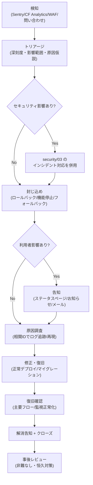
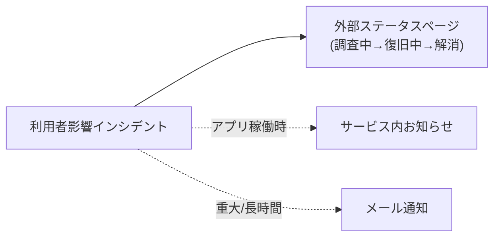

# 障害対応 — GenAI Profile Community

可用性/信頼性のインシデント（障害・性能劣化・データ不整合）の検知から復旧・事後レビューまでの対応フロー、深刻度区分、ロールバック判断、利用者への告知方針を定義する。

> 全体像・責務分担は [00-overview.md](./00-overview.md)。
> **境界**: 本書は**可用性/信頼性**の障害を扱う。**セキュリティインシデント（情報漏えい・キー漏えい・濫用・脆弱性）は [security/03-monitoring-and-response.md](../security/03-monitoring-and-response.md) §5** が正本。両者は重なりうるため相互参照する。
> **ロールバックの手段の正本は [infra/02-deployment.md](../infra/02-deployment.md) §7**。本書は「いつ・どう判断するか」に限定し、手段を再掲しない。

## 1. 対応の原則

- **被害の局所化を最優先**: 影響拡大を止める操作（ロールバック・機能の一時停止・フォールバック）を先に行い、原因究明は並行・後追いで進める。
- **prod 操作は人間のみ**: prod へのロールバック・`git tag`・WAF しきい値変更（Terraform）は人間が実施する。AI エージェントは prod 操作を行わない（[CLAUDE.md](../../../CLAUDE.md)）。
- **データ安全性を急がない**: データ損失を伴う `contract`（破壊的）マイグレーションは急がず、expand/contract の原則で安全側に倒す（[infra/02-deployment.md](../infra/02-deployment.md) §7、[db/02-migrations.md](../db/02-migrations.md)）。
- **記録を残す**: 重要な運用操作（凍結・しきい値変更・削除等）は監査ログに記録される（`BR-COMMON-013`）。対応経緯は事後レビューのために残す。

## 2. 深刻度区分（SEV）

個人開発・低コスト方針に合わせた軽量な 3 段階とする。深刻度は影響範囲とデータ/セキュリティ影響で判定する。

| 深刻度 | 目安 | 例 | 初動 |
| --- | --- | --- | --- |
| **SEV1（重大）** | 主要機能が広範に停止／データ損失・破壊の恐れ | client/admin/api 全体停止、D1 障害、誤った破壊的マイグレーション | 即時封じ込め・ロールバック検討、必要なら告知 |
| **SEV2（重要）** | 一部機能の停止・著しい劣化 | アイコンアップロード不可（Rekognition 障害）、メール送信停止、公開 API の高エラー率 | 該当機能のフォールバック/一時停止、原因切り分け |
| **SEV3（軽微）** | 局所的・回避策あり | 特定画面の不具合、軽微な性能劣化、限定的な表示崩れ | 通常リリースで修正、必要に応じ監視強化 |

> セキュリティ影響（PII 露出・キー漏えい等）が疑われる場合は深刻度に関わらず [security/03](../security/03-monitoring-and-response.md) のセキュリティインシデント対応を併用する。

## 3. 対応フロー

1. **検知**: 監視シグナル（[00-overview.md](./00-overview.md) §4）または問い合わせ（[03-inquiry-driven-investigation.md](./03-inquiry-driven-investigation.md)）から認知する。
2. **トリアージ**: 深刻度を割り当て、影響範囲・原因仮説を立てる。直近のデプロイ/マイグレーション/しきい値変更との相関を確認する。
3. **封じ込め**: ロールバック・該当機能の一時停止・フォールバックで被害を止める（§4）。
4. **告知**: 利用者影響があれば告知する（§5）。
5. **原因調査**: 相関 ID（`requestId`）で構造化ログを追跡し、再現する（[infra/03-logging-monitoring.md](../infra/03-logging-monitoring.md) §2）。
6. **修正・復旧**: 正常な状態へデプロイ／マイグレーションで戻す。prod は人間が実施。
7. **復旧確認**: 主要フロー（ログイン・プロフィール CRUD・公開ページ閲覧・公開 API）と監視の正常化を確認する。
8. **事後レビュー**: 非難なしのポストモーテムで根本原因と恒久対策を記録する（§6）。

## 4. ロールバック判断

ロールバックの**手段の正本は [infra/02-deployment.md](../infra/02-deployment.md) §7**（Worker のバージョン復帰・D1 の down/Time Travel・WAF の Terraform revert・KV の局所化）。ここでは判断基準を示す。

| 状況 | 判断の目安 |
| --- | --- |
| 直近デプロイ後に SEV1/SEV2 が発生 | 速やかに直前の正常デプロイへロールバック（後方互換の範囲で） |
| スキーマ変更起因 | expand 済みなら旧コードへ戻して切り分け。`contract` は急がない |
| WAF/アプリ層しきい値の誤設定 | Terraform で前回値へ revert／管理画面で是正（両者を整合、`BR-ADMIN-008`） |
| 外部サービス障害（Rekognition/SES 等） | コードはロールバックせず、フォールバック/再試行/一時停止で対応（[02-runbooks.md](./02-runbooks.md)） |

- ロールバックも **expand/contract の原則**に従い、データ損失を伴う操作を急がない。prod のロールバックは人間が実施する。

## 5. インシデント告知

利用者影響のあるインシデントは、停止中でも到達できる**外部ステータスページ（FlareWarden）**を一次手段とし、サービス内のお知らせ・メールを補完的に用いる。FlareWarden は無料プランがあり、コード設定不要でURLの入力のみで導入できるため採用した（選定の正本は [CLAUDE.md](../../../CLAUDE.md) の技術選定）。

| 手段 | 役割 | 備考 |
| --- | --- | --- |
| **外部ステータスページ（FlareWarden）** | リアルタイムの稼働状況・インシデント告知（採用） | アプリ停止時も外部から到達可能。状態（調査中/復旧中/解消）を更新。外形からの死活監視も兼ねる |
| サービス内お知らせ（Announcement） | アプリ内での周知 | 既存機能（`BR-CONTENT-001`、[08-content-and-comms.md](../../service/features/08-content-and-comms.md)）。アプリが稼働している場合 |
| メール通知（必要時） | 重大・長時間のインシデント | 重要通知はトランザクション扱い（`BR-CONTENT-004`）。SES（ローカルは Mailpit） |

- 告知文面は日本語で、現象・影響範囲・回避策（あれば）・次回更新目安を簡潔に示し、内部詳細や秘匿情報を含めない（`BR-COMMON-012`/`014`）。
- 解消時は復旧を告知し、ステータスページの状態を戻す。

## 6. 事後レビュー（ポストモーテム）

- SEV1・SEV2 は事後レビューを行う。**非難なし（blameless）**を原則とし、人ではなく仕組みの改善に集中する。
- 記録項目: 時系列・検知方法・根本原因・影響範囲・対応内容・再発防止策（監視/アラート/テスト/ランブックへの反映）。
- 恒久対策は監視ルール・[02-runbooks.md](./02-runbooks.md)・テスト（TDD、[testing/](../testing/)）へ反映し、同種の再発を防ぐ。

## 7. 関連ドキュメント

- 運用の全体像・責務分担・検知手段: [00-overview.md](./00-overview.md)
- シナリオ別ランブック: [02-runbooks.md](./02-runbooks.md)
- 問い合わせ駆動調査: [03-inquiry-driven-investigation.md](./03-inquiry-driven-investigation.md)
- デプロイ・ロールバック手段・Terraform: [infra/02-deployment.md](../infra/02-deployment.md)
- ログ・監視・アラート・相関 ID: [infra/03-logging-monitoring.md](../infra/03-logging-monitoring.md)
- セキュリティインシデント対応: [security/03-monitoring-and-response.md](../security/03-monitoring-and-response.md)
- マイグレーション・D1 復元（Time Travel）: [db/02-migrations.md](../db/02-migrations.md)
- お知らせ・メール通知（告知手段）: [08-content-and-comms.md](../../service/features/08-content-and-comms.md)
