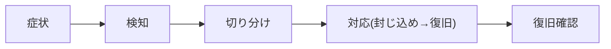

# 障害ランブック — GenAI Profile Community

代表的な障害シナリオごとの症状・検知・切り分け・対応・復旧確認をまとめる。各ランブックは [01-incident-response.md](./01-incident-response.md) の対応フローに沿って用いる。

> 全体像は [00-overview.md](./00-overview.md)。ロールバック手段の正本は [infra/02-deployment.md](../infra/02-deployment.md) §7、監視/ログの正本は [infra/03-logging-monitoring.md](../infra/03-logging-monitoring.md)。本書は値・手段を再掲せず、運用判断と参照に徹する。
> **現状フェーズ**: `apps/` 配下は未実装で、本書は実装に先行する運用設計である。閾値・コマンド・ダッシュボード URL は実装着手時に具体化する。

## ランブックの読み方

各シナリオは次の構成で記す。**prod への変更操作は人間が実施**し、AI エージェントは行わない（[CLAUDE.md](../../../CLAUDE.md)）。

- **症状**: 利用者・監視から見える現象
- **検知**: どのシグナルで気づくか（[00-overview.md](./00-overview.md) §4）
- **切り分け**: 原因を絞る確認
- **対応**: 封じ込め・復旧の手順（参照先に委譲）
- **復旧確認**: 正常化の確認

---

## RB-1. Worker デプロイ後の不具合（client/admin/api/public-api）

- **症状**: 直近リリース後にエラー急増・主要画面/エンドポイントが機能しない（SEV1/SEV2）。
- **検知**: Sentry のリリースタグでの新規/急増 issue、Cloudflare Analytics のエラー率上昇。
- **切り分け**: 影響 Worker を特定（client/admin/api/public-api のどれか）。直近デプロイ・スキーマ変更・しきい値変更との相関を確認。
- **対応**: 直前の正常デプロイへロールバック（Workers のバージョン復帰、[infra/02-deployment.md](../infra/02-deployment.md) §7）。スキーマ変更を伴う場合は expand 済みの旧コードへ戻して切り分ける。
- **復旧確認**: 該当 Worker の主要フロー（ログイン・CRUD・公開ページ・公開 API）と Sentry のエラー率正常化。

## RB-2. D1（データベース）障害・スキーマ不整合

- **症状**: 読み書き失敗・タイムアウト、特定クエリの一斉エラー、マイグレーション後の不整合（SEV1）。
- **検知**: アプリログの DB エラー、Sentry、CRUD 全般の失敗。
- **切り分け**: 一時的なプラットフォーム事象か、直近マイグレーション起因かを区別。`audit_logs` への UPDATE/DELETE ブロックなどトリガー由来のエラーと業務エラーを区別する。
- **対応**: マイグレーション起因なら逆方向（down）適用、または D1 Time Travel で復元（[db/02-migrations.md](../db/02-migrations.md)、[infra/02-deployment.md](../infra/02-deployment.md) §7）。**データ損失を伴う `contract` は急がない**。
- **復旧確認**: 代表的な読み書き・公開ゲート評価・監査ログ追記が正常であること。

## RB-3. NSFW 判定エンジン（AWS Rekognition）障害

- **症状**: アイコンのアップロードが軒並み失敗（`422`）。判定は **fail-closed** のため、エンジン障害＝アップロード不可に直結する（SEV2）。
- **検知**: Rekognition のエラー/タイムアウト率の上昇（重点監視、[infra/03-logging-monitoring.md](../infra/03-logging-monitoring.md) §7）、アップロード失敗の問い合わせ増。
- **切り分け**: Rekognition 側の事象か、署名呼び出し（`aws4fetch`）・ネットワーク・シークレットの問題かを切り分ける。
- **対応**: 一時的事象は bounded timeout＋限定リトライで自然回復を待つ。長時間化する場合は、**安全側（保存しない）を維持**したまま、利用者へ「アイコン変更が一時的に行えない」旨を告知（[01-incident-response.md](./01-incident-response.md) §5）。**判定を無効化して通す運用は行わない**（健全性は前提条件、`BR-SAFE-001`）。すり抜けた画像は通報・モデレーションで事後対応（`BR-SAFE-002`）。
- **復旧確認**: 健全な画像のアップロード成功、`nsfw_checks` 記録、エラー率の正常化。

## RB-4. レート制限の誤設定・想定外の遮断/濫用

- **症状**: 正当な利用者が `429` で広範に遮断される／逆に濫用を止められない（SEV2/SEV3）。
- **検知**: WAF セキュリティイベント、アプリログ（`event: rate_limited`）、問い合わせ・公開 API 利用者からの報告。
- **切り分け**: エッジ（WAF）かアプリ層（@nestjs/throttler）か、対象（公開 API キー単位＝DO／認証系・通報系＝KV／一般閲覧＝WAF のみ）を特定（[infra/01-network-architecture.md](../infra/01-network-architecture.md) §3）。
- **対応**: アプリ層の共通しきい値は管理画面で是正、本番エッジ値は Terraform で revert/apply し、**両者を整合**させる（`BR-ADMIN-008`、[infra/02-deployment.md](../infra/02-deployment.md) §5）。しきい値変更は監査ログに記録。濫用が原因なら凍結・キー失効を検討（[security/03](../security/03-monitoring-and-response.md)）。
- **復旧確認**: 正当利用の成功と濫用の抑制、`RateLimit-*` ヘッダの妥当性。

## RB-5. メール送信（Amazon SES）障害

- **症状**: メール確認・パスワードリセット・通知が届かない（SEV2）。確認/リセットはユーザー登録・復旧に直結する。
- **検知**: SES のエラー率、アプリログの送信失敗、未着の問い合わせ増。
- **切り分け**: SES 側の事象か、認証情報・テンプレート（MJML）・送信元設定の問題かを切り分ける。ローカルは Mailpit で再現確認。
- **対応**: 一時的事象は再試行で回復を待つ。**トランザクションメール（確認・リセット・重要通知）を優先**し、お知らせ系は後回しでよい（`BR-CONTENT-004`）。長時間化時は告知し、確認リンクの再送導線（`BR-ACCT-003`）を案内。
- **復旧確認**: テスト送信の到達、確認/リセットフローの成功。秘匿リンク実値はログに出さない（`BR-COMMON-014`）。

## RB-6. 画像配信（Cloudflare Images / R2）障害

- **症状**: アイコンが表示されない・配信遅延（SEV2/SEV3）。
- **検知**: Cloudflare Analytics、画像 4xx/5xx、表示崩れの報告。
- **切り分け**: 配信（Images）か原本ストレージ（R2）か、特定変換/サイズの問題かを切り分ける。
- **対応**: 既定アイコンへのフォールバック表示で利用者影響を緩和。原本（R2）が健全なら再配信/再登録で復旧。`` は明示的 `width`/`height` でレイアウトシフトを避ける（[ecc-web/performance.md](../../../.claude/rules/ecc-web/performance.md)）。
- **復旧確認**: 公開ページ・一覧でのアイコン表示、CLS への影響がないこと。

## RB-7. KV / セッション障害

- **症状**: ログイン状態が維持されない・セッション検証失敗・レート制限カウンタ異常（SEV2）。
- **検知**: 認証失敗の急増、アプリログ、問い合わせ。
- **切り分け**: 利用者用／管理者用のどちらの KV 名前空間か、セッション・トークン・カウンタのいずれかを特定（[infra/01-network-architecture.md](../infra/01-network-architecture.md) §4）。
- **対応**: 破壊的変更は避け影響を局所化。必要なら名前空間を切替。`session_epoch` による失効方式と整合を保つ。利用者には再ログインを案内しうる。
- **復旧確認**: ログイン・セッション維持・全セッション無効化（パスワード変更時）の整合。

## RB-8. 濫用・通報の急増（運用 × セキュリティの接点）

- **症状**: スパム的プロフィール・大量通報・標的型通報の急増（SEV2/SEV3）。
- **検知**: 通報キューの急増、NSFW 拒否の急増、WAF イベント（[security/03](../security/03-monitoring-and-response.md) §1）。
- **切り分け**: 実害（不適切公開）か、濫用的な大量通報かを区別（重複通報は集約、`BR-SAFE-004`）。
- **対応**: モデレーション（アイコン削除・凍結、`BR-SAFE-005`/`006`）で対処。攻撃的トラフィックはレート制限/WAF 強化（RB-4）。セキュリティインシデントとしての扱いは [security/03](../security/03-monitoring-and-response.md) §5。
- **復旧確認**: キューの正常化、公開面の健全性、対応の監査ログ記録。

---

## 関連ドキュメント

- 障害対応フロー・深刻度・ロールバック判断・告知: [01-incident-response.md](./01-incident-response.md)
- 問い合わせ駆動調査（報告起点の切り分け）: [03-inquiry-driven-investigation.md](./03-inquiry-driven-investigation.md)
- デプロイ・ロールバック手段・Terraform・シークレット: [infra/02-deployment.md](../infra/02-deployment.md)
- ログ・監視・アラート・NSFW エンジン監視: [infra/03-logging-monitoring.md](../infra/03-logging-monitoring.md)
- レート制限の多層・カウンタ配置: [infra/01-network-architecture.md](../infra/01-network-architecture.md) §3/§4
- マイグレーション・D1 Time Travel: [db/02-migrations.md](../db/02-migrations.md)
- 通報・凍結・NSFW のライフサイクル: [06-trust-and-safety.md](../../service/features/06-trust-and-safety.md)
- セキュリティ監視・インシデント対応: [security/03-monitoring-and-response.md](../security/03-monitoring-and-response.md)
