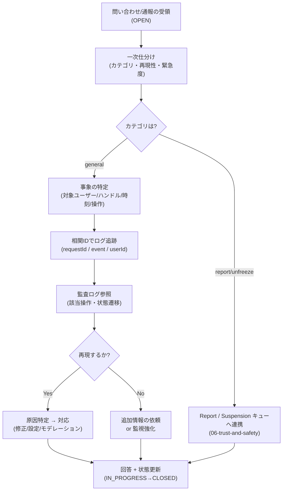

# 問い合わせ駆動調査手順 — GenAI Profile Community

利用者・閲覧者からの問い合わせ・通報を起点に、相関 ID と監査ログを用いて事象を調査し、回答・対応するまでの手順を定義する。自動監視では捉えにくい不具合や個別事象の入口となる。

> 全体像は [00-overview.md](./00-overview.md)。問い合わせフォーム自体の仕様は [08-content-and-comms.md](../../service/features/08-content-and-comms.md)、通報・解除リクエストのライフサイクルは [06-trust-and-safety.md](../../service/features/06-trust-and-safety.md)、管理者操作・権限は [07-admin-console.md](../../service/features/07-admin-console.md) が正本。
> **現状フェーズ**: `apps/` 配下は未実装で、本書は実装に先行する運用設計である。

## 1. 概要と入口

問い合わせフォームは単一の窓口で、カテゴリにより連携先が分かれる（`BR-CONTENT-006`）。調査の出発点と一次仕分けは次のとおり。

| カテゴリ | 内容 | 連携先（正本） |
| --- | --- | --- |
| `general` | 一般的な問い合わせ・不具合報告 | 本書（運用調査） |
| `report` | 不適切プロフィールの通報 | Report キュー（[06-trust-and-safety.md](../../service/features/06-trust-and-safety.md) `BR-SAFE-003`） |
| `unfreeze` | 凍結の解除リクエスト | Suspension キュー（[06-trust-and-safety.md](../../service/features/06-trust-and-safety.md) `BR-SAFE-007`） |

- 問い合わせは `OPEN`/`IN_PROGRESS`/`CLOSED` で状態管理し、対応は監査ログに記録する（`BR-CONTENT-007`）。
- 送信はレート制限（`BR-COMMON-010`）とハニーポット等の軽量対策の対象（[security/02-application-security.md](../security/02-application-security.md) §9）。

## 2. 調査フロー

1. **受領・一次仕分け**: カテゴリ・緊急度・再現性を確認する。広範な障害の兆候なら [01-incident-response.md](./01-incident-response.md) の障害対応へ切り替える。
2. **事象の特定**: 対象ユーザー/ハンドル・発生時刻・操作内容・期待と実際の差を特定する。
3. **相関 ID でログ追跡**: 構造化ログ（LogTape）を `requestId`・`event`・`userId`/`adminId` で追跡する（標準フィールドの正本は [infra/03-logging-monitoring.md](../infra/03-logging-monitoring.md) §2）。1 リクエストを端から端まで追える。
4. **監査ログ参照**: 状態遷移・管理者操作・セキュリティ重要操作は `AuditLog`（追記専用）で追跡する（`BR-COMMON-013`、[infra/03-logging-monitoring.md](../infra/03-logging-monitoring.md) §3）。
5. **再現・原因特定**: 可能なら local（決定論的スタブ・固定時刻/ULID）で再現する（[testing/](../testing/)）。
6. **対応**: 不具合は修正リリース（prod は人間）、設定起因は是正（[02-runbooks.md](./02-runbooks.md)）、コンテンツ起因はモデレーション（[06-trust-and-safety.md](../../service/features/06-trust-and-safety.md)）。
7. **回答・クローズ**: 日本語で分かりやすく回答し、状態を更新する。対応は監査ログに残る。

## 3. よくある問い合わせと初動の当たり

| 問い合わせ | 初動の当たり | 参照 |
| --- | --- | --- |
| 「公開したはずのページが見られない」 | 実効公開ゲートを確認（未確認/凍結/visibility=PRIVATE/退会で `404`） | `BR-COMMON-007`、[security/01](../security/01-authn-authz.md) §3.3 |
| 「メール（確認/リセット）が届かない」 | SES 送信状況・迷惑メール・再送導線・列挙防止仕様の確認 | RB-5（[02-runbooks.md](./02-runbooks.md)）、`BR-ACCT-003`/`006` |
| 「アイコンが保存できない」 | NSFW 拒否か Rekognition 障害か・形式/サイズ違反かを切り分け | RB-3、`BR-SAFE-001` |
| 「公開 API が 429 になる」 | キー単位レート制限・`RateLimit-*` ヘッダ・しきい値設定の確認 | RB-4、`BR-API-008` |
| 「ログイン状態が保持されない」 | セッション/KV・Cookie 属性・パスワード変更による全セッション無効化 | RB-7、`BR-ACCT-005` |
| 「ハンドルにアクセスすると見つからない」 | 旧ハンドルの 301 転送期間・解放・実効公開を確認 | `BR-SHARE-004`、[infra/01](../infra/01-network-architecture.md) §2.1 |
| 「凍結された／解除したい」 | `unfreeze` カテゴリで解除リクエスト連携、状態と理由区分を確認 | `BR-SAFE-006`/`007` |

## 4. プライバシー・秘匿の配慮（必読）

調査は個人データに触れるため、次を厳守する。

- **職務上必要な範囲に限定**: 個人データの閲覧は調査に必要な最小限とし、重要操作時の表示自体も監査の対象となる（`BR-ADMIN-004`、最小権限 `BR-ADMIN-002`）。
- **秘匿値を見ない/出さない**: パスワード・パスワードハッシュ・API キー秘匿値・セッション Cookie 値・トークン・確認/リセットリンク実値はログにも記録されず、調査でも扱わない（`BR-COMMON-014`、[infra/03-logging-monitoring.md](../infra/03-logging-monitoring.md) §2.3）。
- **列挙・存在漏れの防止**: 回答で第三者のアカウント存在・状態を明かさない。認証・存在確認に関わる事項は一般化した表現を用いる（`BR-COMMON-012`）。
- **セキュリティ事象への切替**: 調査中に情報漏えい・キー漏えい・不正アクセスの疑いを認めたら、[security/03-monitoring-and-response.md](../security/03-monitoring-and-response.md) §5 のセキュリティインシデント対応へ切り替える。

## 5. カテゴリ別の取り扱い

- **`report`（通報）**: Report として `OPEN→IN_REVIEW→RESOLVED/DISMISSED` で扱い、重複は集約。審査結果（アイコン削除/凍結/却下）は監査ログに記録（`BR-SAFE-004`/`005`）。
- **`unfreeze`（解除リクエスト）**: Suspension として `PENDING→APPROVED/REJECTED` で審査。承認で `FROZEN→ACTIVE`（凍結前の公開設定を引き継ぐ）。連投はレート制限（`BR-SAFE-007`/`008`）。
- **`general`**: 不具合は本書のフローで調査・対応。仕様確認はヘルプ記事（`BR-CONTENT-005`）へ誘導しうる。

## 6. 関連ドキュメント

- 運用の全体像・検知手段: [00-overview.md](./00-overview.md)
- 障害対応フロー（広範障害への切替先）: [01-incident-response.md](./01-incident-response.md)
- シナリオ別ランブック: [02-runbooks.md](./02-runbooks.md)
- 問い合わせ・お知らせ・ヘルプ・規約: [08-content-and-comms.md](../../service/features/08-content-and-comms.md)
- 通報・凍結・解除リクエスト: [06-trust-and-safety.md](../../service/features/06-trust-and-safety.md)
- 管理者操作・権限・監査ログ閲覧: [07-admin-console.md](../../service/features/07-admin-console.md)
- ログ・監査ログ・相関 ID・秘匿方針: [infra/03-logging-monitoring.md](../infra/03-logging-monitoring.md)
- セキュリティインシデント対応: [security/03-monitoring-and-response.md](../security/03-monitoring-and-response.md)
