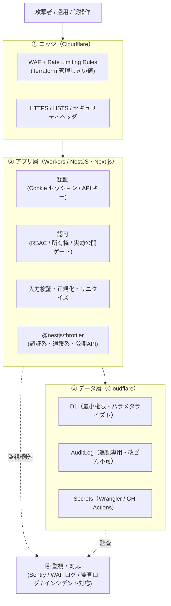

# セキュリティ概要 — GenAI Profile Community

本サービスのセキュリティ方針・脅威モデル・多層防御の全体像と、各セキュリティ要件の正本（SSoT）への参照マップを定義する。
認証認可設計は [01-authn-authz.md](./01-authn-authz.md)、アプリケーション層の防御は [02-application-security.md](./02-application-security.md)、監視とインシデント対応は [03-monitoring-and-response.md](./03-monitoring-and-response.md) を参照。

> **位置づけ**: 本ガイドは [CLAUDE.md](../../../CLAUDE.md) の技術選定・セキュリティ方針と、横断ビジネスルール [00-common-rules.md](../../service/features/00-common-rules.md)（`BR-COMMON-*`）を、セキュリティ設計の観点で具体化したものである。
> **正本の優先順位**: 業務仕様（公開ゲート・レート制限のしきい値・セッション仕様・監査対象など）の正本は [docs/service/features/](../../service/features/)（SSoT）。コーディング規約としてのセキュリティ一次情報は [.claude/rules/ecc-common/security.md](../../../.claude/rules/ecc-common/security.md)・[.claude/rules/ecc-web/security.md](../../../.claude/rules/ecc-web/security.md)。矛盾した場合はそれらを優先し、本ガイドを追従させる。**本ガイドはしきい値・上限・スコープ定義などの値を再掲せず、設計と正本への参照に限定する。**
> **現状フェーズ**: `apps/` 配下は未実装で、本ガイドは実装に先行する設計仕様である。差異が生じたら本ガイドを更新すること。

## 1. セキュリティ方針

- **個人開発・低コスト・実用本位**: Cloudflare を主軸とした、個人開発アプリケーション向けの低コストで基本的な構成を取る（[CLAUDE.md](../../../CLAUDE.md)）。過剰な専用基盤を避け、プラットフォーム標準機能と既存ツールで多層防御を組む。
- **多層防御（Defense in Depth）**: エッジ（Cloudflare WAF）・トランスポート（HTTPS/HSTS）・アプリ層（認証認可・検証・サニタイズ・レート制限）・データ層（最小権限・追記専用監査ログ）の各層で重ねて守る。
- **最小権限の原則**: ロール・スコープ・所有権で操作を絞り、UI と API の双方で強制する（`BR-ADMIN-002`、`BR-API-001b`）。
- **安全側に倒す（fail-safe / fail-closed）**: 判定不能・障害時は公開しない／保存しないなど、危険を回避する側に倒す（NSFW 判定は fail-closed、`BR-SAFE-001`）。
- **秘匿の徹底**: 認証・存在確認に関わる失敗は列挙されない一般化メッセージで返し、秘匿値（パスワード・キー・トークン・Cookie 値）はログ・エラーに出さない（`BR-COMMON-012`/`014`）。
- **健全性は前提条件**: NSFW 自動検出・通報・凍結を運営の土台に組み込む（[06-trust-and-safety.md](../../service/features/06-trust-and-safety.md)）。

## 2. 脅威モデル（資産・脅威・主な対策）

守るべき資産と、想定脅威・主な対策の対応を整理する。詳細な対策の正本は右列の参照先。

| 資産 | 主な脅威 | 主な対策 | 正本 |
| --- | --- | --- | --- |
| 利用者の認証情報・セッション | 総当たり・乗っ取り・セッション固定 | PBKDF2・レート制限＋バックオフ・セッション分離・全セッション無効化・WebAuthn 推奨 | `BR-COMMON-001`/`003`/`016`、`BR-ACCT-005`/`006` |
| 管理者権限 | 権限昇格・横展開・ロックアウト | RBAC（最小権限）・別ドメイン/別ストア・短命セッション・自己降格/最後の super_admin 保護 | `BR-COMMON-002`、`BR-ADMIN-002`/`003` |
| API キー | 漏えい・濫用・スコープ逸脱 | ハッシュ保存・一度限り表示・スコープ（read/full）固定・キー単位レート制限・失効 | `BR-API-001`/`001b`/`008` |
| 個人データ（PII） | 不正閲覧・流出・列挙 | 公開ゲート・職務上必要な範囲の閲覧・列挙防止・退会時匿名化・PII 最小化ログ | `BR-COMMON-007`/`012`/`014`、`BR-ACCT-009` |
| プロフィール公開面 | なりすまし・不適切画像・スパム | NSFW 自動判定（fail-closed）・通報/凍結・正規化/不可視文字除去 | `BR-SAFE-001`〜`008`、`BR-COMMON-009` |
| 入力経路（フォーム・公開 API・画像） | XSS・インジェクション・改ざん・DoS | 境界スキーマ検証・マークダウンサニタイズ・パラメタライズドクエリ・レート制限 | `BR-COMMON-008`/`009`/`010`、[02](./02-application-security.md) |
| 監査証跡 | 改ざん・隠蔽 | D1 追記専用（UPDATE/DELETE をトリガーでブロック）・秘匿値非記録 | `BR-COMMON-013`、`BR-ADMIN-010` |
| シークレット | リポジトリ/ログ流出 | Wrangler/GitHub Secrets・Gitleaks/TruffleHog・依存脆弱性スキャン・即時ローテーション | [02](./02-application-security.md) §8、[03](./03-monitoring-and-response.md) §3 |

## 3. 多層防御の全体像

- 各層のしきい値・経路・カウンタ配置の正本は [infra/01-network-architecture.md](../infra/01-network-architecture.md) §3 と `BR-COMMON-010`。本ガイドでは値を再掲しない。

## 4. SSoT 参照マップ（どこに正本があるか）

| 知りたいこと | 正本（参照先） |
| --- | --- |
| 認証方式・セッション・パスワード・WebAuthn | `BR-COMMON-001`/`002`/`003`/`016`（[00-common-rules.md](../../service/features/00-common-rules.md)）、[01-user-account.md](../../service/features/01-user-account.md) |
| 認可（RBAC ロール/権限） | `BR-ADMIN-002`（[07-admin-console.md](../../service/features/07-admin-console.md)） |
| 所有権ベース認可・公開ゲート | `BR-COMMON-007`、[01-authn-authz.md](./01-authn-authz.md) |
| API キー・スコープ・キー運用 | `BR-API-001`/`001b`/`002`/`003`（[05-public-api.md](../../service/features/05-public-api.md)） |
| セキュリティヘッダ・CSP・CSRF・XSS | `BR-COMMON-004`、[ecc-web/security.md](../../../.claude/rules/ecc-web/security.md)、[02-application-security.md](./02-application-security.md) |
| 入力検証・正規化 | `BR-COMMON-008`/`009` |
| レート制限・濫用対策 | `BR-COMMON-010`、[infra/01-network-architecture.md](../infra/01-network-architecture.md) §3 |
| ログ・監査ログ・監視実装 | [infra/03-logging-monitoring.md](../infra/03-logging-monitoring.md)、`BR-COMMON-013`/`014` |
| シークレット管理・ロールバック | [infra/02-deployment.md](../infra/02-deployment.md) §6/§7 |
| NSFW 判定・通報・凍結 | [06-trust-and-safety.md](../../service/features/06-trust-and-safety.md)、[ADR NSFW](../../adr/20260603-nsfw-moderation-rekognition.md) |

## 5. operations / infra との責務分担

- **infra/**（[03-logging-monitoring.md](../infra/03-logging-monitoring.md)・[02-deployment.md](../infra/02-deployment.md)）: ログ・監視・デプロイ・ロールバックの**実装方式の正本**。
- **security/**（本ディレクトリ）: 上記を前提とした**脅威モデル・認証認可設計・セキュリティ監視&セキュリティインシデント対応**。
- **operations/**（[docs/GUIDES/operations/](../operations/)）: **可用性/信頼性のインシデント対応・ランブック・問い合わせ駆動調査**。

> セキュリティインシデント（情報漏えい・キー漏えい・濫用・脆弱性）の対応は [03-monitoring-and-response.md](./03-monitoring-and-response.md) §5、可用性インシデント（障害・性能劣化）の対応は [operations/01-incident-response.md](../operations/01-incident-response.md) を正本とする。両者は相互に参照し、重複定義しない。

## 6. このディレクトリの構成

| ファイル | 内容 |
| --- | --- |
| [00-overview.md](./00-overview.md) | セキュリティ方針・脅威モデル・多層防御・SSoT 参照マップ（本書） |
| [01-authn-authz.md](./01-authn-authz.md) | 認証認可設計。セッション/パスワード/WebAuthn・RBAC・所有権ベース・実効公開ゲート・API キー認証 |
| [02-application-security.md](./02-application-security.md) | アプリ層の防御。セキュリティヘッダ/CSP・XSS/サニタイズ・CSRF・入力検証・アップロード・CORS・シークレット |
| [03-monitoring-and-response.md](./03-monitoring-and-response.md) | セキュリティ監視・濫用検知・脆弱性/依存管理・シークレットローテーション・セキュリティインシデント対応 |

## 7. 関連ドキュメント

- 横断ビジネスルール（認証・公開ゲート・レート制限・監査）: [00-common-rules.md](../../service/features/00-common-rules.md)
- インフラ全体像・ネットワーク・監視・デプロイ: [docs/GUIDES/infra/](../infra/)
- 運用・障害対応・問い合わせ駆動調査: [docs/GUIDES/operations/](../operations/)
- API 設計規約（認可ガード・キー検証・CORS）: [docs/GUIDES/api/](../api/)
- コーディング規約（セキュリティ一次情報）: [.claude/rules/ecc-common/security.md](../../../.claude/rules/ecc-common/security.md) / [.claude/rules/ecc-web/security.md](../../../.claude/rules/ecc-web/security.md)
- 技術選定・セキュリティ方針の正本: [CLAUDE.md](../../../CLAUDE.md)
