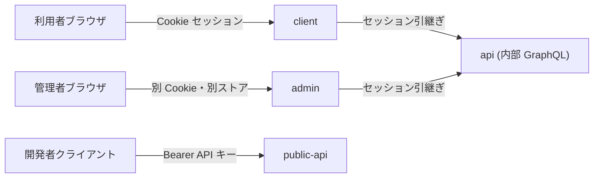
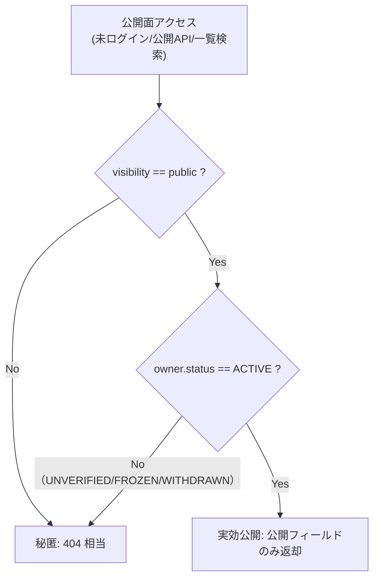
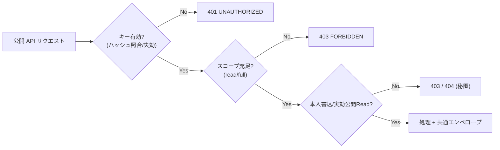

# 認証・認可設計 — GenAI Profile Community

利用者・管理者・公開 API クライアントの認証方式と、ロールベース／所有権ベース／実効公開ゲートを組み合わせた認可モデルを定義する。

> 全体像は [00-overview.md](./00-overview.md)。
> **値の正本（SSoT）**: 認証方式・セッション仕様・パスワードポリシー・WebAuthn・RBAC ロール・API キースコープなどの**値と受け入れ条件は features/ が正本**であり、本ガイドはそれらを**再掲せず**、設計と参照に限定する。
> 主な参照: 認証/セッション = `BR-COMMON-001`/`002`/`003`/`016`、利用者ライフサイクル = [01-user-account.md](../../service/features/01-user-account.md)、RBAC = `BR-ADMIN-002`、API キー = `BR-API-001`〜`003`、保存先 = [infra/01-network-architecture.md](../infra/01-network-architecture.md) §4・[db/01-data-model.md](../db/01-data-model.md)。

## 1. 認証の三系統

本サービスは認証主体が異なる**三つの独立した系統**を持ち、それぞれ認証方式・セッション・到達ドメインを分離する（`BR-COMMON-002`、[infra/01-network-architecture.md](../infra/01-network-architecture.md) §1）。

| 系統 | 対象 | 認証方式 | セッション/資格 | 分離 |
| --- | --- | --- | --- | --- |
| 利用者（client） | 利用者・閲覧者 | HTTPS-Only Cookie セッション | 利用者用 KV 名前空間 | `__Host-` Cookie・利用者ドメイン |
| 管理者（admin） | 運営チーム | HTTPS-Only Cookie セッション | 管理者用 KV 名前空間（**完全分離**） | `__Host-` Cookie・管理者ドメイン |
| 公開 API（public-api） | 開発者 | API キー（`Authorization: Bearer`） | Cookie 不使用 | キーのハッシュ照合のみ |

- **セッション分離の原則**（`BR-COMMON-002`）: 利用者と管理者は Cookie・ドメイン・ストアをすべて分離する。公開 API は Cookie を用いないため、ブラウザ自動送信由来の CSRF 面を構造的に縮小する（[02-application-security.md](./02-application-security.md) §4）。

## 2. 認証の構成要素

### 2.1 パスワード認証（基盤）

- パスワードは平文保存せず **Argon2id** でハッシュ化する（`BR-COMMON-003`）。ポリシー（長さ・流出ブロックリスト等）の正本は `BR-ACCT-002`。
- ログイン失敗メッセージは識別子を漏らさない統一文面（`BR-COMMON-012`）。連続失敗はレート制限＋バックオフの対象とし、監査ログに記録する（`BR-COMMON-010`/`013`、`BR-ACCT-004`）。

### 2.2 WebAuthn（パスキー）認証（任意・推奨）

利用者・管理者の双方で、WebAuthn を**任意かつ推奨の追加認証手段**として登録できる（`BR-COMMON-016`、`BR-ACCT-010`、管理者は [07-admin-console.md](../../service/features/07-admin-console.md)）。設計上の要点:

- **チャレンジはサーバー発行・短命・ワンタイム**。検証時に `origin` / `rp_id` / 署名カウンタ（sign count）を検証し、リプレイ・クローンを検出する。署名カウンタの逆行など異常時は拒否し監査に記録する（`AC-ACCT-017`）。
- **秘密鍵は認証器内にのみ存在**し、サーバーは公開鍵・資格情報 ID・署名カウンタのみ保持する。資格情報は**利用者と管理者でストアを分離**する（`BR-COMMON-002`、[db/01-data-model.md](../db/01-data-model.md) §5）。
- **回復手段の維持**: パスキーを全て失っても締め出されないよう、メール＋パスワードと `BR-ACCT-006` のリセットを常に回復手段として維持する。
- チャレンジの保存先は KV（[infra/01-network-architecture.md](../infra/01-network-architecture.md) §4・[db/01-data-model.md](../db/01-data-model.md) §7）。登録・削除は監査対象（`BR-COMMON-013`）。

### 2.3 セッション管理

- セッション・トークンは KV に保存し、種別ごとに TTL・ワンタイム性・保存先を定める（仕様の正本は [infra/01-network-architecture.md](../infra/01-network-architecture.md) §4、`BR-COMMON-001`/`002`、`BR-ACCT-003`/`006`/`007`）。
- Cookie には `Secure` / `HttpOnly` / `SameSite=Lax` を付与し、可能な環境では `__Host-` プレフィックスを用いる（`BR-COMMON-001`）。
- **全セッション無効化**（パスワード変更/リセット時、`BR-ACCT-005`/`006`）は `users.session_epoch`（トークン世代）のインクリメントで実現し、旧セッションを検証時に失効させる（[infra/01-network-architecture.md](../infra/01-network-architecture.md) §4）。
- KV・トークンに秘匿値（パスワード・キー秘匿値・Cookie 値）を平文で保存しない（`BR-COMMON-014`）。

## 3. 認可モデル（三層）

認可は**ロールベース（管理者）・所有権ベース（利用者リソース）・実効公開ゲート（公開面）**の三層を組み合わせる。すべて UI と API の双方で強制し、UI で隠すだけにしない（`AC-ADMIN-001`）。

### 3.1 ロールベースアクセス制御（RBAC・管理者）

- 管理者操作は `super_admin` / `moderator` / `support` / `viewer` のロールで制御する。ロールと権限マトリクスの正本は `BR-ADMIN-002`。
- **最小権限の原則**: 各操作は対応する権限を要求し、権限のない操作は UI から不可かつ API でも `403`。
- ロール変更・管理者の追加/削除は `super_admin` のみ。自己降格・最後の `super_admin` 削除はロックアウト防止のため拒否する（`AC-ADMIN-003`）。

### 3.2 所有権ベースアクセス制御（利用者リソース）

- 利用者は**自身のリソースのみ**を作成・更新・削除できる。公開 API のキーは「そのキーの所有ユーザーの権限で、付与スコープの範囲内」で動作する（`BR-API-001`/`001b`）。
- 他者の書き込みは `403 FORBIDDEN`、他者の非公開リソースの読み取りは秘匿のため `404`（`AC-API-007`/`011`）。

### 3.3 実効公開ゲート（公開面の認可）

未ログイン閲覧者・公開 API・一覧/検索への露出は、**実効公開**の判定を必ずサーバー側で評価する（判定式の正本は `BR-COMMON-007`）。

- 非公開・未確認・凍結・退会・不存在は**状態を秘匿**し一律 `404` 相当とする（`BR-SHARE-006`）。状態変更（公開切替・凍結・退会・ハンドル変更）は短 TTL キャッシュを無効化して速やかに反映する（`BR-DISC-006`、[infra/01-network-architecture.md](../infra/01-network-architecture.md) §2.1）。

### 3.4 認可の集約

- 所有権ベース／ロールベースの認可と実効公開ゲートは **NestJS のガード／Use Case 層に集約**し、リゾルバ/コントローラ本体や各所へ散在させない（[coding/01-architecture.md](../coding/01-architecture.md) §2.2、[api/01-graphql-internal.md](../api/01-graphql-internal.md) §6）。

## 4. 公開 API のキー認証・スコープ

- 認証は `Authorization: Bearer <api-key>`。受信キーを**ハッシュ照合**して引き当てる（保存はハッシュのみ、一意インデックス `uq_api_keys_key_hash`。`BR-API-001`、[db/01-data-model.md](../db/01-data-model.md) §5.4/§6）。キー値は発行時に一度だけ表示し再表示しない。
- ガード適用順序は **認証 → スコープ → 所有権/実効公開**（実装規約の正本は [api/02-public-rest-api.md](../api/02-public-rest-api.md) §5）。

- **スコープ（read/full）の使い分け**: クライアント（ブラウザ）埋め込みは漏えい耐性のため `read` キー、`full` キーはサーバーサイド限定（`BR-API-010b`）。スコープは発行後に変更不可（昇格は失効＋再発行、`BR-API-001b`）。
- ユーザーが `FROZEN`/`WITHDRAWN` になった場合は当該ユーザーのキーをすべて無効化し、認証段階で失効キーを弾く（`BR-ACCT-009`、`BR-SAFE-006`、[db/01-data-model.md](../db/01-data-model.md) §8）。
- 公開 API で提供しない高権限・不可逆操作（退会・メール/パスワード変更・通報・管理者操作・パスキー操作）は攻撃面から外す（`BR-API-010`）。

## 5. アカウント保護・列挙防止

- **列挙防止**: 登録済みメールでの再登録・パスワードリセットは、存在有無に関わらず同一の完了表示を返す（`BR-ACCT-001`/`006`、`AC-ACCT-003`/`011`）。
- **本人通知**: パスワード変更・リセット・メール変更・パスキー登録/削除など重要操作は本人へ通知し、監査ログに記録する（`BR-ACCT-005`〜`007`/`010`、`BR-COMMON-013`）。トランザクションメールは受信設定に関わらず送る（`BR-CONTENT-004`）。
- **不可逆操作の保護**: 退会は画面操作・再認証必須で公開 API からは不可（`BR-ACCT-009`、`BR-API-010`）。

## 6. 関連ドキュメント

- セキュリティ全体像・脅威モデル: [00-overview.md](./00-overview.md)
- アプリ層の防御（ヘッダ・CSRF・検証）: [02-application-security.md](./02-application-security.md)
- セキュリティ監視・インシデント対応: [03-monitoring-and-response.md](./03-monitoring-and-response.md)
- 認証・状態モデル・公開ゲートの正本: [00-common-rules.md](../../service/features/00-common-rules.md)
- 利用者アカウント・WebAuthn・退会: [01-user-account.md](../../service/features/01-user-account.md)
- 管理者・RBAC: [07-admin-console.md](../../service/features/07-admin-console.md)
- 公開 API・キー・スコープ: [05-public-api.md](../../service/features/05-public-api.md) / [api/02-public-rest-api.md](../api/02-public-rest-api.md)
- セッション/トークン保存先・全セッション無効化: [infra/01-network-architecture.md](../infra/01-network-architecture.md) §4 / [db/01-data-model.md](../db/01-data-model.md)
