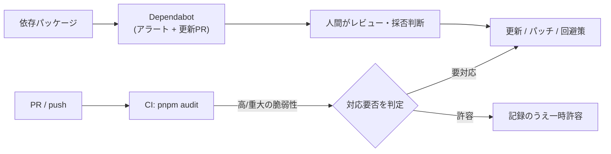
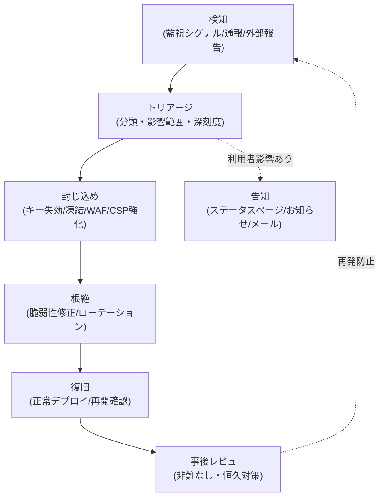

# セキュリティ監視・脆弱性管理・インシデント対応 — GenAI Profile Community

セキュリティ観点の監視対象・濫用検知・依存パッケージの脆弱性管理・シークレットローテーション・セキュリティインシデント対応プロセスを定義する。

> 全体像は [00-overview.md](./00-overview.md)。
> **責務の境界**: ログ・監視の**実装方式の正本は [infra/03-logging-monitoring.md](../infra/03-logging-monitoring.md)**。本ガイドはそれを前提に、**セキュリティ観点の監視と対応**を定める。**可用性/信頼性の障害対応は [operations/01-incident-response.md](../operations/01-incident-response.md)** が正本であり、本ガイドはセキュリティインシデント（情報漏えい・キー漏えい・濫用・脆弱性）に限定する。
> **現状フェーズ**: `apps/` 配下は未実装で、本ガイドは実装に先行する設計仕様である。

## 1. セキュリティ監視の対象

infra/03 で定義する監視基盤（LogTape・Sentry・WAF ログ・監査ログ）の上で、次のセキュリティシグナルを継続監視する。検知の実装・アラート設定の正本は [infra/03-logging-monitoring.md](../infra/03-logging-monitoring.md) §5/§7。

| シグナル | 主な情報源 | 含意 |
| --- | --- | --- |
| ログイン連続失敗・バックオフ発火 | アプリログ（`event: rate_limited`／認証失敗）・監査ログ | 総当たり・クレデンシャルスタッフィング |
| レート制限超過の急増（公開 API/認証系/通報系） | アプリログ・WAF セキュリティイベント | 濫用・スクレイピング・スパム |
| 一般閲覧（未認証）の異常アクセス | エッジ WAF ログ | スクレイピング・偵察 |
| NSFW 拒否の急増 | `nsfw_checks`・アプリログ | 不適切画像の投下試行 |
| 通報の急増 | Report キュー・監査ログ | 濫用・標的型通報・実害発生 |
| 権限外操作の試行（`403`） | アプリログ・監査ログ | 権限昇格の試み |
| Rekognition のエラー/タイムアウト率 | アプリログ・Sentry | fail-closed によりアップロード不可へ直結（[06](../../service/features/06-trust-and-safety.md)） |

- これらのシグナルは運営が早期に対応できるよう可視化する（`BR-ADMIN-009` の利用統計とも連動）。閾値ベースのアラートは Sentry／Cloudflare の機能で構成する。

## 2. 監査ログ（セキュリティコントロールとして）

- 監査ログ（`AuditLog`）は**追記専用・改ざん不可**（D1 で UPDATE/DELETE をトリガーでブロック）であり、説明責任・不正追跡の基盤となる（`BR-COMMON-013`、`BR-ADMIN-010`、データ定義は [db/01-data-model.md](../db/01-data-model.md)）。
- 監査対象イベント・記録項目・秘匿値非記録の正本は `BR-COMMON-013`/`014`・[infra/03-logging-monitoring.md](../infra/03-logging-monitoring.md) §3。セキュリティ調査では監査ログを一次証跡として用いる（[operations/03-inquiry-driven-investigation.md](../operations/03-inquiry-driven-investigation.md)）。

## 3. 脆弱性・依存パッケージ管理

機密情報の push 防止（Gitleaks/TruffleHog）に加え、**依存パッケージの既知脆弱性を継続的に管理**する。

| 仕組み | 役割 | 実行契機 |
| --- | --- | --- |
| **GitHub Dependabot** | 依存の脆弱性アラート＋バージョン更新 PR の自動作成 | リポジトリ常時・スケジュール |
| **`pnpm audit`（CI）** | CI パイプライン内で依存ツリーの既知脆弱性を補助スキャン | main への push / PR |
| Gitleaks（pre-commit）/ TruffleHog（CI） | 機密情報の push 防止（脆弱性管理とは別系統） | pre-commit / CI |
| Cloudflare WAF（マネージドルール） | 本番エッジでの一般的攻撃パターンの緩和 | 本番リクエスト |

- **運用方針**: Dependabot の更新 PR とアラートは人間がレビューし、重大・高深刻度は優先的に対応する。CI の `pnpm audit` は補助的なゲートとし、誤検知・未修正の扱い（一時許容）は記録を残す。
- AI エージェントによる prod デプロイは禁止のため、脆弱性修正のリリース（特に prod の `git tag`）は人間が行う（[CLAUDE.md](../../../CLAUDE.md)、[infra/02-deployment.md](../infra/02-deployment.md) §4.3）。
- 車輪の再発明を許容しつつ、簡易ユーティリティのためだけにパッケージを増やさない方針（[CLAUDE.md](../../../CLAUDE.md)）は、依存の攻撃面を小さく保つ点でもセキュリティに資する。

## 4. シークレットローテーション

- 露出が疑われるシークレット（SES 認証情報・Sentry DSN・内部署名鍵・API キー等）は**即時ローテーション**する（`BR-COMMON-014`、[02-application-security.md](./02-application-security.md) §8）。
- 手順の骨子: ①新シークレット発行 → ②Wrangler/GitHub Secrets を更新 → ③各 Worker へ反映（再デプロイ） → ④旧シークレット失効 → ⑤露出経路の特定と監査記録。
- 利用者の API キーは本人が任意に失効・再発行でき、漏えい時に即時遮断できる（`BR-API-002`/`003`）。`full` キー露出はサーバーサイド限定方針（`BR-API-010b`）で被害を抑える。

## 5. セキュリティインシデント対応プロセス

セキュリティインシデントは検知→トリアージ→封じ込め→根絶→復旧→事後レビューの流れで対応する。可用性障害は [operations/01-incident-response.md](../operations/01-incident-response.md) を用いる（両者は重複しうるため相互参照する）。

### 5.1 インシデント分類（例）

| 分類 | 例 | 一次対応 |
| --- | --- | --- |
| 情報漏えい | PII の不正閲覧・流出 | アクセス遮断・影響範囲特定・必要に応じ通知 |
| 認証情報/キー漏えい | API キー・シークレットの露出 | 即時失効・ローテーション（§4） |
| 濫用・不正利用 | 大量リクエスト・スパム・標的型通報 | レート制限/WAF 強化・凍結（[06](../../service/features/06-trust-and-safety.md)） |
| 不適切コンテンツ | NSFW すり抜け・なりすまし | アイコン削除・凍結（`BR-SAFE-002`/`006`） |
| 脆弱性 | 依存/自作コードの脆弱性 | パッチ・回避策・リリース（§3） |

### 5.2 対応の原則

- **封じ込め優先**: 被害拡大を止める操作（キー失効・ユーザー凍結・WAF ルール・CSP/ヘッダ強化・該当機能の一時停止）を先に行う。凍結・失効は監査ログに記録する（`BR-COMMON-013`）。
- **prod 操作は人間のみ**: prod への反映（`git tag`・WAF しきい値の Terraform 変更）は人間が実施し、AI エージェントは行わない（[CLAUDE.md](../../../CLAUDE.md)）。
- **証跡の保全**: 監査ログ・構造化ログ・WAF ログを保全し、秘匿値を新たに露出させない。
- **告知**: 利用者影響があるセキュリティインシデントは、外部ステータスページとサービス内お知らせ（必要時メール）で告知する（[operations/01-incident-response.md](../operations/01-incident-response.md) §5）。
- **事後レビュー**: 非難なしのポストモーテムで根本原因と恒久対策を記録し、監視・ルールへ反映する。

## 6. 関連ドキュメント

- セキュリティ全体像・脅威モデル: [00-overview.md](./00-overview.md)
- 認証認可設計: [01-authn-authz.md](./01-authn-authz.md)
- アプリ層の防御・シークレット管理: [02-application-security.md](./02-application-security.md)
- ログ・監視・監査ログ・アラートの実装正本: [infra/03-logging-monitoring.md](../infra/03-logging-monitoring.md)
- 可用性インシデント対応・告知: [operations/01-incident-response.md](../operations/01-incident-response.md)
- 問い合わせ駆動調査（監査ログ参照手順）: [operations/03-inquiry-driven-investigation.md](../operations/03-inquiry-driven-investigation.md)
- 通報・凍結・NSFW のライフサイクル: [06-trust-and-safety.md](../../service/features/06-trust-and-safety.md)
- デプロイ・ロールバック・シークレット: [infra/02-deployment.md](../infra/02-deployment.md)
