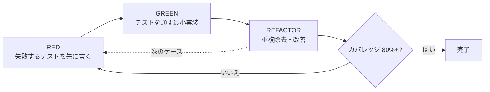
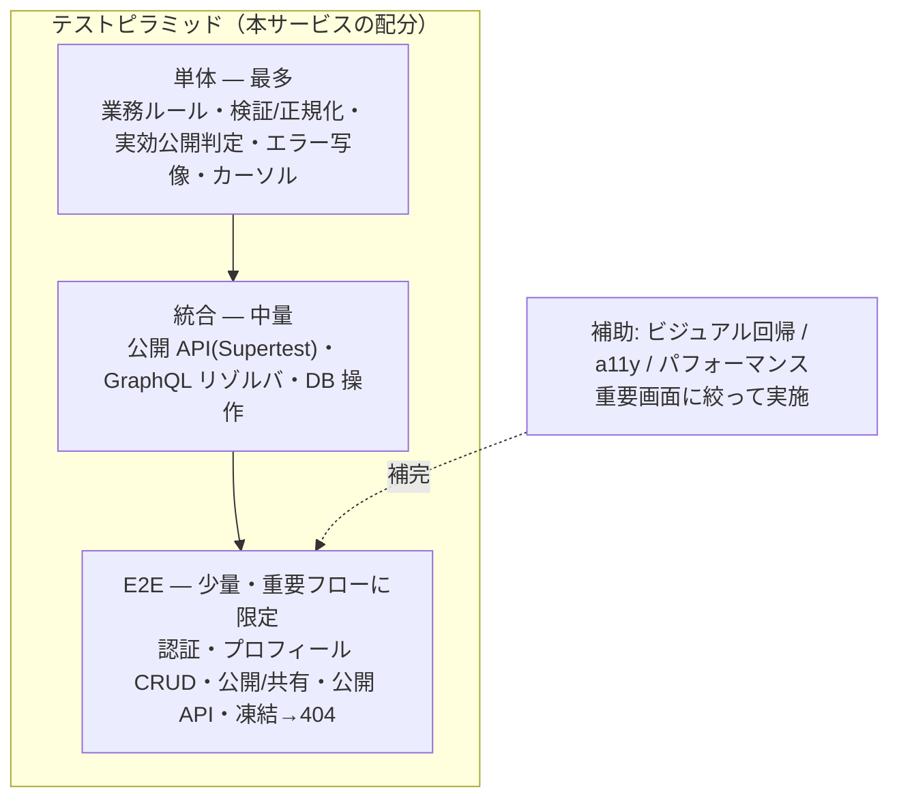

# テスト戦略概要 — GenAI Profile Community

本サービスのテスト戦略・テスト駆動開発（TDD）・カバレッジ方針・テスト配分・決定性を定義する。
単体/統合の規約は [01-unit-integration.md](./01-unit-integration.md)、E2E の規約は [02-e2e.md](./02-e2e.md) を参照。

> **位置づけ**: 本ガイドは [.claude/rules/ecc-common/testing.md](../../../.claude/rules/ecc-common/testing.md)・[ecc-web/testing.md](../../../.claude/rules/ecc-web/testing.md)（テスト要件の一次情報）と [CLAUDE.md](../../../CLAUDE.md)（ツール選定）を、本サービスへ具体化したものである。
> テスト対象の受け入れ条件・業務値の正本は [docs/service/features/](../../service/features/)（`AC-*`/`BR-*`）。矛盾した場合は features/・一次情報を優先して本ガイドを更新する。
> **現状フェーズ**: `apps/` 配下は未実装で、本ガイドは実装に先行するテスト設計方針である。

## 1. テスト駆動開発（TDD）

TDD を徹底する（[CLAUDE.md](../../../CLAUDE.md) 作業ルール・[ecc-common/testing.md](../../../.claude/rules/ecc-common/testing.md)）。新規機能・バグ修正・リファクタは次のサイクルで進める。

- 受け入れ条件（[features/](../../service/features/) の Given/When/Then、`AC-*`）を**テストケースへ直接対応づける**。正常系・異常系・境界値を区別する（[features/README.md](../../service/features/README.md) 受け入れ条件の書式）。
- 「テストを実装に合わせる」のではなく「実装をテストに合わせる」。テスト自体が誤っている場合のみテストを修正する（[ecc-common/testing.md](../../../.claude/rules/ecc-common/testing.md)）。

## 2. テスト種別とツール

3 種すべてを必須とする（[ecc-common/testing.md](../../../.claude/rules/ecc-common/testing.md)）。ツールは [CLAUDE.md](../../../CLAUDE.md) の選定に従う。

| 種別 | 対象 | ツール | 詳細 |
| --- | --- | --- | --- |
| 単体（Unit） | 純粋関数・ドメインロジック・ユーティリティ・カスタムフック・コンポーネント挙動 | **Jest** / **React Testing Library** / **jest-axe** | [01](./01-unit-integration.md) |
| 統合（Integration） | API エンドポイント・GraphQL リゾルバ・DB 操作 | **Jest** / **Supertest** / **MikroORM**（テスト用 SQLite） | [01](./01-unit-integration.md) |
| E2E | 重要ユーザーフロー（横断） | **Playwright** / **@axe-core/playwright** | [02](./02-e2e.md) |

### 採用する補助ツール

- **jest-axe**（単体）・**@axe-core/playwright**（E2E）: アクセシビリティ違反の自動チェック。
- **Playwright スクリーンショット**（`toHaveScreenshot`）: 重要画面のビジュアル回帰（外部サービス不要）。

### 採用しないツール

- **Lighthouse CI** / **Storybook + Chromatic** は採用しない。パフォーマンスは目標値（[ecc-web/performance.md](../../../.claude/rules/ecc-web/performance.md) の CWV）を設計指針として参照しつつ、CI ゲートには組み込まず重要画面で随時手元計測する（個人開発向けの低コスト方針）。

## 3. テスト配分（正確性優先）

本サービスは**プロフィール CRUD・フォーム・公開 API 中心**である。視覚表現主体のサイトではないため、ECC web ルールの既定（ビジュアル回帰を最優先）から外れ、**正確性（ロジック・業務ルール）を最優先**に配分する。

- **最優先（厚く書く）**: 横断ビジネスルールの単体テスト。実効公開ゲート（`BR-COMMON-007`）・入力検証/正規化（`BR-COMMON-008`/`009`）・エラー写像（`BR-API-011`）・カーソルエンコード（`BR-DISC-003`/`BR-API-007`）・レート制限の判定など。
- **次点**: API 統合テスト（公開 REST=Supertest、内部 GraphQL=リゾルバ/モジュールテスト）と DB 操作（MikroORM）。
- **重要フローに限定**: E2E（[02](./02-e2e.md) のフロー一覧）。
- **補助**: ビジュアル回帰・アクセシビリティ・パフォーマンスは重要画面に絞る。ビジュアル回帰はカバレッジ目標を**置き換えるものではなく補完**する（[ecc-web/testing.md](../../../.claude/rules/ecc-web/testing.md)）。

## 4. カバレッジ方針

- **最低カバレッジ 80%**（[ecc-common/testing.md](../../../.claude/rules/ecc-common/testing.md)）。CI で `branches`/`functions`/`lines`/`statements` のしきい値を 80% に設定し、未満はパイプラインを失敗させる（[coding/02-lint-format-commit.md](../coding/02-lint-format-commit.md) §7）。
- 計測対象から除外する: 生成物（GraphQL Code Generator 出力）・マイグレーション・設定ファイル・型定義・E2E 専用コード。
- カバレッジは**最低ライン**であり、目的はリグレッション検知。重要な業務ルールは数値に関わらず正常系・異常系・境界値を網羅する。

## 5. テストの決定性（重要）

ローカル・CI で**毎回同じ結果**になるようにする（[CLAUDE.md](../../../CLAUDE.md)）。

- **NSFW 判定（Rekognition）**: ローカル・CI・テストでは**決定論的スタブの偽判定器**を使う（`BR-SAFE-001`、[ADR](../../adr/20260603-nsfw-moderation-rekognition.md)）。本物の AWS を呼ばない。
- **メール送信（SES）**: ローカルは **Mailpit**、テストはモック/フェイクで送信内容を検証する（[infra/00-overview.md](../infra/00-overview.md) §3.2）。
- **時刻・ID**: `created_at` 等の時刻と ULID は固定シード/固定クロックで決定化し、スナップショットやアサーションを安定させる（[db/00-overview.md](../db/00-overview.md) §4・§5）。
- **ネットワーク非依存**: 単体・統合テストは外部ネットワークに依存しない。フロントのネットワークはモック（例: MSW 等のローカルモック）で固定する。
- **テスト分離**: 各テストは独立して実行・並列化できるよう、共有状態（DB・KV フェイク）をテストごとに初期化/ロールバックする（[01](./01-unit-integration.md) §テスト分離）。

## 6. テスト構造・命名

- **AAA パターン**（Arrange-Act-Assert）で記述する（[ecc-common/testing.md](../../../.claude/rules/ecc-common/testing.md)）。
- テスト名は**振る舞いを説明**する日本語/英語の文で記述する（例: `クエリに一致しないとき空配列を返す`）。
- フロントのコンポーネントテストは**実装詳細ではなくユーザーの振る舞い**（ロール・ラベル経由）を検証する（[01](./01-unit-integration.md) §フロントエンド）。

## 7. 関連ドキュメント

- 単体・統合テストの規約: [01-unit-integration.md](./01-unit-integration.md)
- E2E テストの規約: [02-e2e.md](./02-e2e.md)
- テスト要件の一次情報: [ecc-common/testing.md](../../../.claude/rules/ecc-common/testing.md) / [ecc-web/testing.md](../../../.claude/rules/ecc-web/testing.md)
- CI でのテスト実行位置: [coding/02-lint-format-commit.md](../coding/02-lint-format-commit.md) §7
- 受け入れ条件の正本: [docs/service/features/](../../service/features/)
- NSFW 判定の決定論的スタブ: [ADR 20260603-nsfw-moderation-rekognition](../../adr/20260603-nsfw-moderation-rekognition.md)
