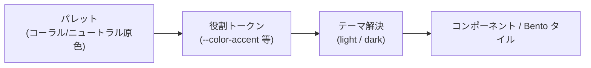
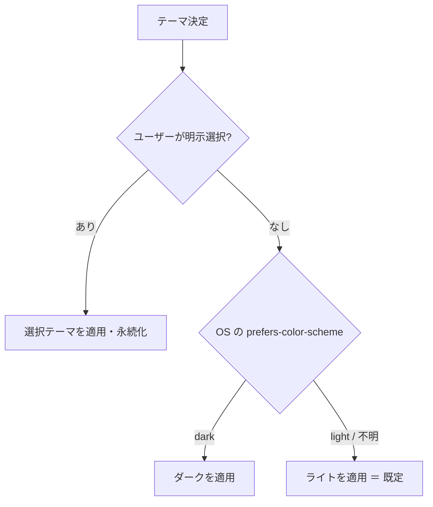

# デザイントークンの方針 — 色・タイポ・余白・角丸・モーション

デザインの基礎要素（色・タイポグラフィ・スペーシング・角丸/影・モーション）の **意図と役割**を定義する。
[00-overview.md](./00-overview.md) のスタイルディレクション（温かみのある Bento／ライト・ダーク／コーラル）を、再利用可能なトークンの考え方に落とす。

> **本書は「意図」を定め、「実装値」は実装ガイドに置く**。CSS カスタムプロパティ・Tailwind `theme` 拡張の具体は [coding/05-tailwind.md §1](../../GUIDES/coding/05-tailwind.md)、共通実装は [apps/frontend-lib/](../../../apps/frontend-lib/) を正本とする。値を二重管理せず、トークン名（意味）を単一の出所にする。

## 1. トークン設計の原則

- **意味的（セマンティック）に命名する。** `--color-accent` `--color-surface-raised` のように「役割」で名付け、`--coral-500` のような生のパレット値を UI から直接使わない。役割トークンがパレットを参照する 2 段構成にする。
- **テーマはトークンの差し替えで切り替える。** ライト/ダークはコンポーネントのクラスを分岐させず、役割トークンの値を入れ替えて実現する（[tailwind §5](../../GUIDES/coding/05-tailwind.md)）。
- **マジックな数値を UI に直書きしない。** 色・サイズ・余白・時間は名前付きトークンに束ねる（[coding 00-overview のマジックナンバー方針](../../GUIDES/coding/00-overview.md)）。

## 2. 色（カラー）

### 2.1 役割（セマンティックロール）

色は **意味的に**使う（[design-quality](../../../.claude/rules/ecc-web/design-quality.md) #5）。最低限、次の役割を定義する。具体値（oklch）は実装時に確定する。

| 役割トークン（例） | 用途 | 備考 |
| --- | --- | --- |
| `surface` / `surface-raised` / `surface-sunken` | 背景・Bento タイル面・沈んだ面 | エレベーション差を**色と影**の両方で表す（§5） |
| `text` / `text-muted` / `text-subtle` | 本文・補助・最も弱い文字 | コントラストは §2.4 を満たす |
| `border` / `border-strong` | タイルの罫線・区切り | 罫線は薄く、面の分節は余白優先 |
| `accent` / `accent-hover` / `accent-contrast` | アクセント（コーラル系）。アクション・選択・強調・リンク強調 | `accent-contrast` はアクセント上の文字色 |
| `focus-ring` | フォーカス可視リング | アクセントとは別管理可（コントラスト確保のため） |
| `success` / `warning` / `danger` / `info` | 状態色 | §2.3 を参照 |

### 2.2 アクセント（コーラル／サンセット系）の使い方

主役はユーザーの内容であり、**アクセントは脇役**である（[00-overview 原則 2](./00-overview.md)）。

- **使ってよい**: 主要アクション（保存・コピー・共有）、選択/アクティブ状態、フォーカスや強調の線、リンクの強調、わずかなブランド表現（ロゴ・小さなアイキャッチ）。
- **避ける**: 広い背景面の塗り、カード全面の着色、複数のアクセント系統の併用。コーラルを「装飾の塗り」に乱用しない。
- グラデーション（サンセット）を使う場合も、**主役のアイコン・写真とコントラスト競合しない**範囲に留め、テキストの可読性を優先する。

### 2.3 状態色とコーラルの混同回避

コーラル（暖色アクセント）は **`danger`（エラー赤）/`warning`（警告）と色相が近づきやすい**。混同を避けるため:

- アクセントと `danger`/`warning` は**色相・明度で明確に差**をつける（アクセントはサンセット寄りの暖色、`danger` は彩度の高い赤、`warning` は黄〜橙）。
- **色だけに依存しない**。エラー・警告・成功は必ずアイコン＋テキストを併用する（[04-content-a11y.md](./04-content-a11y.md)、色覚多様性への配慮）。

### 2.4 コントラスト（必達）

- 文字・重要な UI のコントラストは **WCAG 2.2 AA** を満たす（本文 4.5:1 以上、大きな文字・UI コンポーネント/グラフィック境界 3:1 以上）。
- アクセント上の文字（`accent-contrast`）、ダークテーマ上の `text-muted`、薄い罫線まで含めて検証する（[testing/02-e2e.md §4.2](../../GUIDES/testing/02-e2e.md) の axe 検証）。

### 2.5 テーマ解決（ライト/ダーク）

ライトを既定（base）とし、ダークは**意図的に設計した代替テーマ**とする。**既定で勝手にダークにしない**（[tailwind §5](../../GUIDES/coding/05-tailwind.md)、[design-quality](../../../.claude/rules/ecc-web/design-quality.md)）。

- 明示選択（トグル）はライト/ダーク/システム追従の 3 択を基本とし、選択を永続化する。
- 両テーマで**ユーザーのアイコン画像が破綻しない**よう、アイコン背景には中立サーフェスを敷く（透過 PNG の白/黒つぶれ対策）。
- ダーク時も主役を食わない原則は不変。アクセントはダークで明度を調整し、コントラストを保つ。

## 3. タイポグラフィ

### 3.1 方針

- **名前を主役に組む**。表示名はタイポグラフィ階層の最上位（hero）として、最も大きく・読みやすく配置する（[BR-SHARE-006](../features/03-profile-sharing.md)）。
- **和欧混植**を前提にする。日本語（ゴシック系）と Latin が混在しても破綻しないフォント・行間・字間を選ぶ。フォントファミリは原則 **2 つまで**（[performance フォント方針](../../../.claude/rules/ecc-web/performance.md)）。
- 階層は**スケールコントラスト**で明確に分ける（名前 ≫ 職業 ＞ 本文 ＞ 補助）。サイズは `clamp()` の流体トークンで端末幅に追従させる。

### 3.2 役割（タイプスケール）

| 役割トークン（例） | 用途 | 階層 |
| --- | --- | --- |
| `text-display` | 公開ページの表示名（hero） | 最大 |
| `text-title` | 一覧カードの名前・セクション見出し | 大 |
| `text-occupation` | 職業・肩書き | 中（名前より一段下げる） |
| `text-body` | 自己紹介・本文 | 標準 |
| `text-meta` / `text-caption` | 補助情報・ラベル・注記 | 小 |

### 3.3 名前・テキストの組版規則（要点）

- 表示名は `firstName`/`lastName` と `nameDisplayOrder` から決定論的に組み立て、**二重空白・前後余白を生じさせない**（[BR-PROF-003](../features/02-profile.md)）。組版の詳細・改行・切り詰め規則は [04-content-a11y.md](./04-content-a11y.md)。
- 行長（measure）は本文で読みやすい範囲に制限し、自己紹介（最大 500 文字）が長くてもタイルが破綻しないよう折り返し・最大幅を設ける。
- `font-display: swap`、クリティカルなウェイトのみ preload（[performance フォント方針](../../../.claude/rules/ecc-web/performance.md)）。

## 4. スペーシングとリズム

- 余白は**間隔スケール（トークン）**から選び、任意値を直書きしない。
- **均一な padding を全面に敷かない**（アンチテンプレート）。Bento のタイル間ガター、タイル内パディング、セクション間スペースに**意図したリズム**の差をつける（[02-layout.md](./02-layout.md)）。
- タッチ操作の当たり判定（ヒットエリア）を十分に確保する（[tailwind §4](../../GUIDES/coding/05-tailwind.md)、最小ターゲットは [04-content-a11y.md](./04-content-a11y.md)）。

## 5. 角丸・サーフェス・エレベーション

- Bento タイルは**サーフェス＋角丸＋エレベーション**で「浮き」を表す。すべてに同じ角丸・影を当てず、**重要なタイル（アイデンティティ）を一段持ち上げる**など階層に差をつける（[design-quality](../../../.claude/rules/ecc-web/design-quality.md) #3）。
- 角丸・影はトークン化し、`elevation-0/1/2` のような段階で管理する。影は濃すぎず、温かみのある柔らかな投影にする。
- ダークテーマでは影が効きにくいため、エレベーションを**サーフェス明度差**でも併せて表現する。

## 6. モーション

- **コンポジタフレンドリーなプロパティのみ**アニメーションする（`transform`/`opacity`/`clip-path`/`filter` 控えめ）。レイアウト連動プロパティは避ける（[tailwind §6](../../GUIDES/coding/05-tailwind.md)・[performance](../../../.claude/rules/ecc-web/performance.md)）。
- モーションは**流れを明確化する目的**に限る（タイルの出現、共有完了のフィードバック等）。装飾的に動かさない。
- 時間・イージングはトークン化（`duration-fast/normal`、`ease-out-*`）。
- **`prefers-reduced-motion` を尊重**し、低減設定時は過度な動きを止める（[04-content-a11y.md](./04-content-a11y.md)・[testing/02-e2e.md §4.2](../../GUIDES/testing/02-e2e.md)）。

## 7. 関連ドキュメント

- スタイルディレクション・原則: [00-overview.md](./00-overview.md)
- 配置・Bento レイアウト: [02-layout.md](./02-layout.md)
- 文字・コントラスト・a11y: [04-content-a11y.md](./04-content-a11y.md)
- トークン/Tailwind 実装: [coding/05-tailwind.md](../../GUIDES/coding/05-tailwind.md)
- パフォーマンス（フォント・モーション・CSS バジェット）: [.claude/rules/ecc-web/performance.md](../../../.claude/rules/ecc-web/performance.md)
