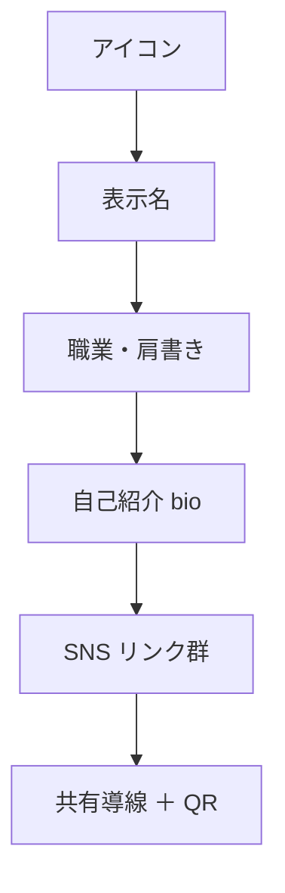

# レイアウトとパーツ配置 — Bento 構成・視線の流れ・レスポンシブ

各画面で「何を、どこに、どの大きさで」置くかを定義する。
原理は [00-overview.md](./00-overview.md)（温かみのある Bento）、トークンは [01-foundations.md](./01-foundations.md) を前提とする。

> 配置は **視線の流れ `アイコン → 名前 → 職業 → リンク`**（[BR-SHARE-006](../features/03-profile-sharing.md)）を最優先で守る。Bento のタイル配置はこの優先順を**サイズと位置**で表現する手段であり、優先順そのものを変えない。

## 1. Bento レイアウトの原則

1. **タイル＝情報の単位。** 1 タイルは 1 つの意味（アイデンティティ／自己紹介／リンク群 等）を持つ。詰め込まない。
2. **サイズで階層を表す。** 最重要のアイデンティティタイルを最大・最上位に置き、補助情報は小さく。均一タイルの敷き詰めを避ける（[design-quality](../../../.claude/rules/ecc-web/design-quality.md)）。
3. **ガターにリズムをつける。** タイル間の余白を一律にせず、関連の強いタイルは近づけ、グループ間は離す（[01-foundations §4](./01-foundations.md)）。
4. **DOM 順＝読み上げ順＝視覚優先順。** CSS グリッドの配置で意味的な順序を入れ替えない（[04-content-a11y.md](./04-content-a11y.md)）。
5. **モバイルは 1 カラムへ素直に積む。** 小画面ではタイルを優先順に縦積みし、横溢れを出さない（§5）。

## 2. 公開プロフィールページ（最重要・閲覧者向け）

「見るのが速い」の核。ログイン不要で、アイコン・表示名・職業・自己紹介・SNS リンクを提示する（[BR-SHARE-006](../features/03-profile-sharing.md)）。

### 2.1 視線の流れ（不変）



### 2.2 Bento 構成（デスクトップの目安）

アイデンティティ（アイコン＋名前＋職業）を**最上位の大タイル**にまとめ、視線の起点を 1 つに固定する。続けて自己紹介、リンク群を配置する。

```
┌──────────────────────────────┬───────────────┐
│  ⬤  里中 みなと               │  共有 / QR     │ ← アイデンティティ大タイル
│      イラストレーター          │  (コピー・QR)  │   ＋ 共有を近接配置
├──────────────────────────────┴───────────────┤
│  水彩で日常を描いています。ご依頼は DM へ…       │ ← 自己紹介タイル
├──────────────┬──────────────┬─────────────────┤
│  → X         │  → Instagram │  → GitHub        │ ← リンクをタイル化
├──────────────┴──────────────┴─────────────────┤
│  → Website（ポートフォリオ）                     │
└────────────────────────────────────────────────┘
```

- **アイデンティティタイルを一段持ち上げる**（エレベーション差、[01-foundations §5](./01-foundations.md)）。アイコンは正方形（512px 正規化、[BR-PROF-001](../features/02-profile.md)）で、名前と密接に隣接させる。
- **共有導線（URL コピー・QR・主要 SNS 共有）はページ上部の主役近くに置く**。「渡すのが速い」を後付けにしない（[00-overview 原則 6](./00-overview.md)、[03-components.md](./03-components.md)）。
- リンクは**登録順（利用者が並べ替えた順）**にタイル化する（[BR-PROF-007](../features/02-profile.md)）。各リンクは別タブ・`rel="nofollow noopener noreferrer"`（[03-components.md](./03-components.md)）。
- 職業は名前より一段下げて、肩書きとして従属させる（[01-foundations §3.2](./01-foundations.md)）。

### 2.3 本人向け状態の表示（非公開・未確認）

第三者には実効公開のみ表示し、非公開・未確認・凍結・退会・不在は一律 `404` 相当で秘匿する（[BR-SHARE-006](../features/03-profile-sharing.md)）。本人がログインして自分の非公開/未確認ページを開いたときは、**ページ上部に状態バナー**で「なぜ未公開か・次に何をすべきか」を示す（描画分岐は [03-components.md §6](./03-components.md)）。

## 3. 一覧・検索（discovery）

実効公開のプロフィールを発見する画面。1 ページ 20 件・新着順・カーソルページング、カードは**アイコン・表示名・職業**を表示する（[BR-DISC-003](../features/04-profile-discovery.md)）。

- **Bento 風のレスポンシブグリッド**で並べ、均一タイルの敷き詰め感を避けるため、ガターと余白に意図したリズムをつける（[design-quality](../../../.claude/rules/ecc-web/design-quality.md)）。
- 各カードは **表示名を主見出し**にし（[BR-DISC-007](../features/04-profile-discovery.md)）、アイコン→名前→職業の順で読める内部階層を持つ。
- 並び順は features/ の規定（新着順／検索は関連度）に従い、**デザイン都合で「おすすめ」等の序列を新設しない**（挙動の SSoT を侵さない）。
- 検索バー・並び替え・該当なし状態（[03-components.md](./03-components.md)）を含める。

## 4. プロフィール編集（利用者・client）

入力と「完成イメージ」を同時に見せ、「作るのが速い・デフォルトで完成」を支える。

- **デスクトップは 2 ペイン**（左: 入力フォーム／右: ライブプレビュー）、**モバイルは縦積み**（入力 → プレビューはトグルまたは下部）。
- プレビューは保存前の入力値を反映し、保存しなければ確定しない（[BR-PROF-009](../features/02-profile.md)、ライブプレビューは Could）。
- フィールド単位の保存・一括保存いずれも、成功は即時反映、失敗は入力値を保持しフィールドエラーを提示（[BR-PROF-010](../features/02-profile.md)・[03-components.md](./03-components.md)）。
- 必須項目（氏名）未充足でも公開は妨げないが、公開導線で注意を促す（[BR-SHARE-005](../features/03-profile-sharing.md)）。

## 5. レスポンシブ

主要ブレークポイント **320 / 375 / 768 / 1024 / 1440 / 1920** で横溢れ（overflow）がないことを確認する（[tailwind §4](../../GUIDES/coding/05-tailwind.md)・[testing/02-e2e.md §4](../../GUIDES/testing/02-e2e.md)）。モバイルファーストで段階拡張する。

| 幅の目安 | Bento の振る舞い |
| --- | --- |
| 〜767（モバイル） | **1 カラム**。タイルを優先順（アイデンティティ→自己紹介→リンク）に縦積み。共有導線はアイデンティティ直下 |
| 768〜1023（タブレット） | 2 カラム主体。アイデンティティは横幅いっぱい、リンクを 2 列に |
| 1024〜（デスクトップ） | 多カラム Bento。アイデンティティを大タイル化、リンクを 2〜3 列、共有を近接配置 |

- タッチ端末ではヒットエリアを十分に確保する（[01-foundations §4](./01-foundations.md)・[04-content-a11y.md](./04-content-a11y.md)）。
- 画像（アイコン）は明示的な寸法を与え、レイアウトシフト（CLS）を防ぐ（[performance](../../../.claude/rules/ecc-web/performance.md)）。

## 6. 管理者コンソール（admin）

運営の生産性を優先する、利用者アプリとは**別アプリ・別セッション**の画面（[glossary 管理者コンソール](../glossary.md)・[BR-COMMON-002](../features/00-common-rules.md)）。

- **同じトークン（色・タイポ・余白）を共有**しつつ、密度を上げた**実務的なダッシュボード/テーブル中心**のレイアウトにする。閲覧者向けの「余白広めの主役引き立て」とは密度方針を変える。
- 一覧（ユーザー・通報・解除リクエスト・監査ログ）はテーブル＋フィルタ。重要操作（凍結・解除・アイコン削除・権限変更）は確認を挟み、状態を明示する（[07-admin-console.md](../features/07-admin-console.md)・[03-components.md](./03-components.md)）。
- アクセントの使い方（脇役）と a11y 基準は利用者アプリと共通。

## 7. 共通フレーム（ヘッダ・フッタ・ランドマーク）

- **セマンティック HTML を第一**に、`header`/`nav`/`main`/`section`/`footer` を用いる（[tailwind §8](../../GUIDES/coding/05-tailwind.md)・[04-content-a11y.md](./04-content-a11y.md)）。
- グローバルナビ・フッタの chrome は控えめにし、主役（公開ページではユーザー内容）から視線を奪わない（[00-overview 原則 2](./00-overview.md)）。

## 8. 関連ドキュメント

- スタイルディレクション・原則: [00-overview.md](./00-overview.md)
- トークン（色・字・余白・角丸・モーション）: [01-foundations.md](./01-foundations.md)
- 部品と状態（カード・フォーム・共有・QR・OGP・空/エラー）: [03-components.md](./03-components.md)
- 文字・名前表示・a11y・国際化: [04-content-a11y.md](./04-content-a11y.md)
- 公開・共有・閲覧の挙動 SSoT: [03-profile-sharing.md](../features/03-profile-sharing.md) / [04-profile-discovery.md](../features/04-profile-discovery.md)
