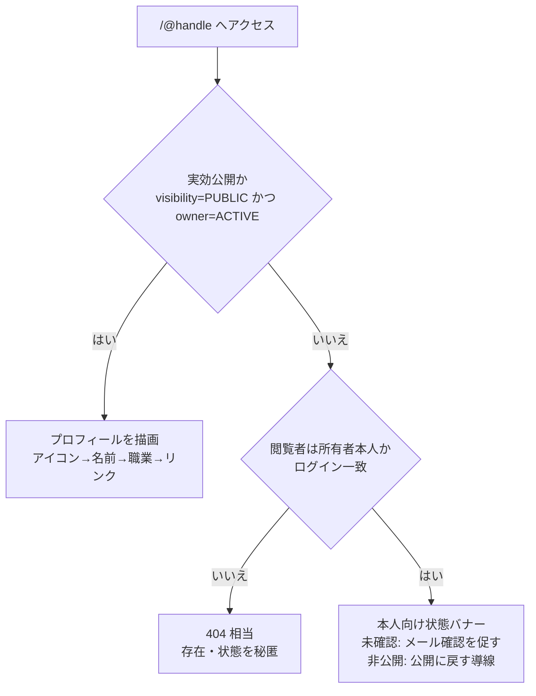

# 主要パーツの配置と状態 — カード・フォーム・共有・QR・OGP・空/エラー

主要な UI パーツについて、**配置のルール**と**状態（既定/ホバー/フォーカス/アクティブ/無効、空/ローディング/エラー）**を定義する。
レイアウト全体は [02-layout.md](./02-layout.md)、トークンは [01-foundations.md](./01-foundations.md) を前提とする。

> 実装プリミティブは **shadcn/ui** をベースにしつつ、テンプレート然とした見た目を避けて本サービス固有に調整する。キーボード操作・ARIA・フォーカス管理は**ヘッドレス層に保持**し、装飾の差し替えで壊さない（[tailwind §7](../../GUIDES/coding/05-tailwind.md)・[patterns](../../../.claude/rules/ecc-web/patterns.md)）。

## 1. インタラクション状態（全パーツ共通）

すべての操作可能要素は、4 状態を**設計された見た目**として作り込む（[design-quality コンポーネントチェックリスト](../../../.claude/rules/ecc-web/design-quality.md)）。

| 状態 | 方針 |
| --- | --- |
| 既定（rest） | 静かに。アクセントを乱用しない |
| ホバー（hover） | 微妙なエレベーション/明度変化。コンポジタフレンドリーな変化のみ（[01-foundations §6](./01-foundations.md)） |
| フォーカス（focus-visible） | `focus-ring` トークンで**常に可視**。キーボード操作で必ず見える（[04-content-a11y.md](./04-content-a11y.md)） |
| アクティブ/選択（active/selected） | アクセント（コーラル）で「いま選んでいる」を示す |
| 無効（disabled） | コントラストを落としつつ、理由が分かる補助文を添える |

## 2. アイデンティティ（アイコン・名前・職業）

公開ページ・一覧・OGP で一貫して使う、ユーザーの主役パーツ。

- **アイコン**: 正方形（512px 正規化、[BR-PROF-001](../features/02-profile.md)）。背景に中立サーフェスを敷き、透過画像でもライト/ダーク両テーマで破綻させない（[01-foundations §2.5](./01-foundations.md)）。代替テキストは表示名から生成（[04-content-a11y.md](./04-content-a11y.md)）。
- **既定アイコン**: 未設定・削除時は自動生成のプレースホルダを表示し、「デフォルトで完成する」を保つ（[BR-PROF-001](../features/02-profile.md)・§7）。
- **名前・職業**: 名前を hero、職業を従属に組む（[01-foundations §3](./01-foundations.md)）。表示順（`givenNameFirst`/`familyNameFirst`）に従い、崩れ・余白を生じさせない（[BR-PROF-003/004](../features/02-profile.md)・[04-content-a11y.md](./04-content-a11y.md)）。

## 3. SNS / Web リンク

- 1 リンク = アイコン（プラットフォーム）＋ラベル。種別は `x`/`github`/`linkedin`/`instagram`/`youtube`/`facebook`/`tiktok`/`website`（[BR-PROF-007](../features/02-profile.md)）。`website` は任意ラベル（最大 30 文字）。
- **別タブ遷移・`rel="nofollow noopener noreferrer"`**（[BR-PROF-007](../features/02-profile.md)・[BR-DISC-002](../features/04-profile-discovery.md)）。外部遷移であることが分かる視覚手がかり（アイコン等）を添える。
- 利用者が並べ替えた**登録順**で表示（[02-layout §2.2](./02-layout.md)）。最大 10 件。
- 編集画面では並べ替え UI（ドラッグ等）を提供。ドラッグ操作にはキーボード代替を用意する（[04-content-a11y.md](./04-content-a11y.md)）。

## 4. 共有導線・QR コード

「渡すのが速い」の中心。後付けにしない（[00-overview 原則 6](./00-overview.md)）。

- **URL ワンタップコピー**: 押下で固有 URL（`https://<service-domain>/@{handle}`）をコピーし、**完了フィードバック**を明示（トースト等、控えめなモーション）（[BR-SHARE-009](../features/03-profile-sharing.md)）。
- **主要 SNS への共有導線**を併設（[BR-SHARE-009](../features/03-profile-sharing.md)）。
- **QR コード**: 固有 URL のみを符号化（個人情報を埋め込まない）。表示・ダウンロード可能。名刺・イベント用途で読み取りやすいコントラスト/余白（クワイエットゾーン）を確保（[BR-SHARE-008](../features/03-profile-sharing.md)）。

## 5. OGP / 共有プレビュー

- 実効公開ページは整った OGP/Twitter Card を返す。`og:image` = 正規化済みアイコン、`og:title` = 表示名（＋職業）、`og:description` = 自己紹介の抜粋（[BR-SHARE-007](../features/03-profile-sharing.md)）。
- **非公開・未確認・凍結のページは個人情報を含めない汎用メタのみ**（露出抑制、[BR-SHARE-007](../features/03-profile-sharing.md)・[AC-SHARE-012](../features/03-profile-sharing.md)）。デザイン上も汎用のサービス紹介ビジュアルに切り替える。

## 6. 公開ページの描画状態（秘匿との整合）

第三者向けには**実効公開のみ**を描画し、それ以外は状態を漏らさない（[BR-COMMON-007](../features/00-common-rules.md)・[BR-SHARE-006](../features/03-profile-sharing.md)）。本人には状態と次の行動を示す。

- `404` 相当画面も**親しみのある体裁**にし、トップ/検索への導線を添える（突き放さない、トーン & マナー）。
- 本人向けバナーは「メール未確認のため未公開」「非公開中」など、**何をすれば公開されるか**を明示（[AC-SHARE-008](../features/03-profile-sharing.md)）。

## 7. 空・既定・未充足の状態（「デフォルトで完成」）

| ケース | 表示方針 | 根拠 |
| --- | --- | --- |
| アイコン未設定 | 自動生成の既定アイコン | [BR-PROF-001](../features/02-profile.md) |
| 氏名未入力 | 公開ページで「名前未設定」と体裁を保って表示。公開導線で充足を促す | [BR-PROF-002](../features/02-profile.md)・[BR-SHARE-005](../features/03-profile-sharing.md) |
| 自己紹介・リンク空 | 当該タイルを省略し、レイアウトを破綻させない | 「デフォルトで完成」原則 |
| 一覧・検索が 0 件 | 「該当する結果がありません」をエラーにせず提示。検索条件の見直しを促す | [AC-DISC-008](../features/04-profile-discovery.md) |

## 8. ローディング・エラー・レート制限

- **ローディング**: スケルトン/プレースホルダで体感速度を保つ。レイアウトシフトを起こさない固定寸法（[performance](../../../.claude/rules/ecc-web/performance.md)）。
- **フォームエラー**: フィールド単位に、**何をすればよいか**が分かる日本語で表示し、入力値を失わせない（[BR-COMMON-012](../features/00-common-rules.md)・[BR-PROF-010](../features/02-profile.md)）。認証・存在系は列挙されない一般化メッセージ（[BR-COMMON-012](../features/00-common-rules.md)）。
- **レート制限超過**: 公開 API は `429`＋`Retry-After`（[BR-COMMON-010](../features/00-common-rules.md)）。画面の検索・送信が制限された場合は、再試行までの目安を穏当に案内する（[AC-DISC-010](../features/04-profile-discovery.md)）。
- 状態は**色だけに依存しない**（アイコン＋テキスト併用、[01-foundations §2.3](./01-foundations.md)）。

## 9. 通報・問い合わせ・凍結まわりの UI

- **通報・問い合わせフォーム**はログイン不要で送信できる（[06-trust-and-safety.md](../features/06-trust-and-safety.md)・[08-content-and-comms.md](../features/08-content-and-comms.md)）。重い CAPTCHA を既定にせず、ハニーポット等の軽量な anti-abuse を優先する（[.claude/rules/ecc-web/security.md](../../../.claude/rules/ecc-web/security.md)・送信レート制限は [BR-COMMON-010](../features/00-common-rules.md)）。
- **凍結ユーザー向け**は、ログイン後に凍結状態と**解除リクエスト導線**のみを明示する（[BR-COMMON-005](../features/00-common-rules.md)・[06-trust-and-safety.md](../features/06-trust-and-safety.md)）。威圧的にせず、手続きを案内する。

## 10. 管理コンソールのパーツ

- テーブル・フィルタ・一括操作・確認ダイアログを中心に、密度を高める（[02-layout §6](./02-layout.md)）。
- 破壊的・重要操作（凍結・解除・アイコン削除・権限変更・規約発効・しきい値変更）は**確認を挟み、結果を明示**。これらは監査ログ対象である旨が分かる UI にする（[BR-COMMON-013](../features/00-common-rules.md)・[07-admin-console.md](../features/07-admin-console.md)）。

## 11. 関連ドキュメント

- レイアウト・配置: [02-layout.md](./02-layout.md)
- トークン・状態色・モーション: [01-foundations.md](./01-foundations.md)
- 文字・コピー・a11y: [04-content-a11y.md](./04-content-a11y.md)
- 挙動 SSoT: [02-profile.md](../features/02-profile.md) / [03-profile-sharing.md](../features/03-profile-sharing.md) / [00-common-rules.md](../features/00-common-rules.md)
- 実装（shadcn/ui・状態クラス）: [coding/05-tailwind.md](../../GUIDES/coding/05-tailwind.md)
