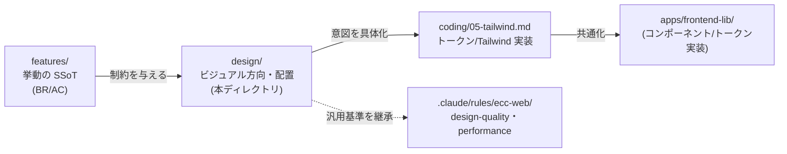

# デザインガイドライン索引 — GenAI Profile Community

本ディレクトリは、本サービス固有の **デザインガイドライン**（ビジュアル方向・文字とパーツの配置原則）の正本である。
「どんな見た目で、何を、どこに、どう配置するか」を、プロデューサー・デザイナー・エンジニアが共通の拠り所として参照する。

> **このサービスは何か**: アイコン・名前・職業・自己紹介・SNS リンクを、固有 URL の公開ページにまとめて共有できるプロフィール共有サービス（[サービス概要](../overview/01-overview.md)）。

## 位置づけ（3 つの正本の役割分担）

本サービスのドキュメントは「振る舞い」「見た目」「実装」を分けて正本（SSoT）化している。本ディレクトリは **見た目（ビジュアル方向・配置）の正本**である。

| 層 | 問い | 正本 |
| --- | --- | --- |
| 振る舞い（What/How-behaves） | 何が起きるべきか・何を満たすか | [docs/service/features/](../features/)（**最優先 SSoT**） |
| **見た目（How-looks）** | **どんな装い・どこに配置するか** | **本ディレクトリ `docs/service/design/`** |
| 実装（How-built） | どう CSS/コンポーネントにするか | [docs/GUIDES/coding/05-tailwind.md](../../GUIDES/coding/05-tailwind.md) ほか |



> **矛盾時の優先順位**: 振る舞いは features/ が最優先。本ディレクトリの記述が features/ と矛盾した場合は features/ を優先し、本ディレクトリを追従させる。見た目・配置の判断が分かれた場合は本ディレクトリを正本とする。

## 確定しているデザイン方向（v1）

仕様決定フェーズで合意した方向性。詳細と根拠は [00-overview.md](./00-overview.md) を参照。

| 観点 | 決定 | 一言で |
| --- | --- | --- |
| スタイルディレクション | **Bento（ベント）レイアウト主体** | 情報をタイル状に整理し、サイズの強弱で階層をつける |
| テーマ | **ライト基調＋ダーク両対応** | ライトを既定とし、ダークも意図的に設計（[tailwind §5](../../GUIDES/coding/05-tailwind.md) に整合） |
| アクセント | **コーラル／サンセット系の差し色 1 系統** | 面ではなく線・状態・強調に控えめに使う |
| 主役 | **クリエイター（ユーザーの内容）** | サービスの装飾は退き、アイコン・名前・リンクを引き立てる |

## このディレクトリのドキュメント

| ファイル | 内容 | 主な読者 |
| --- | --- | --- |
| [00-overview.md](./00-overview.md) | スタイルディレクション宣言・デザイン原則・アンチテンプレート方針・実装との関係 | 全員（まず最初に読む） |
| [01-foundations.md](./01-foundations.md) | デザイントークンの方針（色／ライト・ダーク、タイポグラフィ、スペーシング、角丸・影、モーション） | デザイナー、フロントエンド |
| [02-layout.md](./02-layout.md) | Bento レイアウト原則・公開ページ/一覧/編集/管理の配置・視線の流れ・レスポンシブ | デザイナー、フロントエンド |
| [03-components.md](./03-components.md) | 主要パーツ（カード・フォーム・共有導線・QR・OGP）の配置と状態（既定/空/エラー/ローディング） | フロントエンド、QA |
| [04-content-a11y.md](./04-content-a11y.md) | 文字・コピー・名前表示・代替テキスト・アクセシビリティ（WCAG 2.2 AA）・国際化 | デザイナー、フロントエンド、QA |

## 読む順番（推奨）

```
00-overview  →  01-foundations  →  02-layout  →  03-components  →  04-content-a11y
（方向と原則）     （色・字・余白）      （配置）         （部品と状態）       （文字とa11y）
```

## このディレクトリで扱わないこと（非対象）

「手軽な共有ページ」の核を保つため、以下は本ディレクトリの対象外とする。

- **挙動・受け入れ条件**: 文字数上限・状態遷移・公開ゲートなどの確定値は [features/](../features/) を正本とする（本ディレクトリは配置・表現のみ扱い、数値は features/ を引用する）。
- **画面仕様・ワイヤーフレームの網羅**: 画面単位の詳細仕様は [docs/service/screens/](../) を正本とする（今後整備）。
- **CSS/コンポーネントの実装手順**: トークンの実装・Tailwind 設定・shadcn/ui 運用は [coding/05-tailwind.md](../../GUIDES/coding/05-tailwind.md)、共通コンポーネントは [apps/frontend-lib/](../../../apps/frontend-lib/)（Storybook カタログ）に委ねる。
- **汎用のデザイン品質基準**: アンチテンプレート等の一般原則は [.claude/rules/ecc-web/design-quality.md](../../../.claude/rules/ecc-web/design-quality.md) を継承する（本ディレクトリは本サービスへの具体化に徹する）。

## 関連ドキュメント

- サービス像（なぜ・誰に・何を）: [docs/service/overview/](../overview/)
- 挙動の正本（SSoT）: [docs/service/features/](../features/)
- 用語の定義: [glossary.md](../glossary.md)
- スタイリング実装規約: [docs/GUIDES/coding/05-tailwind.md](../../GUIDES/coding/05-tailwind.md)
- アクセシビリティ・テスト: [docs/GUIDES/testing/02-e2e.md](../../GUIDES/testing/02-e2e.md)
