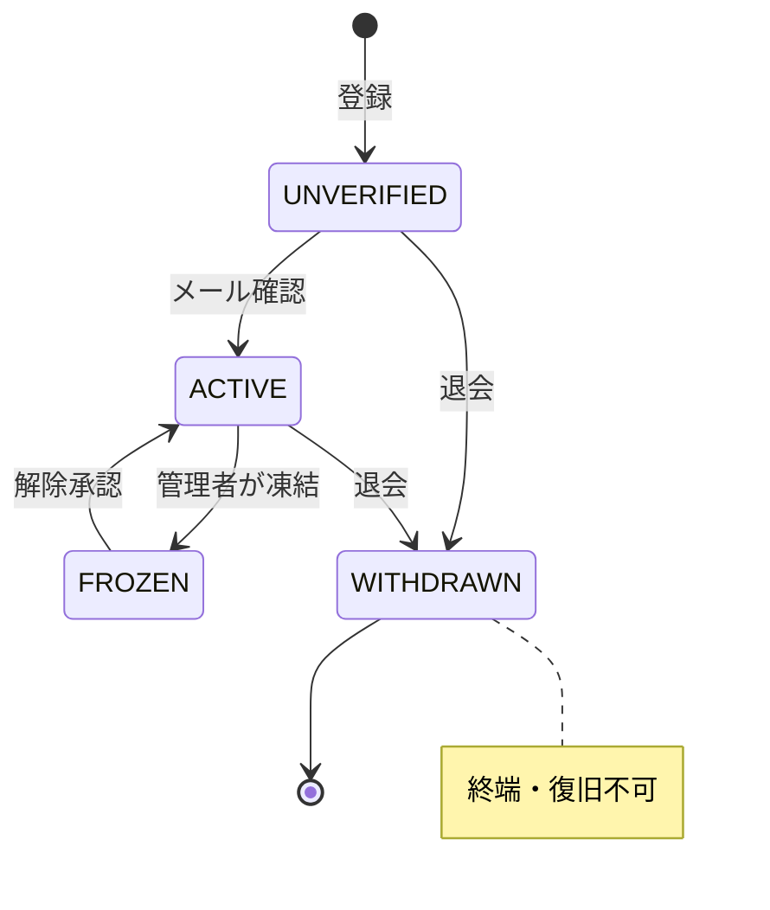
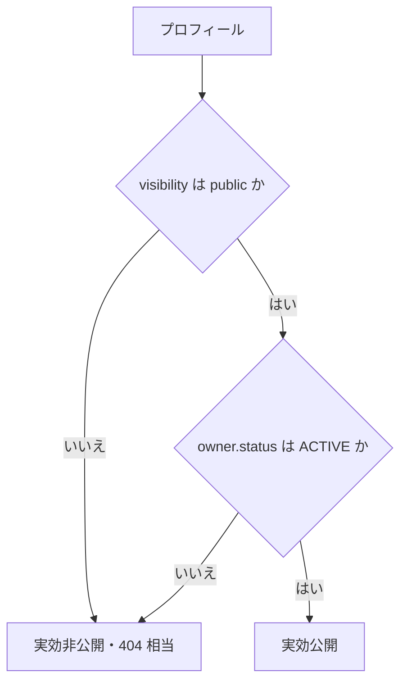

# 横断ビジネスルール（共通） — GenAI Profile Community

全機能に共通して適用される前提・制約・状態遷移・規約を定義する。各エンティティ別ドキュメントは本書を前提とし、重複定義しない。

> 記法・ID 規約は [README.md](./README.md) を参照。

## COMMON-1. 認証・セッション

### BR-COMMON-001 利用者の認証方式

- 利用者（client 側）の認証は **HTTPS-Only Cookie によるセッション** で行う。Cookie には `Secure` / `HttpOnly` / `SameSite=Lax` を付与し、可能な環境では `__Host-` プレフィックス付きの名称を用いる。
- 基盤の本人確認は **メールアドレス＋パスワード**（`BR-COMMON-003`）。これに加えて **WebAuthn（パスキー）による認証を推奨**とする（任意・`BR-COMMON-016`）。
- セッション有効期間は **30 日**。最終アクセスで更新するスライディング方式とする。
  - 根拠: 共有ページサービスは再訪頻度が低く、過度に短いと再ログインが手間。30 日は一般的な「Remember me」既定に整合。
- ログアウトでセッションを即時無効化する。サーバー側でも当該セッションを破棄する。

### BR-COMMON-002 管理者の認証方式

- 管理者（admin 側）も HTTPS-Only Cookie によるセッションを用いるが、**利用者セッションとは分離**する（Cookie・ドメイン・ストアを分ける）。
- 管理者セッション有効期間は **8 時間**、アイドルタイムアウト **30 分** とする。
  - 根拠: 管理権限は影響が大きいため、利用者より短命にして放置リスクを下げる。
- 管理者アカウントは **WebAuthn（パスキー）による認証を推奨**とする（任意・`BR-COMMON-016`）。v1 では必須化しないが、設計上はいつでも必須化できる拡張余地を残す。管理権限の重要度を踏まえ、運用に応じた必須化を検討する（[07-admin-console.md](./07-admin-console.md) §8）。

### BR-COMMON-003 パスワード保管

- パスワードは平文保存しない。**Argon2id** でハッシュ化して保存する。
- パスワードポリシーは [01-user-account.md](./01-user-account.md) の `BR-ACCT-002` を正本とする。

### BR-COMMON-004 CSRF・セキュリティヘッダ

- 状態変更を伴う画面操作（フォーム送信・mutation）には CSRF 対策を施す（同一サイト Cookie ＋ トークン）。
- 本番では `Strict-Transport-Security` / `X-Content-Type-Options` / `Referrer-Policy` / `Content-Security-Policy` 等のセキュリティヘッダを付与する（詳細は [docs/GUIDES/security/02-application-security.md](../../GUIDES/security/02-application-security.md)）。

### BR-COMMON-016 WebAuthn（パスキー）認証（横断・利用者／管理者共通）

利用者アカウント（User）・管理者アカウント（AdminAccount）の双方で、**WebAuthn（パスキー）を任意かつ推奨の追加認証手段**として利用できる。

- **位置づけ**: メール＋パスワード（`BR-COMMON-003`）を基盤としたうえで、パスキーを **追加の認証要素（ステップアップ／第二要素）** として登録できる。認証器が対応する場合は、パスワードに依存しない再認証（パスワードレス）にも用いうる。v1 では登録を必須化しないが、推奨として導線を提供する。
- **複数登録**: 1 アカウントにつき複数のパスキー（プラットフォーム認証器・セキュリティキー等）を登録できる。各資格情報には任意の表示名（ニックネーム・最大 50 文字）を付与でき、一覧表示・個別削除ができる。
- **登録・認証フロー**: 登録時・認証時の **チャレンジ（challenge）はサーバーが発行し、短命・ワンタイム**で検証する（保存先は [01-data-model.md](../../GUIDES/db/01-data-model.md) §7 の KV を参照）。`origin`／`rp_id`／署名カウンタ（sign count）を検証し、リプレイ・クローンを検出する。
- **資格情報の保管**: 公開鍵・資格情報 ID・署名カウンタ等を保存する。**利用者と管理者はストアを分離**する原則（`BR-COMMON-002`）に従い、資格情報も別テーブルで保持する（[01-data-model.md](../../GUIDES/db/01-data-model.md) §5）。秘密鍵は認証器内にのみ存在し、サーバーは保持しない。
- **アカウント復旧との整合**: パスキーを失っても締め出されないよう、パスワード（および `BR-ACCT-006` のメール経由リセット）を回復手段として維持する。
- **監査**: パスキーの登録・削除はセキュリティ上重要な操作として監査ログに記録する（`BR-COMMON-013`）。

> 利用者向けの詳細な受け入れ条件は [01-user-account.md](./01-user-account.md) `BR-ACCT-010`、管理者向けは [07-admin-console.md](./07-admin-console.md) を正本とする。

## COMMON-2. アカウント状態モデル（横断）

User の状態は以下のいずれかであり、全機能はこの状態を尊重する。

| 状態 ID | 名称 | 説明 |
| --- | --- | --- |
| `S-USER-UNVERIFIED` | 未確認 | 登録直後でメール未確認。ログイン・編集は可能だが**公開は不可**。 |
| `S-USER-ACTIVE` | 有効 | メール確認済みで通常利用できる状態。 |
| `S-USER-FROZEN` | 凍結 | 管理者により凍結された状態。公開停止・API 無効・編集制限。 |
| `S-USER-WITHDRAWN` | 退会済み | 本人が退会した状態。公開停止・匿名化済み。復旧不可。 |

### 状態遷移



### BR-COMMON-005 状態に応じた一律の振る舞い

- `UNVERIFIED`: ログイン・プロフィール編集は可能。**公開ページの一般公開は不可**（`COMMON-3` を参照）。公開 API のキー発行は不可。
- `FROZEN`: 公開ページは一般閲覧者に対し非公開（`404` 相当）。ログインは可能だが、プロフィール編集・公開・API 利用・新規キー発行は不可。解除リクエストのみ可能（[06-trust-and-safety.md](./06-trust-and-safety.md)）。
- `WITHDRAWN`: 一切のログイン不可。公開ページ・API ともに `404`。本人特定可能データは匿名化済み（[01-user-account.md](./01-user-account.md) `BR-ACCT-009`）。

## COMMON-3. 「公開」と「メール確認」の整合（最重要・横断）

公開状態の既定値と、実際に一般公開される条件は分離して扱う。

### BR-COMMON-006 公開既定値

- 新規作成された Profile の公開フラグ（visibility）の既定値は **`public`（公開）** とする。
  - 根拠: コンセプト「作るのが速い・渡すのが速い」に沿い、作成直後から共有可能にする。

### BR-COMMON-007 実効公開の前提条件（公開ゲート）

- visibility が `public` であっても、**実際に一般公開（未ログイン閲覧者・公開 API・一覧/検索への露出）されるのは、所有ユーザーが `S-USER-ACTIVE`（メール確認済み）かつ凍結・退会でない場合に限る**。
- 「実効公開（effective public）」の判定式を全機能で統一する。



> 判定式: `effectivePublic(profile) = (profile.visibility == public) AND (owner.status == ACTIVE)`
> `owner.status` が `UNVERIFIED` / `FROZEN` / `WITHDRAWN` のときは、`visibility` が `public` でもすべて実効非公開（`404` 相当）となる。

- `UNVERIFIED` ユーザーの公開ページ・一覧/検索・公開 API では、未確認である旨を所有者本人には提示しつつ、第三者には非公開（`404` 相当）として扱う。
  - 根拠: スパム・なりすまし対策。メール到達性の確認前に第三者へ露出させない。

## COMMON-4. 共通バリデーション規約

### BR-COMMON-008 入力検証の基本

- すべての外部入力（画面フォーム・公開 API・ファイル）は、システム境界で **スキーマ検証**（client は Zod、api は class-validator / GraphQL スキーマ）を行ってから処理する。信頼しない。
- 文字列は前後の空白をトリムし、制御文字（改行を許可する欄を除く）を除去する。文字数は **書記素クラスタ単位**で数える（絵文字・結合文字を 1 文字として扱う）。
  - 根拠: 名前・自己紹介に多言語・絵文字が入りうるため、コードポイント数ではなく見た目の文字数で上限を管理する。
- 検証失敗は早期に、フィールド単位の明確なメッセージで返す（`COMMON-6`）。

### BR-COMMON-009 文字種・正規化

- 名前・自己紹介などの自由入力は Unicode を許容し、保存前に **NFC 正規化**する。
- 不可視・紛らわしい文字（ゼロ幅文字、両方向制御文字等）は除去または拒否する。
  - 根拠: なりすまし・表示崩れ・ホモグラフ攻撃を防ぐ。

## COMMON-5. レート制限・濫用対策（基本）

### BR-COMMON-010 レート制限の階層

| 対象 | 既定しきい値 | 実装層 |
| --- | --- | --- |
| 公開 API（キー単位） | 60 リクエスト / 分 | アプリ層（@nestjs/throttler）＋ 本番はエッジ（Cloudflare WAF） |
| 認証系（ログイン/登録/リセット） | 10 回 / 5 分 / IP＋識別子 | アプリ層 |
| 通報・問い合わせ送信 | 5 件 / 10 分 / IP（＋ログイン時はユーザー） | アプリ層 |
| 一般閲覧・検索（未認証） | 60 リクエスト / 分 / IP | エッジ（Cloudflare WAF）のみ |

- 公開 API のしきい値は管理者が変更可能（全キー共通の値、[07-admin-console.md](./07-admin-console.md) `BR-ADMIN-008`）。本番のエッジ閾値は Terraform で管理する（[CLAUDE.md](../../../CLAUDE.md) デプロイ方針）。
- しきい値超過時の応答は各機能の規定に従う（公開 API は `429`＋`Retry-After`、[05-public-api.md](./05-public-api.md)）。
  - 根拠: スクレイピング・総当たり・スパム送信を抑止しつつ、正当な利用を妨げない一般的な初期値。

## COMMON-6. レスポンス・エラー規約

### BR-COMMON-011 共通レスポンスエンベロープ（公開 API）

公開 API のレスポンスは一貫した封筒形式とする（詳細は [05-public-api.md](./05-public-api.md)）。

```jsonc
// 成功
{ "success": true,  "data": { /* ... */ }, "error": null, "meta": { /* ページング等、任意 */ } }
// 失敗
{ "success": false, "data": null, "error": { "code": "VALIDATION_ERROR", "message": "…", "details": [ /* フィールド別 */ ] } }
```

### BR-COMMON-012 エラーメッセージ方針

- 利用者・閲覧者向けのメッセージは日本語で、**何をすればよいか**が分かる文面にする。
- 認証・存在確認に関わる失敗は、情報漏えいを避けるため**列挙されない一般化されたメッセージ**を用いる（例: ログイン失敗時に「メールアドレスかパスワードが正しくありません」と統一）。
- サーバー側には詳細なエラーコンテキストを構造化ログ（LogTape）で記録する。エラーは握りつぶさない。

## COMMON-7. 監査ログ

### BR-COMMON-013 監査対象イベント

以下のイベントは `AuditLog` に**不変**（追記のみ・改ざん不可）で記録する。記録項目・参照は [07-admin-console.md](./07-admin-console.md) `ADMIN-5` を正本とする。

- 管理者によるすべての操作（凍結・解除・アイコン削除・権限変更・規約公開・しきい値変更 等）
- セキュリティ上重要なユーザー操作（ログイン失敗の連続、パスワード変更・リセット、メール変更、退会、API キー発行/失効、WebAuthn パスキーの登録/削除）
- 公開/非公開の切り替え、ハンドル変更

### BR-COMMON-014 個人データの取り扱い

- 退会時の匿名化対象・監査ログの保持方針は [01-user-account.md](./01-user-account.md) `BR-ACCT-009` を正本とする。監査ログは匿名化後も**運営上必要な範囲で保持**する（不正対策・説明責任のため）。
- ログ・エラー出力に、パスワード・API キー秘匿値・Cookie 値・トークンを出力しない。

## COMMON-8. 国際化・表記

### BR-COMMON-015 言語・タイムゾーン

- UI・通知の既定言語は **日本語**。日時は既定で **ローカルタイム（閲覧者の現地時間）** で表示し、保存は UTC とする。世界中の閲覧者がそれぞれの現地時間で日時を確認できることを意図する。
- 名前は多言語表記・複合姓を尊重して扱う（表示順の規定は [02-profile.md](./02-profile.md) `BR-PROF-004`）。

## 関連ドキュメント

- ユーザーストーリー: [04-user-stories.md](../overview/04-user-stories.md)
- セキュリティ設計の詳細: [docs/GUIDES/security/](../../GUIDES/security/)
- 各エンティティ仕様: [README.md](./README.md) の一覧を参照
