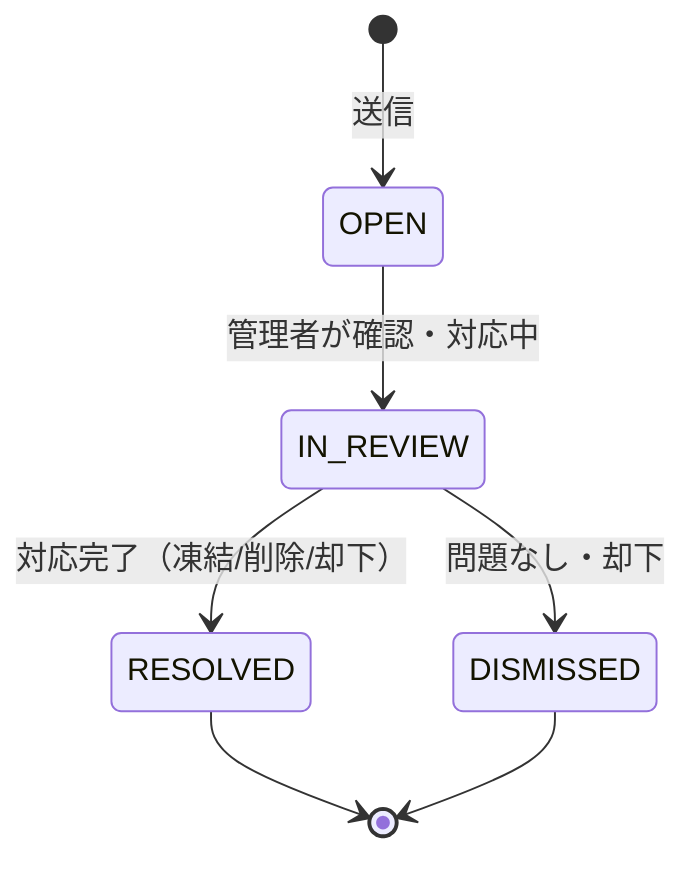
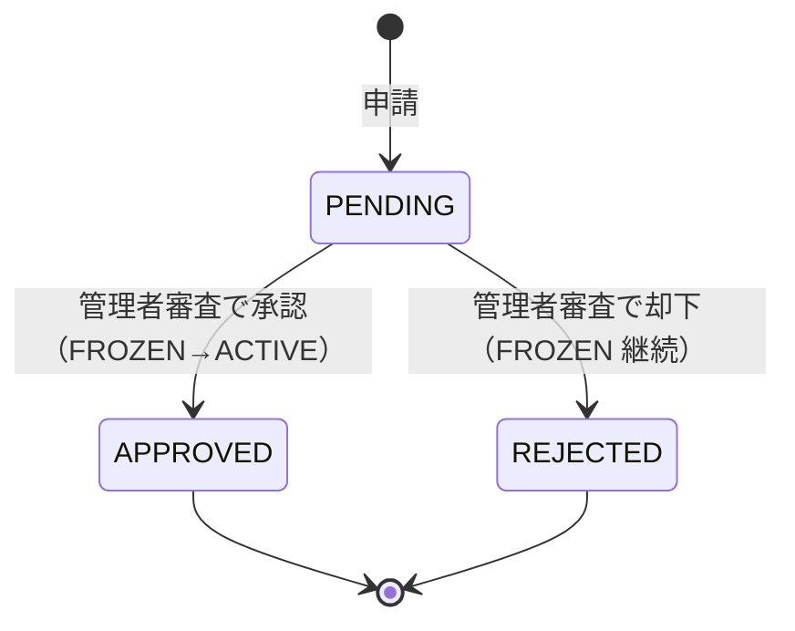

# 機能仕様 — Trust & Safety（健全性・安全性）

エンティティ **Report（通報）** と **Suspension（凍結・解除リクエスト）**、および **NSFW 画像の自動検出**のライフサイクルに関するビジネスルールと受け入れ条件を定義する。

> 横断前提（状態モデル `S-USER-FROZEN` 等）は [00-common-rules.md](./00-common-rules.md)。対応エピック: EP-06、および EP-07 の一部（US-0702/0703/0704）。
> 管理者側の操作 UI・権限は [07-admin-console.md](./07-admin-console.md)、問い合わせフォーム自体は [08-content-and-comms.md](./08-content-and-comms.md) を参照。

## 1. 概要

「健全さは前提条件」（コンセプト デザイン原則 4）。NSFW 画像の自動検出、通報、凍結、解除リクエストを運営の土台として組み込む。
通報・解除リクエストは**問い合わせフォーム**を入口とする（US-0602/US-0603）。本書では Report / Suspension をドメインエンティティとして、そのライフサイクル全体（送信→審査→処分→監査）を正本として定義する。

## 2. NSFW 画像の自動検出

### BR-SAFE-001 アイコンアップロード時の自動判定

- アイコン画像のアップロード時、**自動で NSFW（不適切）判定**を行い、不適切と判定された画像は**保存せず拒否**する（US-0601、[02-profile.md](./02-profile.md) `BR-PROF-001`）。
- 判定は分類カテゴリ（例: 露骨な性的表現・暴力・グロtestスク等）に対するスコアで行い、しきい値を超えたら拒否する。しきい値は設定で管理する。
- 判定結果（合否・スコア・カテゴリ）はモデレーション用に記録する（個人特定情報は最小化）。
- 拒否時、既存のアイコンは変更しない。利用者には「画像を保存できなかった」旨を、詳細な判定理由を晒さずに提示する。
  - 根拠: 回避テクニックの誘発を避けつつ、健全性を担保。

### BR-SAFE-002 判定をすり抜けた画像への対処

- 自動判定をすり抜けた不適切画像は、通報（`SAFE-3`）または管理者のモデレーション（[07-admin-console.md](./07-admin-console.md) `BR-ADMIN-004`）で事後対応する。
- 管理者はアイコンを削除でき、削除されたアイコンは既定アイコンに戻る。削除は監査ログに記録する。

## 3. 通報（Report）

### BR-SAFE-003 通報の送信

- 閲覧者・利用者は、問い合わせフォーム（カテゴリ「通報」）から不適切なプロフィールを通報できる（US-0602）。ログインは必須としない。
- 通報の入力項目:

| 項目 | 必須 | 制約 |
| --- | --- | --- |
| 対象ハンドル | 必須 | 実在する公開プロフィール |
| 通報理由カテゴリ | 必須 | `inappropriate_image`（不適切画像）/ `impersonation`（なりすまし）/ `spam`（スパム）/ `other`（その他） |
| 詳細 | 任意 | 最大 1000 文字・プレーンテキスト |
| 連絡先メール | 任意 | 返信が必要な場合 |

- 送信はレート制限（5 件 / 10 分 / IP、`BR-COMMON-010`）の対象。濫用的な大量通報は抑制する。

### BR-SAFE-004 通報のライフサイクル（状態）

- 同一対象への重複通報は集約して扱う（件数を保持）。
- 通報の受領・状態遷移・処分は監査ログに記録する。

### BR-SAFE-005 通報処理の結果

- 管理者は通報を審査し、次のいずれかを行う（[07-admin-console.md](./07-admin-console.md) `BR-ADMIN-005`）: アイコン削除、ユーザー凍結（`SAFE-4`）、却下（問題なし）。
- 通報者への結果通知は v1 では必須としない（連絡先が任意のため）。連絡先がある場合は対応する旨を案内できる。

## 4. 凍結（Suspension）と解除リクエスト

### BR-SAFE-006 凍結（管理者操作）

- 管理者は違反ユーザーを凍結できる（US-0703）。凍結により状態が `S-USER-FROZEN` に遷移する。
- 凍結の効果（`BR-COMMON-005` の具体化）:

| 対象 | 凍結時の挙動 |
| --- | --- |
| 公開ページ | 第三者に `404` 相当（非公開化） |
| 一覧・検索・公開 API（他者 Read） | 露出から除外 |
| ログイン | 可能（解除リクエスト導線の提示のため） |
| プロフィール編集・公開切替 | 不可 |
| 公開 API 利用・新規キー発行 | 不可（既存キーは無効化） |

- 凍結時には理由区分を記録し、本人のログイン後画面に「凍結中である」旨と解除リクエスト導線を表示する。
- 凍結・解除は監査ログに記録する。

### BR-SAFE-007 解除リクエスト（凍結ユーザー）

- 凍結されたユーザーは、問い合わせフォーム（カテゴリ「解除リクエスト」）から解除を申請できる（US-0603）。
- 解除リクエストの入力項目: 申請理由（必須・最大 1000 文字）、補足（任意）。
- 同一ユーザーからの解除リクエストはレート制限（例: 1 件 / 24 時間）を設け、連投を防ぐ。
  - 根拠: 審査リソースの保護と濫用防止。

### BR-SAFE-008 解除リクエストの審査

- 管理者は解除リクエストを審査し、承認（解除）または却下する（US-0704、[07-admin-console.md](./07-admin-console.md) `BR-ADMIN-006`）。
- 承認時、状態は `S-USER-ACTIVE` に戻り、公開・編集・API 利用が再び可能になる（visibility は凍結前の値を引き継ぐ）。
- 却下時は `FROZEN` を継続する。審査結果は監査ログに記録する。

## 5. 受け入れ条件（Given/When/Then）

### NSFW

#### AC-SAFE-001 NSFW アイコンの自動拒否（正常系）

- **関連ストーリー**: US-0601 / US-0201
- **Given**: 利用者がプロフィール編集画面でアイコンをアップロードしようとしている
- **When**: NSFW と判定される画像を選ぶ
- **Then**: 画像は保存されず、既存アイコンも変わらず、判定結果が記録される

#### AC-SAFE-002 健全な画像は通過（正常系）

- **関連ストーリー**: US-0601
- **Given**: プロフィール編集画面にいる
- **When**: 問題のないアイコン画像をアップロードする
- **Then**: 判定を通過して保存され、即時に反映される

#### AC-SAFE-003 すり抜け画像の事後削除（正常系）

- **関連ストーリー**: US-0601 / US-0702
- **Given**: 自動判定を通過したが不適切と判断されたアイコンが公開されている
- **When**: 管理者がそのアイコンを削除する
- **Then**: アイコンが既定アイコンに戻り、削除が監査ログに記録される

### 通報

#### AC-SAFE-004 未ログインでの通報（正常系）

- **関連ストーリー**: US-0602
- **Given**: 未ログインの閲覧者が不適切なプロフィールを見ている
- **When**: 問い合わせフォーム（通報）から対象ハンドルと理由を送信する
- **Then**: 通報が `OPEN` で記録され、受領が表示される

#### AC-SAFE-005 通報のレート制限（境界値）

- **関連ストーリー**: US-0602
- **Given**: 同一 IP から 10 分間に 5 件の通報が送信済み
- **When**: 6 件目を送信しようとする
- **Then**: 一時的に送信が制限され、再試行までの案内が表示される

#### AC-SAFE-006 重複通報の集約（正常系）

- **関連ストーリー**: US-0602 / US-0703
- **Given**: 同一ユーザーに対し複数の通報が届いている
- **When**: 管理者が通報キューを見る
- **Then**: 同一対象として集約され、件数が把握できる

### 凍結

#### AC-SAFE-007 凍結で即時公開停止（正常系・整合）

- **関連ストーリー**: US-0703 / US-0302
- **Given**: 公開中のユーザーに違反が認められた
- **When**: 管理者がそのユーザーを凍結する
- **Then**: 公開ページ・一覧・検索・公開 API から即時に除外され、状態が `FROZEN` になり、監査ログに記録される

#### AC-SAFE-008 凍結ユーザーは編集・API 不可（正常系）

- **関連ストーリー**: US-0703
- **Given**: `FROZEN` のユーザー
- **When**: ログインしてプロフィール編集や API 呼び出しを試みる
- **Then**: ログインはできるが編集・公開切替・API は拒否され、解除リクエスト導線が提示される

### 解除リクエスト

#### AC-SAFE-009 解除リクエストの送信（正常系）

- **関連ストーリー**: US-0603
- **Given**: `FROZEN` のユーザー
- **When**: 問い合わせフォーム（解除リクエスト）から理由を送信する
- **Then**: リクエストが `PENDING` で記録され、受領が表示される

#### AC-SAFE-010 解除リクエストの連投制限（境界値）

- **関連ストーリー**: US-0603
- **Given**: 直近 24 時間に解除リクエストを 1 件送信済みのユーザー
- **When**: 追加の解除リクエストを送信しようとする
- **Then**: 連投が制限され、再申請可能時刻の案内が表示される

#### AC-SAFE-011 解除承認で復帰（正常系・整合）

- **関連ストーリー**: US-0704 / US-0603
- **Given**: `PENDING` の解除リクエストがある
- **When**: 管理者が承認する
- **Then**: 状態が `ACTIVE` に戻り、凍結前の公開設定に従って公開・編集・API が再び可能になり、監査ログに記録される

#### AC-SAFE-012 解除却下で凍結継続（正常系）

- **関連ストーリー**: US-0704
- **Given**: `PENDING` の解除リクエストがある
- **When**: 管理者が却下する
- **Then**: ユーザーは `FROZEN` のままで、却下が監査ログに記録される

## 6. 関連ドキュメント

- 横断ルール（状態モデル・監査ログ）: [00-common-rules.md](./00-common-rules.md)
- アイコン仕様: [02-profile.md](./02-profile.md)
- 公開停止の整合: [03-profile-sharing.md](./03-profile-sharing.md) / [04-profile-discovery.md](./04-profile-discovery.md) / [05-public-api.md](./05-public-api.md)
- 管理者操作・権限: [07-admin-console.md](./07-admin-console.md)
- 問い合わせフォーム: [08-content-and-comms.md](./08-content-and-comms.md)

## 7. オープン事項（将来課題）

- **NSFW 判定の実装手段**: Cloudflare Workers AI 等のいずれを用いるかは実装時に決定（本書はビジネスルールのみ規定）。
- **段階的処分**: 警告→一時凍結→恒久凍結のような多段処分は将来課題。v1 は凍結/解除の単純モデル。
